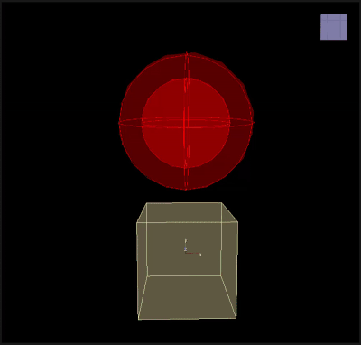

# Sink

___

## About

Kill particles with positions on wrong side of the specified

<table><thead>
  <tr>
    <th>Key</th>
    <th>Value</th>
    <th>Value Description</th>
  </tr></thead>
<tbody>
  <tr>
    <td rowspan="6">Sink</td>
    <td>Name</td>
    <td>Action name</td>
  </tr>
  <tr>
    <td>Kill Inside</td>
    <td>Determining whether to remove particles within the domain</td>
  </tr>
  <tr>
    <td>Domain</td>
    <td>Domain type</td>
  </tr>
  <tr>
    <td>Allow Rotate</td>
    <td></td>
  </tr>
  <tr>
    <td>Draw</td>
    <td></td>
  </tr>
  <tr>
    <td>Enabled</td>
    <td>Enabling or disabling Action</td>
  </tr>
</tbody>
</table>
