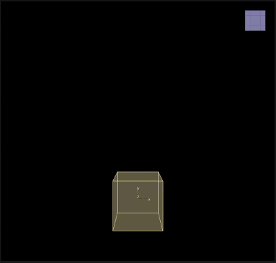

# Target Size

___

## About

Change sizes of all particles toward the specified size

<table><thead>
  <tr>
    <th>Key</th>
    <th>Value</th>
    <th>Value Description</th>
  </tr></thead>
<tbody>
  <tr>
    <td rowspan="5">TargetSize</td>
    <td>Name</td>
    <td>Action Name</td>
  </tr>
  <tr>
    <td>Size</td>
    <td>Target Size</td>
  </tr>
  <tr>
    <td>Scale</td>
    <td>A coefficient that determines how fast the particles will change their size per frame. A value of 1.0 means that the particles will instantly reach the target size, while values less than 1.0 will change size smoothly</td>
  </tr>
  <tr>
    <td>Draw</td>
    <td></td>
  </tr>
  <tr>
    <td>Enabled</td>
    <td>Enabling or disabling Action</td>
  </tr>
</tbody>
</table>
