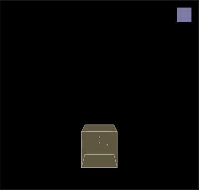

# Target Velocity

___

## About

Changes the velocity of all particles to the specified velocity.

<table><thead>
  <tr>
    <th>Key</th>
    <th>Value</th>
    <th>Value Description</th>
  </tr></thead>
<tbody>
  <tr>
    <td rowspan="6">TargetVelocity</td>
    <td>Name</td>
    <td>Action name</td>
  </tr>
  <tr>
    <td>Velocity</td>
    <td>Target velocity</td>
  </tr>
  <tr>
    <td>Scale</td>
    <td>A coefficient that determines how fast the particles will change their velocity per frame. A value of 1.0 means that the particles will instantly reach the target velocity, while values less than 1.0 will change velocity smoothly</td>
  </tr>
  <tr>
    <td>Allow Rotate</td>
    <td></td>
  </tr>
  <tr>
    <td>Draw</td>
    <td></td>
  </tr>
  <tr>
    <td>Enabled</td>
    <td>Enabling or disabling Action</td>
  </tr>
</tbody>
</table>
