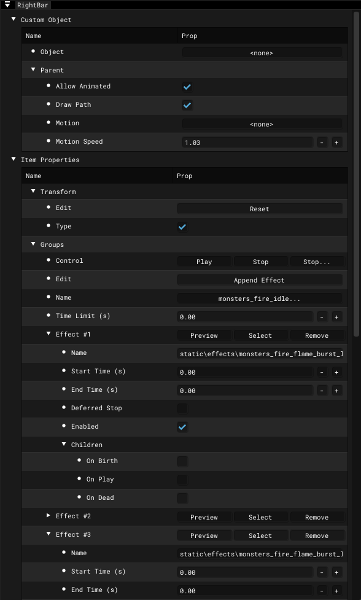

# Particle Editor - Right Bar

___

## About

## Interface

### Custom Object

<table><thead>
  <tr>
    <th></th>
    <th>Description</th>
    <th>Extra</th>
    <th>Extra Description</th>
  </tr></thead>
<tbody>
  <tr>
    <td>Object</td>
    <td></td>
    <td>-</td>
    <td>-</td>
  </tr>
  <tr>
    <td rowspan="4">Parent</td>
    <td rowspan="4"></td>
    <td>Allow Animated</td>
    <td></td>
  </tr>
  <tr>
    <td>Draw Path</td>
    <td></td>
  </tr>
  <tr>
    <td>Motion</td>
    <td></td>
  </tr>
  <tr>
    <td>Motion Speed</td>
    <td></td>
  </tr>
</tbody>
</table>

### Item Properties

Different Properties are used for Particle Effect and Particle Group

  

    <button class="tab-button active" onclick="openTable(event, 'ParticleEffect')">Particle Effect</button>
    <button class="tab-button" onclick="openTable(event, 'ParticleGroup')">Particle Group</button>
  

  <table>
    <thead>
      <tr>
        <th></th>
        <th></th>
        <th>Description</th>
        <th>Extra</th>
        <th>Extra Description</th>
        <th>Extra</th>
        <th>Extra Description</th>
      </tr></thead>
    <tbody>
      <tr>
        <td rowspan="2">Transform</td>
        <td>Edit</td>
        <td></td>
        <td>Reset</td>
        <td></td>
        <td>-</td>
        <td>-</td>
      </tr>
      <tr>
        <td>Type</td>
        <td></td>
        <td>-</td>
        <td>-</td>
        <td>-</td>
        <td>-</td>
      </tr>
      <tr>
        <td rowspan="51">Effects</td>
        <td rowspan="3">Control</td>
        <td rowspan="3"></td>
        <td>Play</td>
        <td>Play</td>
        <td>-</td>
        <td>-</td>
      </tr>
      <tr>
        <td>Stop</td>
        <td>Instant stop</td>
        <td>-</td>
        <td>-</td>
      </tr>
      <tr>
        <td>Stop...</td>
        <td>Deferred stop</td>
        <td>-</td>
        <td>-</td>
      </tr>
      <tr>
        <td>Name</td>
        <td></td>
        <td>-</td>
        <td>-</td>
        <td>-</td>
        <td>-</td>
      </tr>
      <tr>
        <td>Time Limit</td>
        <td></td>
        <td>Value (sec)</td>
        <td></td>
        <td>-</td>
        <td>-</td>
      </tr>
      <tr>
        <td rowspan="9">Sprite</td>
        <td rowspan="9"></td>
        <td>Texture</td>
        <td>Selecting texture</td>
        <td>-</td>
        <td>-</td>
      </tr>
      <tr>
        <td>Shader</td>
        <td>Selecting Engine Shader</td>
        <td>-</td>
        <td>-</td>
      </tr>
      <tr>
        <td>Culling</td>
        <td>Enable <a href="https://www.khronos.org/opengl/wiki/Face_Culling">Back-Face Culling</a></td>
        <td>CCW</td>
        <td>Enable <a href="https://www.khronos.org/opengl/wiki/Face_Culling">Counter-Clockwise Culling</a></td>
      </tr>
      <tr>
        <td rowspan="4">Frame</td>
        <td rowspan="4"></td>
        <td>Random Init</td>
        <td></td>
      </tr>
      <tr>
        <td>Count</td>
        <td></td>
      </tr>
      <tr>
        <td>Size U (0..1)</td>
        <td></td>
      </tr>
      <tr>
        <td>Size V (0..1)</td>
        <td></td>
      </tr>
      <tr>
        <td rowspan="2">Animated</td>
        <td rowspan="2"></td>
        <td>Random Playback</td>
        <td></td>
      </tr>
      <tr>
        <td>Speed</td>
        <td></td>
      </tr>
      <tr>
        <td rowspan="9">Movement</td>
        <td rowspan="9"></td>
        <td rowspan="3">Align To Path</td>
        <td rowspan="3"></td>
        <td>Face Align</td>
        <td></td>
      </tr>
      <tr>
        <td>Default World Align</td>
        <td></td>
      </tr>
      <tr>
        <td>Default Rotate</td>
        <td></td>
      </tr>
      <tr>
        <td>Velocity Scale</td>
        <td></td>
        <td>Value</td>
        <td></td>
      </tr>
      <tr>
        <td rowspan="5">Collision</td>
        <td rowspan="5"></td>
        <td>Collide With Dynamic</td>
        <td>Collide with Dynamic Objects</td>
      </tr>
      <tr>
        <td>Destroy On Contact</td>
        <td></td>
      </tr>
      <tr>
        <td>Friction</td>
        <td>Friction</td>
      </tr>
      <tr>
        <td>Resilence</td>
        <td></td>
      </tr>
      <tr>
        <td>Cutoff</td>
        <td></td>
      </tr>
      <tr>
        <td rowspan="28">Actions</td>
        <td rowspan="28"></td>
        <td rowspan="28">Edit</td>
        <td rowspan="28"></td>
        <td><a href="actions/avoid.md">Avoid</a></td>
        <td></td>
      </tr>
      <tr>
        <td><a href="actions/bounce.md">Bounce</a></td>
        <td></td>
      </tr>
      <tr>
        <td><a href="actions/copy-vertexb.md">Copy VertexB</a></td>
        <td></td>
      </tr>
      <tr>
        <td><a href="actions/damping.md">Damping</a></td>
        <td></td>
      </tr>
      <tr>
        <td><a href="actions/explosion.md">Explosion</a></td>
        <td></td>
      </tr>
      <tr>
        <td><a href="actions/follow.md">Follow</a></td>
        <td></td>
      </tr>
      <tr>
        <td><a href="actions/gravitate.md">Gravitate</a></td>
        <td></td>
      </tr>
      <tr>
        <td><a href="actions/gravity.md">Gravity</a></td>
        <td></td>
      </tr>
      <tr>
        <td><a href="actions/jet.md">Jet</a></td>
        <td></td>
      </tr>
      <tr>
        <td><a href="actions/kill-old.md">Kill Old</a></td>
        <td></td>
      </tr>
      <tr>
        <td><a href="actions/match-velocity.md">Match Velocity</a></td>
        <td></td>
      </tr>
      <tr>
        <td><a href="actions/move.md">Move</a></td>
        <td></td>
      </tr>
      <tr>
        <td><a href="actions/orbit-line.md">Orbit Line</a></td>
        <td></td>
      </tr>
      <tr>
        <td><a href="actions/orbit-point.md">Orbit Point</a></td>
        <td></td>
      </tr>
      <tr>
        <td><a href="actions/random-accel.md">Random Accel</a></td>
        <td></td>
      </tr>
      <tr>
        <td><a href="actions/random-displace.md">Random Displace</a></td>
        <td></td>
      </tr>
      <tr>
        <td><a href="actions/random-velocity.md">Random Velocity</a></td>
        <td></td>
      </tr>
      <tr>
        <td><a href="actions/restore.md">Restore</a></td>
        <td></td>
      </tr>
      <tr>
        <td><a href="actions/scatter.md">Scatter</a></td>
        <td></td>
      </tr>
      <tr>
        <td><a href="actions/sink-velocity.md">Sink Velocity</a></td>
        <td></td>
      </tr>
      <tr>
        <td><a href="actions/sink.md">Sink</a></td>
        <td></td>
      </tr>
      <tr>
        <td><a href="actions/source.md">Source</a></td>
        <td></td>
      </tr>
      <tr>
        <td><a href="actions/speed-limit.md">Speed Limit</a></td>
        <td></td>
      </tr>
      <tr>
        <td><a href="actions/target-color.md">Target Color</a></td>
        <td></td>
      </tr>
      <tr>
        <td><a href="actions/target-size.md">Target Size</a></td>
        <td></td>
      </tr>
      <tr>
        <td><a href="actions/target-velocity.md">Target Velocity</a></td>
        <td></td>
      </tr>
      <tr>
        <td><a href="actions/turbulence.md">Turbulence</a></td>
        <td></td>
      </tr>
      <tr>
        <td><a href="actions/vortex.md">Vortex</a></td>
        <td></td>
      </tr>
    </tbody>
  </table>

  <table>
    <thead>
      <tr>
        <th></th>
        <th></th>
        <th>Description</th>
        <th>Extra</th>
        <th>Extra Description</th>
        <th>Extra</th>
        <th>Extra Description</th>
        <th>Extra</th>
        <th>Extra Description</th>
      </tr></thead>
    <tbody>
      <tr>
        <td rowspan="2">Transform</td>
        <td>Edit</td>
        <td></td>
        <td>Reset</td>
        <td></td>
        <td>-</td>
        <td>-</td>
        <td>-</td>
        <td>-</td>
      </tr>
      <tr>
        <td>Type</td>
        <td></td>
        <td>-</td>
        <td>-</td>
        <td>-</td>
        <td>-</td>
        <td>-</td>
        <td>-</td>
      </tr>
      <tr>
        <td rowspan="18">Groups</td>
        <td rowspan="3">Control</td>
        <td rowspan="3"></td>
        <td>Play</td>
        <td>Play</td>
        <td>-</td>
        <td>-</td>
        <td>-</td>
        <td>-</td>
      </tr>
      <tr>
        <td>Stop</td>
        <td>Instant stop</td>
        <td>-</td>
        <td>-</td>
        <td>-</td>
        <td>-</td>
      </tr>
      <tr>
        <td>Stop...</td>
        <td>Deferred stop</td>
        <td>-</td>
        <td>-</td>
        <td>-</td>
        <td>-</td>
      </tr>
      <tr>
        <td>Edit</td>
        <td></td>
        <td>Append Effect</td>
        <td>Add Particle Effect</td>
        <td>-</td>
        <td>-</td>
        <td>-</td>
        <td>-</td>
      </tr>
      <tr>
        <td>Name</td>
        <td></td>
        <td></td>
        <td></td>
        <td>-</td>
        <td>-</td>
        <td>-</td>
        <td>-</td>
      </tr>
      <tr>
        <td>Time Limit (s)</td>
        <td></td>
        <td></td>
        <td></td>
        <td>-</td>
        <td>-</td>
        <td>-</td>
        <td>-</td>
      </tr>
      <tr>
        <td rowspan="12">Effect</td>
        <td rowspan="12"></td>
        <td>Preview</td>
        <td>Preview Particle Effect</td>
        <td>-</td>
        <td>-</td>
        <td>-</td>
        <td>-</td>
      </tr>
      <tr>
        <td>Select</td>
        <td></td>
        <td>-</td>
        <td>-</td>
        <td>-</td>
        <td>-</td>
      </tr>
      <tr>
        <td>Remove</td>
        <td></td>
        <td>-</td>
        <td>-</td>
        <td>-</td>
        <td>-</td>
      </tr>
      <tr>
        <td>Name</td>
        <td></td>
        <td>-</td>
        <td>-</td>
        <td>-</td>
        <td>-</td>
      </tr>
      <tr>
        <td>Start Time</td>
        <td></td>
        <td>-</td>
        <td>-</td>
        <td>-</td>
        <td>-</td>
      </tr>
      <tr>
        <td>End Time</td>
        <td></td>
        <td>-</td>
        <td>-</td>
        <td>-</td>
        <td>-</td>
      </tr>
      <tr>
        <td>Deferred Stop</td>
        <td></td>
        <td>-</td>
        <td>-</td>
        <td>-</td>
        <td>-</td>
      </tr>
      <tr>
        <td>Enabled</td>
        <td></td>
        <td>-</td>
        <td>-</td>
        <td>-</td>
        <td>-</td>
      </tr>
      <tr>
        <td rowspan="4">Children</td>
        <td rowspan="4"></td>
        <td>On Birth</td>
        <td></td>
        <td>Effect Name</td>
        <td></td>
      </tr>
      <tr>
        <td rowspan="2">On Play</td>
        <td rowspan="2"></td>
        <td>Effect Name</td>
        <td></td>
      </tr>
      <tr>
        <td>Play After Stop</td>
        <td></td>
      </tr>
      <tr>
        <td>On Dead</td>
        <td></td>
        <td>Effect Name</td>
        <td></td>
      </tr>
    </tbody>
  </table>

