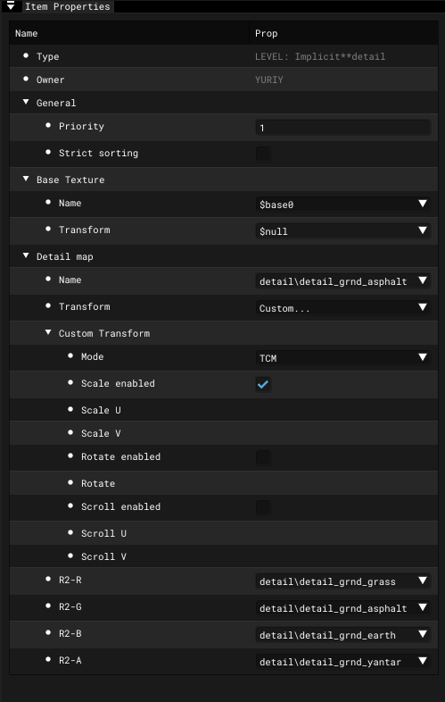

# Engine Shader Parametres

___

## About

| Parameter | Description |
|---|---|
| Type | Shader Type  [basic (simple)](shader-types/basic-simple.md)  [EDITOR: selection](shader-types/editor-selection.md)  [EDITOR: wire](shader-types/editor-wire.md)  [INTERNAL: blur](shader-types/internal-blur.md)  [INTERNAL: gray-scale effect](shader-types/internal-gray-scale-effect.md)  [INTERNAL: shadow projecting](shader-types/internal-shadow-projecting.md)  [LEVEL: detail objects](shader-types/level-detail-objects.md)  [LEVEL: diffuse*base.aref](shader-types/level-diffuse-base-aref.md)  [LEVEL: diffuse*base](shader-types/level-diffuse-base.md)  [LEVEL: implicit**detail](shader-types/level-implicit-detail.md)  [LEVEL: lmap*base.aref](shader-types/level-lmap-base-aref.md)  [LEVEL: lmap*base (default)](shader-types/level-lmap-base-default.md)  [LEVEL: env^base](shader-types/level-lmap-env-base.md)  [LEVEL: (lmap+env*const)\*base](shader-types/level-lmap-env-const-base.md)  [LEVEL: trees/bushes](shader-types/level-trees-bushes.md)  [MODEL: Default](shader-types/model-default.md)  [MODEL: env^base](shader-types/model-env-base.md)  [particles](shader-types/particles.md) |
| Owner | Owner name |

[Shader List Here](../../../reference/shaders/shaders-list/shaders-list.md)
