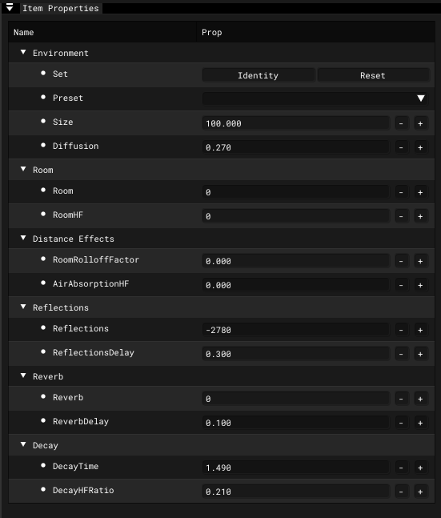

# Sound Env

___

## About

### General

| Parameter | Description |
|---|---|
| Name | Sound Environment Name |

### Environment

| Parameter | Description |
|---|---|
| Set | `Reset` - Resets parameters `Identity` - Sets the parameters to the parameters from Identity |
| Preset | Alley Arena Auditorium Bathroom Carpet Hallway Cave City Concert Hall Dizzy Drugged Forest Generic Hallway Hangar Livingroom Mountains Padded Cell Parkinglot Plain Psychotic Quarry Room Sewer Pipe Stone Corridor Stone Room Under Water |
| Size | This setting sets the perceived size of the audio environment. The larger the number, the larger and wider the environmental space will "sound" |
| Diffusion | Controls the master density of audio reflections and reverbrations, i.e. how thick the reverb and echo effects will be |

### Room

| Parameter | Description |
|---|---|
| Room | This controls the initial volume level and amount of reverb and echo effects; "0" equates to full effects, while "-10000" equates to no effects |
| RoomHF | Sets the high frequency attenuation via a low-pass filter for Room setting and audio reflection; "0" equates to no low-pass filter, while "-10000" equates to no sound refelected |

### Distance Effects

| Parameter | Description |
|---|---|
| RoomRolloffFactor | This setting attenuates reflected sound based on how far from the audio source the player is; the higher the value, the more a sound will decay the greater the player's distance from the source of the audio |
| AirAbsorptionHF | This setting attenuates high frequencies based on the distance between the player and the audio source, but simulates a denser environment. The higher the value, the less absorbent the environement is (e.g. a low value would mimic thick fog, a high value would mimic a dry desert or tundra) |

### Reflections

| Parameter | Description |
|---|---|
| Reflections | This sets the amount of initial echoes dependant upon the Room setting. "1000" equates to maximum initial reflections, while "-10000" equates to no initial reflections |
| ReflectionsDelay | Sets the amount of time (in milliseconds) from the initial perception of the audio source, to the first percieved echo. The higher the value, the longer the amount of time between first hearing a sound, and hearing any echoes of that sound |

### Reverb

| Parameter | Description |
|---|---|
| Reverb | This setting controls the amount of late reverbrations dependant upon the Room setting. "2000" equates to maxmium late reverbrations, while "-10000" equates to no late reverbrations |
| ReverbDelay | This sets the length of time (in milliseconds) from the initial perception of audio reflections, to the first percieved reverbration. The higher the value, the longer the amount of time between the first echo and it's resounding reverbration |

### Decay

| Parameter | Description |
|---|---|
| DecayTime | Controls the decay time of the audio reverbration; how quickly the reverbration fades away. The smaller the value, the quicker reverbrations fade out, and the smaller the percieved room size is; the higher the value, the longer it takes for reverbrations to fade out |
| DecayHFRatio | Sets the ratio of high frequency reverbration decay relative to actual reverbration decay time. The higher the value, the brighter the high frequency reverbration decay; the lower the value, the more dull the high frequency reverbration |
