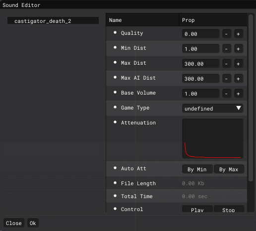

# Sound Editor

___

## About

A sound editor is needed to edit sound files in [*.wav](https://en.wikipedia.org/wiki/WAV) format and convert to [*.ogg](../../../reference/file-formats/audio-video/ogg.md)

___

## Interface

| Key | Description | Value |
|---|---|---|
| Quality | Quality | Range is 0.00 - 1.00 |
| Min Dist | indicates the distance in meters from the sound source at which it can still be heard at 100% volume | Range is 0.01 - 1000.00 |
| Max Dist | Distance in meters from the sound source at which you can no longer hear the sound | Range is 0.10 - 1000.00 |
| Max AI Dist | Distance from the sound source (in meters) at which NPCs can no longer hear the sound | Range is 0.10 - 1000.00 |
| Base Sound Volume | Default sound volume in the game at the sound source location | Range is 0.00 - 2.00 |
| Game Type | Determines how the sound will be perceived by NPCs and mutants in the game | undefined  anomaly_idle  item_dropping  item_hiding  item_pickup  item_taking  item_using  NPC_attacking  NPC_dying  NPC_eating  NPC_injuring  NPC_step  NPC_talking  object_breaking  object_colliding  object_exploding  weapon_bullet_hit  weapon_empty_click  weapon_recharging  weapon_shooting  world_ambient |
| [Attenuation](https://en.wikipedia.org/wiki/Attenuation) | Attenuation Graph | - |
| Auto Att | Automatic attenuation based on minimum and maximum audible distance values | By Min  By Max |
| File Length | File Length | - |
| Total Time | Total Time | - |
| Control | Control | Play  Stop |
| Auto Play | Auto Play | on  off |
| MANAGE | Synchronizes changes | SyncCurrent |
