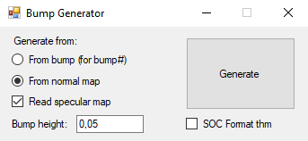

# Bump Generator

___

## Info

|  |  |
|---|---|
| Program Developer | i-love-kfc |
| Described Version | [0.1](https://gitlab.com/i-love-kfc/bump-generator/-/releases/%D0%A0%D0%B5%D0%BB%D0%B8%D0%B7) |
| Discussion Forum | [Ap-pro forum topic](https://ap-pro.ru/forums/topic/3740-bump-generator) |

___

## About

A simple [_bump.dds](../../reference/file-formats/textures/bump.md) and [_bump#.dds](../../reference/file-formats/textures/bump_hash.md) texture generator from normal maps with the ability to use specular maps, also, is capable of generating .bump# for ready-made "green" .bumps.

## Features

- Generates _bump and \_bump# textures from normal maps (with the ability to use specular maps)
- Generating _bump# for ready-made \_bump
- Supports *.dds and \*.tga texture formats.

## Functionality

| Generate From | Description |
|---|---|
| From bump (For bump#) | Generates bump# from the bump map |
| From Normal map | Generates bump from the normal map |
| Read Specular map | Whether to use the Specular Map |
| Bump height | Bump height |

Checkboxes

| Checkboxes | Description |
|---|---|
| SOC Format thm | Generates SoC version *.thm file |

___

## Sources

[Source Code](https://gitlab.com/i-love-kfc/bump-generator)
