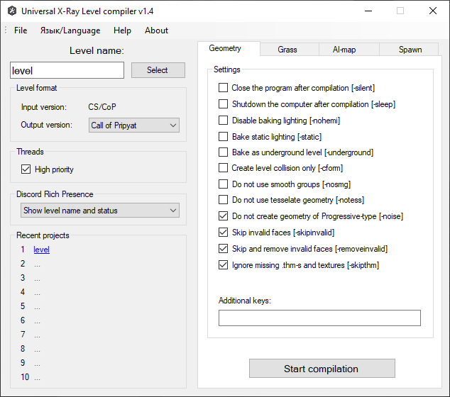

# Universal x64 level compilers

- Program Developer:
  - GCS Game Word
- Compiler edits and build:
  - SkyLoader
- Acknowledgements:
  - Abramcumner
  - K.D.
- The version described in the article: 1.4
- [Ap-pro forum topic](https://ap-pro.ru/forums/topic/3341-universalnye-kompilyatory-urovney-h64)

___

## About

Universal level compiler that supports the compilation format for games of all series and has many keys to compile

## Compilation of compilers

- Geometry compiler (SoC, CS, CoP)
- Grass compiler (SoC, CS, CoP)
- AI grid compiler (SoC, CS, CoP)
- Spawn Compiler (SoC, CS, CoP)

## Features

- Support for x64
- Support for major games in the series (except for spawn formats)
- All compilers united in one application
- Interface completely rewritten in WinForms
- Added compiler menu, where you can choose a project level, set certain settings and run the compilation
- A system for saving and loading settings of recent projects has been added
- The number of threads created is no longer fixed, but depends on the number of processor cores
- Migration to DirectXTex library to replace FreeImage and nvDXT now obsolete
- Removed rendering of RGB and Sun lighting components, leaving only Hemi
- Some phases of compilation and code parsing of third-party libraries were made
- Integrated Discord Rich Presence to be able to monitor the status of compilation on a remote PC
- Added an option to automatically shutdown the PC after compilation
- Implemented a progress bar in the taskbar to display the current compilation status when minimized
- Added keys for the accelerated compilation of levels for testing purposes.
- Added experimental switches to disable some compilation phases and bypass KKS parameters
- Added major changes to past compilers
- Expanded information output on some bugs
- Fixed some crashes of the original compilers

It requires Microsoft Visual C++ 2017 Redistributable x64 installed.

## Setup

The files must be moved to the root folder of the SDK

___

## Functionality

### Buttons

> #### File Button

| Button | Description |
---|---|
| Recent Projects | Recent Projects |
| Exit | Exit |

> #### Язык/Language Button

| Button | Description |
---|---|
| English | English language |
| Русский | Russian language|

> #### Help Button

| Button | Description |
---|---|
| Help | Shows helpful information |

> #### About Button

| Button | Description |
---|---|
| About | About the program |

### Level Name

| Button | Description |
---|---|
| Select | Selects the level for compilation |

#### Level Format

- Input Version: (Input version of the level format)
- Output Version: (Output version of the level format)

### Threads

| Checkboxes | Description |
---|---|
| High Priority | Enables high priority |

### Discord Rich Presence

- Do not use
- Show compilation status only
- Show level name and status

### Recent Projects

### Keys

#### Geometry Keys

| Key | Description |
---|---|
| -silent | Close the program after compilation |
| -sleep | Shutdown the computer after compilation |
| -nohemi | Disable baking lighting |
| -static | Bake static lighting |
| -underground | Bake as underground level |
| -cform | export only collision level |
| -nosmg | Do not use smooth groups |
| -notess | do not tessellate geometry |
| -noise | Do not create geometry of Progressive-type |
| -skipinvalid | Skip invalid faces |
| -removeinvalid | Skip and remove invalid faces |
| -skipthm | Ignore missing thm-s and textures |

#### Grass

| Key | Description |
---|---|
| -silent | Close the program after compilation |
| -sleep | Shutdown the computer after compilation |
| -nohemi | Disable baking lighting |
| -static | Bake static lighting |
| -skipthm | Ignore missing thm-s and textures |

#### AI-Map

Build Ai-Map

| Key | Description |
---|---|
| -draft | Do not calculate covers |
| -skipthm | Ignore missing thm-s and textures |

Check Ai-Map

| Key | Description |
---|---|
| -noverbose | Do not show info about single nodes |

#### Spawn

| Key | Description |
---|---|
| -no_separator_check | Disable some conflicts |
| -large_aimap | Build for large AI-map (requires a modified game engine and SDK to work!) |

##### Additional spawns

| Buttons | Description |
---|---|
| Add | Add spawn file |
| Remove | Remove spawn file |
| Clear | Clear spawn files |

##### Spawn name

| Checkboxes | Description |
---|---|
| by default | Renames the .spawn file by default (name chosen from the folder name) |

- Spawn name - Spawn name

### The following keys are supported/required

| Key | Description |
---|---|
| -? or -help | call help with a list of all startup keys |
| -f \<NAME> | level name in GameData\levels\<NAME>\ |
| -version \<NAME> | output level format (shoc/cs/cop) |
| -fsltx \<NAME> | use custom fsgame.ltx |
| -log_name \<NAME> | create a log file with custom name |
| -discord | enable discord rich presence with showing project name |
| -discord_s | enable discord rich presence without showing project name |
| -tbb | use TBB multithreading (not recommended) |
| -t \<NUM> | number of threads |

### Additional keys for geometry compilation

| Key | Description |
---|---|
| -tex_rgba | do not use compression for stored textures |
| -tex_bc7 | use BC7 compression for stored textures (format is only supported on DX11) |
| -nocform | skips the creation of level.cform |
| -no_mt_cdb_pack | disable multithreaded collision packing |
| -noweld | disable small triangles welding |
| -nomerge | skip the Merging geometry stage |
| -noimpl | don't bake lighting for terrain |
| -noresize | don't resize bigger textures to 1024x1024 |
| -nostrip | disable geometry optimization and streamlining |
| -dx_opt | turn on D3DX optimizer geometry optimization instead of NvTriStrip |
| -gi | turn on the Radiosity phase |
| -no_mt_mu | don't run the lighting calculation for Multiple Usage objects in parallel with the main compilation |
| -high | higher priority for the threads |
| -saveobj_base | save level objects as .obj models to temp folder (base UV) |
| -saveobj_lmap | save level objects as .obj models to temp folder (lighmap UV)
| -saveobj_cform | save level collision as .obj models to temp folder |
| -force_default_shader | forced replacement of "`def_vertex`" shaders with "`default`" |
| -force_vertex_shader | forced replacement of "`default`" shaders with "`def_vertex`" |
| -qual_draft | set the quality of the scene in Draft (does not affect the exposed shaders) |
| -qual_high | set the quality of the scene to High (does not affect the exposed shaders) |
| -ppm \<float> | hemi lighmaps quality (`by default: use value from SDK`) |
| -weld_dist \<float> | weld distance (`by default: use value from SDK`) |
| -hemi_bias \<float> | position bias for hemi calc (`default: 0.1, vanilla: 0.001`) |
| -insert_graph | enable adding graphs to common spawn when building a SoC Level (Key for SoC only) |
