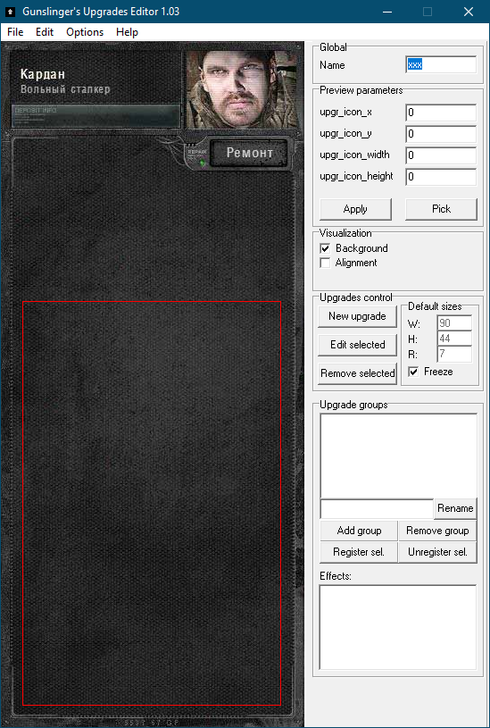

# Upgrade Editor

___

- Program Developers:
  - Sin!, Gunslinger Mod Team

___

## About

```admonish warning
The editor was created for Gunslinger Mod so some parameters will be incompatible with Anomaly! Also, after exporting, you may need to modify the config!
```

Visual editor that makes it relatively quick and easy to create weapon upgrade schemes



## Features

## Functionality

### Hotkeys

- `F4` - New
- `Ctrl+O` - Open
- `Ctrl+S` - Save

### Buttons

#### File Button

| Button | Description |
|---|---|
| New | New Upgrade Tree |
| Open... | Open Upgrade Tree |
| Open Recent | Open Recent Upgrade Tree |
| Save | Save Upgrade Tree |
| Save As... | Save As Upgrade Tree |
| Export... | Export Upgrade Tree<br> Use application's directory<br> - Yes - save everything to the folder where the application is located<br> - No - will allow you to select an export path |
| Exit | Exit |

#### Edit Button

| Button | Description |
|---|---|
| New Upgrade... | Creates a new upgrade |
| Edit Upgrade... | Edits selected upgrade |
| Delete Upgrade | Deletes selected upgrade |

#### Options Button

| Button | Description |
|---|---|
| Set preview texture... | The texture of the item to be upgraded is selected |
| Set upgrade texture... | The texture of the item's upgrades is selected |
| Assotiate program with .upr | Assotiate program with .upr (Upgrades tree file) |
| Remove .upr assotiation | Remove .upr assotiation |
| Clear program's registry settings | ? |
| Calculate treasures | ? |
| Find parametr... | Finds upgrade parameters |

#### Help Button

| Button | Description |
|---|---|
| Help... | Shows useful information |
| About... | About |

___

### Right side

#### Global

- Name - Upgrade Tree Name

#### Preview parameters

| Parameters | Description |
|---|---|
| upgr_icon_x | X coordinate of the upper left corner of the weapon icon in the upgrade window |
| upgr_icon_y | Y coordinate of the upper left corner of the weapon icon in the upgrade window |
| upgr_icon_width | icon width in the upgrade window |
| upgr_icon_height | icon height in the upgrade window |

| Button | Description |
|---|---|
| Apply | Apply |
| Pick | Allows you to pick an icon in a separate window |

#### Visualization

| Button | Description |
|---|---|
| Background | On/Off background |
| Aligment |  |

#### Upgrades control

| Button | Description |
|---|---|
| New Upgrade | Creates a new upgrade |
| Edit Selected | Edits selected upgrade |
| Remove selected | Deletes selected upgrade |

##### Edit Upgrades

| General | Description |
|---|---|
| Name | Upgrade Name |
| Property | ? |
| Inherits | ? |
| Cost | Cost |
| Value | ? |
| Setup Influence... | Selecting a parameter that improves the item's parameters |

| Visualization | Description |
|---|---|
| Point X | ? |
| Point Y | ? |
| Scheme X | ? |
| Scheme Y | ? |

| Advanced configuration | Description |
|---|---|
| inventory name | ? |
| inventory description | ? |
| precondition_functor | ? |
| precondition_parameter | ? |
| effect_functor | ? |
| effect_parameter | ? |
| prereq_functor | ? |
| prereq_tooltip_functor | ? |
| prereq_params | ? |

##### Default sizes

| Button | Description |
|---|---|
| W: | ? |
| H: | ? |
| R: | ? |
| Freeze | Enables Freezing |

#### Upgared groups

| Button | Description |
|---|---|
| Rename | Rename Group |
| Add group | Add Group |
| Remove group | Remove Group |
| Register sel. | Registers the selected upgrade to a group |
| Unregister sel. | Removes the selected upgrade from the group |

#### Effects

?
