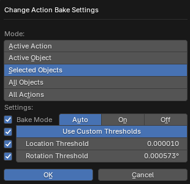

# Change Action Bake Settings

___

## About

This operator is needed to change the bake parameters of a large number of animations at once. It facilitates setting of bake parameters, which are located in the X-Ray Engine: Action panel

### Mode

Operator mode. Specifies which animations to change

- `Active Action` - Active animation that is set to the active object
- `Active Object` - All animations from the `Motions` list of the active object
- `Selected Objects` - All animations from the `Motions` list of selected objects
- `All Objects` - All animations from the `Motions` list of all objects in the blend file
- `All Actions` - All animations of the blend file

### Change Bake Mode

If enabled, the animations change the bake mode parameter (`Auto`, `On`, `Off` modes)

### Bake Mode

Indicates the baking mode (values `Auto`, `On`, `Off`). It has an effect if the `Change Bake Mode` parameter above is activated

### Change Use Custom Thresholds

If enabled, animations have the `Use Custom Thresholds` parameter changed

### Use Custom Thresholds

The value for the `Use Custom Thresholds` parameter. Has an effect if the `Change Use Custom Thresholds` parameter above is activated

### Change Location Thresholds

If enabled, the `Location Thresholds` parameter is changed for animations

### Location Thresholds

The value for the `Location Thresholds` parameter. Has an effect if the `Change Location Thresholds` parameter above is activated

### Change Rotation Thresholds

If enabled, the `Rotation Thresholds` parameter of animations is changed

### Rotation Thresholds

Value for the `Rotation Thresholds` parameter. Has an effect if the `Change Rotation Thresholds` parameter above is activated

___

## Sources

[Source](https://github.com/PavelBlend/blender-xray/wiki/Panel-Batch-Tools#change-action-bake-settings)
