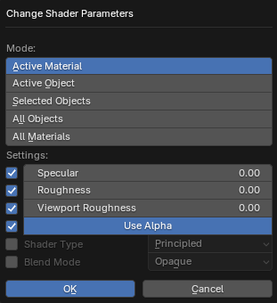

# Change Shader Parameters

___

## About

Changes the settings of materials. Makes it easier to change the settings of a large number of materials. For example, you can change at once all materials that are created after importing game levels. All parameters except `Mode` have a check mark on the left side, which is responsible for changing this parameter. If the check mark is on, the parameter will be changed, if it is off, the value of the material parameter will remain unchanged. The operator can change the `Cycles`/`EEVEE` parameters and the `Internal Render` parameters (`Blender Render` in Blender `2.7x`). For `Cycles`/`EEVEE` the parameters `Specular`, `Roughness`, `Viewport Roughness`, `Use Alpha`, `Shader Type`, `Blend Mode`, `Shadow Mode` are used. For `Internal Render` the parameters `Diffuse Intensity`, `Specular Intensity`, `Transparency Alpha`, `Specular Hardness`, `Transparency, Shadeless` are used

### Mode

Operator Mode. Specifies which materials to change

- `Active Material` - Active material of the active object
- `Active Object` - All materials of the active object
- `Selected Objects` - All materials of selected objects
- `All Objects` - All materials of all objects of the blend-file
- `All Materials` - All materials of the blend file

### Specular

Value for specular intensity (`Specular` parameter of the `Principled BSDF` shader node)

### Roughness

Value for roughness (`Roughness` parameter of the `Principled BSDF` shader node)

### Viewport Roughness

Roughness value in the viewport (`Properties` > `Material` > `Viewport Display` > `Roughness` parameter of the material)

### Use Alpha

Value for alpha channel. If on, the `Alpha` socket of the `Principled BSDF` node will be connected to the `Alpha` socket of the `Image Texture` node. If off, this connection will be removed

### Shader Type

Specifies the type of shader. It is possible to specify `Principled BSDF`, `Diffuse BSDF`, `Emission`

### Blend Mode

Specifies the value for `Properties` > `Material` > `Viewport Display` > `Blend Mode` for the material

### Shadow Mode

Specifies the value for the `Properties` > `Material` > `Viewport Display` > `Shadow Mode` option for the material. This option is only available in Blender `2.80` and later

### Diffuse Intensity

Specifies the `Properties` > `Material` > `Diffuse` > `Intensity` parameter of the material

### Specular Intensity

Specifies the `Properties` > `Material` > `Specular` > `Intensity` parameter of the material

### Transparency Alpha

Specifies the `Properties` > `Material` > `Transparency` > `Alpha` parameter of the material

### Specular Hardness

Specifies the `Properties` > `Material` > `Specular` > `Hardness` parameter of the material

### Transparency

Specifies the `Properties` > `Material` > `Transparency` option for the material

### Shadeless

Specifies the `Properties` > `Material` > `Shading` > `Shadeless` option for the material

___

## Sources

[Source](https://github.com/PavelBlend/blender-xray/wiki/Panel-Batch-Tools#change-shader-parameters)
