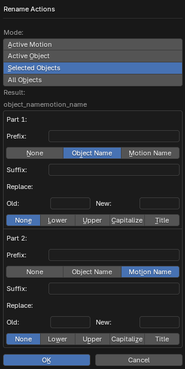

# Rename Actions

___

## About

The operator mass renames animations (action data blocks). The approximate result of the name is displayed under the Result label. In the label, object_name stands for the object name and motion_name stands for the animation name. Other characters are added when the operator settings are changed. The operator settings are divided into two parts: Part 1 and Part 2. The parameters in these blocks are the same, but the parameters in Part 1 specify the first part of the name, which comes first, and the parameters in Part 2 specify the second part of the name, which comes after the first and is at the end of the name

### Mode

Operator mode. Specifies which animations to rename

- `Active Motion` - active animation of the active object, which is selected in the Motions list
- `Active Object` - all animations from the Motions list of the active object
- `Selected Objects` - all animations from the Motions list of selected objects
- `All Objects` - all animations from the Motions list of all objects in the blend file

### Prefix

Prefix. Added to the beginning of the name part

### Part

The base string of the name part. Three options are available:

- `None` - Nothing, empty string
- `Object Name` - Name of the object that stores this animation in the Motions list
- `Motion Name` - Name of the animation used for export (may not coincide with the name of the action)

### Suffix

Suffix. Added to the end of the name part

### Replace: Old

The string in the final name to replace with the one specified in the Replace: New parameter. For example, you can replace all dots in the final name with underscores. To do this, you must write the dot . in Old and the underscore _ in New. Or you can replace not just one character, but several, for example, replace the string test with new. If you replace the string with an empty string, the Old string will be removed from the name

### Replace: Old

A string that replaces the Replace: Old string in the final animation name

### Function

A function that is applied to the final name. The available options are:

- `None` - Does not change the name
- `Lower` - Converts all characters of the name to lower case
- `Upper` - Converts all characters of the name to upper case
- `Capitalize` - Converts the first character of the name to upper case and the rest to lower case
- `Title` - Converts the first character of each word to uppercase and the rest of the characters to lower case

___

## Sources

[Source](https://github.com/PavelBlend/blender-xray/wiki/Panel-Batch-Tools#rename-actions)
