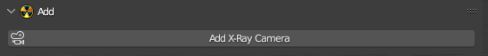

# Add

___

## About

Creates a camera on the scene with a choice of type (HUD or Level)

___

### Camera Type Parameters

Указывает тип камеры. От этого параметра зависит, какой угол обзора будет иметь камера.

| Camera Type | Description |
|---|---|
| HUD SoC/CS | камера для hud-моделей оружия из ТЧ/ЧН. Угол обзора равен произведению базового угла на коэффициент (67.5 * 0.45 = 30.375) |
| HUD CoP | камера для hud-моделей оружия из ЗП. Угол обзора равен произведению базового угла на коэффициент (55.0 * 0.45 = 24.75) |
| Level SoC/CS | камера для локаций из ТЧ/ЧН. Используется для создания анимаций полёта камеры в кат-сценах. Угол обзора равен 67.5 |
| Level CoP | камера для локаций из ЗП. Угол обзора равен 55.0 |

___

## Sources

[Source](https://github.com/PavelBlend/blender-xray/wiki/Operator-Add-XRay-Camera)
