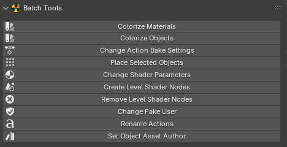

# Batch Tools

___

Allows editing of various material settings, baking, etc.

## Operators

- [Colorize Materials](../addon-operators/operator-colorize-materials.md)
- [Colorize Objects](../addon-operators/operator-colorize-objects.md)
- [Change Action Bake Settings](../addon-operators/operator-change-action-bake-settings.md)
- [Place Selected Objects](../addon-operators/operator-place-selected-objects.md)
- [Change Shader Parameters](../addon-operators/operator-change-shader-parameters.md)
- [Create Level Shader Nodes](../addon-operators/operator-create-level-shader-nodes.md)
- [Remove Level Shader Nodes](../addon-operators/operator-remove-level-shader-nodes.md)
- [Change Fake User](../addon-operators/operator-change-fake-user.md)
- [Rename Actions](../addon-operators/operator-rename-actions.md)
- [Set Object Asset Author](../addon-operators/operator-set-object-asset-author.md)

___

## Sources

[Source](https://github.com/PavelBlend/blender-xray/wiki/Panel-Batch-Tools)
