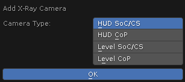

# Add X-Ray Camera Operator

___

## About

Creates a camera on the scene with a choice of type (HUD or Level)

## Parameters

### Camera Type

Indicates the type of camera. This parameter determines what angle of view the camera will have

| Camera Type | Description |
|---|---|
| HUD SoC/CS | Camera for hud models of weapons from SoC/CS. View angle is equal to the product of the base angle by a coefficient (67.5 * 0.45 = 30.375) |
| HUD CoP | Camera for hud-models of weapons from CoP. View angle is equal to the product of the base angle by a coefficient (55.0 * 0.45 = 24.75). |
| Level SoC/CS | Camera for locations from SoC/CS. It is used to create animations of camera flight in cut scenes. Viewing angle is 67.5 |
| Level CoP | Camera for locations from CoP. Viewing angle is 55.0 |

___

## Sources

[Source](https://github.com/PavelBlend/blender-xray/wiki/Operator-Add-XRay-Camera)
