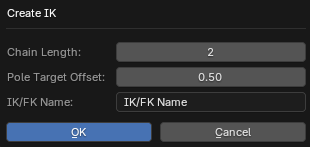

# Create IK Operator

___

## About

Configures inverse and forward kinematics for selected bones. This operator should be used only for bones that are chained together when the tail of the parent bone coincides with the position of the head of the child bone, otherwise the result of the rig will be incorrect. If the bones are not connected in a chain, you must use the [Create Connected Bones](blender-x-ray-addon-operator-create-connected-bones.md) operator to create such bones. This operator adds contraints, drivers, and auxiliary bones for inverse and forward kinematics and for the ability to switch between them. Bones for use in animation are placed on the first layer. Auxiliary bones are placed on the last layers. Also, a `Custom` property in the form of a floating point number is added to the control bone, which can be used to enable/disable forward/reverse kinematics. Such properties will be displayed in the `3D Viewport` window in the `N`-panel, in the `X-Ray` tab, in the [Rig](../addon-n-panels/blender-x-ray-addon-n-panel-rig.md) panel. When using this operator, you need to highlight the last bone in the chain that needs to participate in the kinematics. For example, when setting up the arms, you need to select the ulna bone (located between the wrist and the bend of the elbow). Demonstration video that shows the use of this operator: [YouTube](https://www.youtube.com/watch?v=_45pq-823JI)

### Chain Length Parameter

Chain length for `Inverse Kinematics` constrain and for selecting the bones that will participate in forward kinematics

### Pole Target Offset Parameter

Specifies the distance by which the bone is shifted to control knee rotation in Inverse Kinematics. This bone is specified in the `Inverse Kinematics` Constraint in the `Pole Target Bone` parameter

### IK/FK Name Parameter

Specifies the name of the property that is used to switch between forward and inverse kinematics. This property will be displayed in the [Rig](../addon-n-panels/blender-x-ray-addon-n-panel-rig.md) panel

___

## Sources

[Source](https://github.com/PavelBlend/blender-xray/wiki/Operator-Create-IK#%D0%BE%D0%BF%D0%B5%D1%80%D0%B0%D1%82%D0%BE%D1%80-create-ik)
