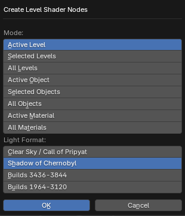

# Create Level Shader Nodes

___

## About

Creates shader lighting nodes for models from game levels. Can be used for rendering in blender or for editing lighting maps. The operator creates groups of nodes that are used in all materials with the same lighting type. There can be four types of lighting in total and they can be: lighting maps, vertex lighting, `Multiple Usage` object lighting, `Terrain` object lighting. For each type a different group of nodes is created in a single instance. To change the lighting of one type, it is enough to change the nodes in one group. The operator also loads `bump`, `bump#` textures and customizes normal maps and glare maps. The path to `bump` and `bump#` files is read from [*.thm](../../../../main-folders-and-files/file-formats/textures/thm.md) files if they exist, but if they don't, the path to them is generated based on the base texture (`_bump` and `_bump#` are added to the end of the path). Search for `*.thm` files is done in [Textures Folder](../addon-preference-panels/preference-panel-paths.md#textures-folder) from addon settings

### Mode

This parameter specifies what to change:

- `Active Level` - All active level visualization materials
- `Selected Levels` - All materials of visuals of selected levels
- `All Levels` - All visuals materials of all levels
- `Active Object` - Materials of the active object
- `Selected Objects` - Materials of selected objects
- `All Objects` - Materials of all objects
- `Active Material` - Active material of the active object
- `All Materials` - All materials

### Light Format

Specifies the lighting format for different versions of the game and different builds. It is possible to set the lighting format for:

- `Clear Sky / Call of Pripyat` - Clear Sky or Call of Pripyat
- `Shadow of Chernobyl` - Shadow of Chernobyl
- `Builds 3436-3844` - Builds 3436-3844
- `Builds 1964-3120` - Builds 1964-3120

___

## Sources

[Source](https://github.com/PavelBlend/blender-xray/wiki/Panel-Batch-Tools#create-level-shader-nodes)
