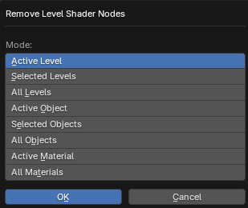

# Remove Level Shader Nodes

___

## About

Deletes lighting nodes that were created using the [Create Level Shader Nodes](operator-create-level-shader-nodes.md) operator

### Mode

This parameter specifies which materials should have nodes removed

- `Active Level` - All active level visualization materials
- `Selected Levels` - All materials of visuals of selected levels
- `All Levels` - All visuals materials of all levels
- `Active Object` - Materials of the active object
- `Selected Objects` - Materials of selected objects
- `All Objects` - Materials of all objects
- `Active Material` - Active material of the active object
- `All Materials` - All materials

___

## Sources

[Source](https://github.com/PavelBlend/blender-xray/wiki/Panel-Batch-Tools#remove-level-shader-nodes)
