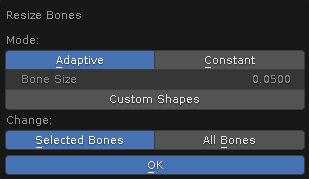

# Resize Bones Operator

___

## About

Changes the bone size of selected armatures

___

## Parameters

### Mode

Bone resizing mode

- `Adaptive` - the size for each bone is calculated individually and depends on the distance to the nearest bone. The closer the nearest bone is to the bone, the smaller the size of the bone. For example, finger bones will be smaller than leg bones because the finger bones are close to each other
- `Constant` - the bone size is the same for all bones and is specified using the Bone Size parameter

### Bone Size

Specifies the size of bones in Constant mode

### Custom Shape

If this option is enabled, the bones will have a shape set as a empty with the Sphere type

### Change

This parameter specifies which bones to modify. It is only available in Pose Mode

- `Selected Bones` - modify the selected bones
- `All Bones` - modify all bones

___

## Sources

[Source](https://github.com/PavelBlend/blender-xray/wiki/Operator-Resize-Bones)
