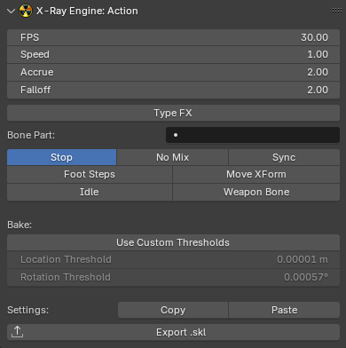

# X-Ray Engine: Action

___

## About

This page describes the X-Ray Engine: Action panel. This panel stores animation parameters for skeleton animations ([*.skl](../../../../main-folders-and-files/file-formats/animations/skl-skls.md), [*.skls](../../../../main-folders-and-files/file-formats/animations/skl-skls.md), [*.omf](../../../../main-folders-and-files/file-formats/animations/omf.md), [*.object](../../../../main-folders-and-files/file-formats/models/object.md), [*.ogf](../../../../main-folders-and-files/file-formats/models/ogf.md)) or path animations ([*.anm](../../../../main-folders-and-files/file-formats/animations/anm.md))

### Location

`Dope Sheet` window > (in blender versions 2.77 and 2.78 in the Graph Editor window) > `N-panel` > `X-Ray` tab

### Context

The number of parameters depends on the type of object

If the object type is Armature, all parameters except Bake Mode (Auto, On, Off) will be available and all operators will be available

If the object is not Armature, FPS, Bake Mode (Auto, On, Off), Use Custom Thresholds, Location Threshold, Rotation Threshold, but no operators will be available

### Parameters

#### X-Ray Parameters

Parameters that are read or written to files during import/export

##### FPS

Frame rate of the animation. Usually equal to 30

##### Speed

Animation playback speed. You can speed up or slow down the animation

##### Accrue

Blend-In

##### Falloff

Blend-out. The value must be less than Accrue. If it is not, the engine will calculate its own value for Falloff, which will be less than Accrue by a minimum amount

##### Type FX

TODO

##### Bone Part

TODO

##### Start Bone

TODO

##### Power

TODO

##### Stop

Stop at end flag that stops the animation after playing. If off, the animation is played cyclically

##### No Mix

Animations will not be mixed

##### Sync

This flag is used to indicate that this animation will synchronize with another animation depending on the Bone Part

##### Foot Steps

TODO

##### Move XForm

TODO

##### Idle

TODO

##### Weapon Bone

TODO

#### Addon Parameters

Parameters that are used by the addon inside blender, or during import/export, but are not read or saved to files.

##### Bake Mode (Auto, On, Off)

Animation bake mode during exporting

- Auto - Automatic mode. The addon itself will calculate whether to bake or not. If the object or bones with animation have constreints, baking will be used, and if there are no constreints, it will not be used
- On - Enable baking
- Off - Disable baking

##### Use Custom Thresholds

Use arbitrary threshold values for position and rotation during animation key filtering, instead of the default value of 0.00001. Arbitrary values are specified using the Location Threshold, Rotation Threshold parameters

##### Location Threshold

Threshold for the position

##### Rotation Threshold

Threshold for rotation

### Operators

#### Copy

Copies animation parameters to the clipboard. The parameters are saved in text form, which can be saved to any text file

#### Paste

Inserts animation parameters from the clipboard that were copied with Copy or from a text file. You can paste copied parameters from any other open blend file

#### Export *.skl

Exports one current Action (which is selected in Dope Sheet) to *.skl format.

___

## Sources

[Source](https://github.com/PavelBlend/blender-xray/wiki/Panel-XRay-Engine-Action)
