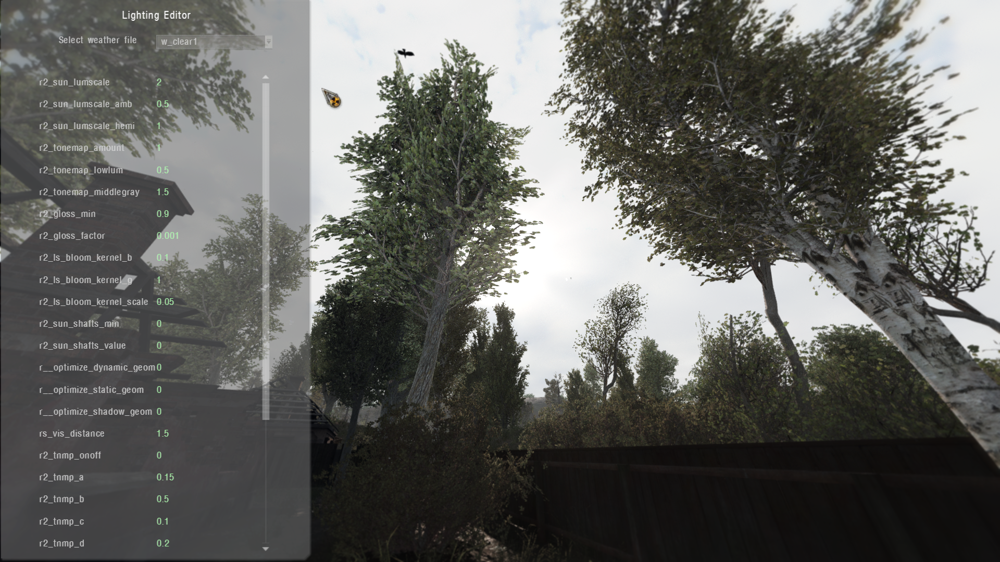

# Lightning Editor

___

## General information

Allows you to change the various lighting settings of the weather preset

First you need to select a weather file from the drop-down list and then edit it.

### Keybinds

- `INSERT` to start
- `Up` and `Down` keys to rotate through the avaiable commands
- `NUMPAD_8` and `NUMPAD_2` keys to increase/reduce the value of highlighted command
- `Enter` key to save the adjusted commands to print_table.txt

___

## Technical part

The commands and their settings are assigned in the script "`ui_debug_lightning.script`"

`List of commands` (Full list of commands can be found [here]())

| Сommand | Command description |
|---|---|
| r2_sun_lumscale | Sunlight intensity control |
| r2_sun_lumscale_amb | Ambient light intensity control |
| r2_sun_lumscale_hemi | hemispherical lighting |
| r2_tonemap_amount |  |
| r2_tonemap_lowlum |  |
| r2_tonemap_middlegray | Controls the setting that controls the middle gray value for Tone Mapping technologies |
| r2_gloss_min |  |
| r2_gloss_factor |  |
| r2_ls_bloom_kernel_b |  |
| r2_ls_bloom_kernel_g | "Shape" of bloom. High value = more blurry bloom |
| r2_ls_bloom_kernel_scale | Size of bloom effect |
| r2_sun_shafts_min |  |
| r2_sun_shafts_value |  |
| r__optimize_dynamic_geom |  |
| r__optimize_static_geom |  |
| r__optimize_shadow_geom |  |
| rs_vis_distance |  |
| r2_tnmp_onoff |  |
| r2_tnmp_a |  |
| r2_tnmp_b |  |
| r2_tnmp_c |  |
| r2_tnmp_d |  |
| r2_tnmp_e |  |
| r2_tnmp_f |  |
| r2_tnmp_w |  |
| r2_tnmp_gamma |  |
| r2_tnmp_exposure |  |
| r3_dynamic_wet_surfaces_near |  |
| r3_dynamic_wet_surfaces_far |  |
| r3_dynamic_wet_surfaces_sm_res |  |
