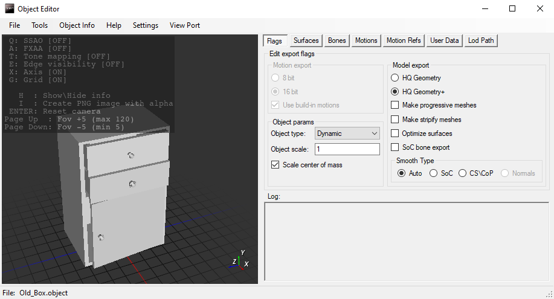

# Object Tool (or XRay Export Tool)

- Program Developers:
  - RedPandaProject (BearIvan and other) (Original Authors)
  - ValeroK
- The version described in the article: [4.35](https://github.com/VaIeroK/XrayExportTool/releases/tag/4.35)
- [Ap-pro forum topic](https://ap-pro.ru/forums/topic/3577-object-editor-v435)

___

## About

Tool for fast editing and exporting raw stalker formats

## Features

- Uncompressed ogf export (HQ Geometry+)
- Removed the limit on the maximum number of vertexes in 65535
- HQ Geometry with patches, exports better than SDK
- Save and load .bones settings
- Load, save, delete .skls animations
- Export animations in 8 bit, 16 bit and uncompressed
- Optimization of meshes with the same textures and shaders is disabled by default (they will not merge into one when exported so you can edit them in the OGF Editor)
- Tuning and collision generation
- Ability to resize models and animations when exporting, keeping the modifier in .object
- Editing Userdata
- Editing LOD
- Editing Motion refs
- Export models with original normals without X-Ray anti-aliasing groups
- Generating LOD models
- Removed the limit on the number of polygons for static meshes
- Viewport displaying the model with textures

| Supported formats |
|---|
| .object |
| .ogf |
| .omf |
| .skl |
| .skls |
| .bones |
| .dm |
| .obj (wavefront) |
| .ltx (bone parts) |

## Functionality

### Hotkeys

- F3 - Export
- F4 - Load
- F5, Ctrl+S - Quick Save .object
- F6 - Save
- Ctrl+Del - Closing the current process

### Buttons

- #### File Button

| Button | Description |
|---|---|
| Load | Imports the selected .object, .skl/.skls, .bones, Bone Parts, Motions Refs, User Data |
| Save | Save file |
| Save As | Saves the file as a .object, .skl, .skls, .bones, Bone Parts file |
| Export | Exports the file as an .ogf, .omf, .object, .dm, C++ (All info/ Vertex/ Faces/ Vertex Normals/ Normals), Motions Refs, User Data |
| Delete | Deletes skls/ Bone parts to default |
| Batch Convert | From ltx/ From File Dialog (To OGF/ To OMF)/ From Folder Dialog (To OGF/ To OMF) |
| Exit | Exit program |

- #### Tools

| Button | Description |
|---|---|
| Surface Params | Enable all 2 sided/Disable all 2 sided |
| Shape Params | All None - All Box - All Sphere - All Cylinder |
| Generate Shapes | Generates shapes for bones |
| Generate LOD | Open the LOD generation tab |
| Import Object Params | Imports parameters from another object |

##### Generate LOD

Allows you to adjust the quality of Lod.

| Checkbox | Description |
|---|---|
| Make progressive meshes | Make progressive meshes |

- #### Object Info

Outputs information about the loaded object

- #### Help

Outputs useful information about aspects and settings of the program

- #### Settings

The default settings menu, where you can set the default values of the parameters, as well as activate additional functions, such as:

| Checkboxes | Description |
|---|---|
| Use No Compress motions ([Need STCoP Reader](https://github.com/mortany/stcop-engine/commit/7d6e967ff081f8f797890f2c1954ce493c8b7084)) | Activates a new animation compression option, by selecting which animations will be exported without compression. Requires a commit in the engine from STCoP WP |
| Program debugging | Activates the tab with buttons for debugging |
| Force Viewport Load | Viewport is automatically loaded each time a file is loaded (slows down loading) |

| Field | Description |
|---|---|
| Image path: | Folder for generated screenshots from viewport |
| FS Ltx path: | If you select fs.ltx, the program will automatically add all other paths to the gamedata files |
| Textures path: | Texture folder for viewport |
| Game Mtl path: | Path to gamemtl.xr file. After that you can select and apply materials to the bones (Bones tab) |

- #### View Port

| Button | Description |
|---|---|
| Reload | Reload viewport |
| Refresh textures | Refresh textures in viewport |
| Open Image folder | Open Image folder |

### Sections

- #### Flags

##### Edit Export Flags

###### Motion Export

| Checkboxes | Description |
|---|---|
| 8 bit | Compression animation for the SoC format |
| 16 bit | Compression animation for CoP format |
| Use build-in motions | When activated, the program will use the downloaded animations instead of the motion references. If there are no animations, the reference animations will be used, if any. When deactivated, the loaded animations will be ignored. Affects everything except Object saves. |

| Field | Description |
|---|---|
| Object Type| Object Type |
| Object Scale | Changes the size of the object when exporting, affecting the size of the model and the size of animations |

| Checkboxes | Description |
|---|---|
| Scale Center of Mass | If you export with a resized object, the collision centers of mass will be recalculated to the new size |

###### Model Export

| Checkboxes | Description |
|---|---|
| HQ Geometry |  |
| HQ Geometry + | Exports the model without optimization of vertices and faces |
| Make Progressive Meshes | Creates progressive meshes when exporting OGF |
| Make Stripify Meshes | Includes optimized vertices and faces on meshes (Optimize meshes for old DirectX and video cards) |
| Optimize Surfaces | Combines meshes with the same texture and shader names |
| SoC bone export | When exporting a dynamic OGF, the polygon will be affected by a maximum of 2 bones. When disabled, a CoP influence of 4 bones will be enabled (not supported in SoC). |

###### Smooth Type

| Checkboxes | Description |
|---|---|
| SoC | Smoothing type for SoC |
| CS\CoP | Smoothing type for CS/CoP |
| Normals | Using the original Split normal, new format |

###### Log

Outputs the program log

- #### Surfaces

Texture Name

| Field | Description |
|---|---|
| Texture | Texture path |
| Shader | Shader path |

| Checkboxes | Description |
|---|---|
| 2 Sided | After exporting the .ogf the model will be rendered from the outside and inside. Increases the number of polygons in the model by a factor of 2. |

- #### Bones

##### Bone Name: Bone name

| Checkboxes | Description |
|---|---|
| No Pickable | When activated, Ray Querry and hit wallmarks will skip this element |
| No Physics | When activated, the engine ignores the physics of the shape |
| Remove After Break | When activated, all bones, after spawning an object, will start a timer "remove_time" from the config, after which the object will be removed |
| No Fog Collider | When activated Volumetric Fog will ignore this element |

| Checkboxes | Description |
|---|---|
| Shape Type: | None - Box - Sphere - Cylinder |

| Field | Description |
|---|---|
| Material | Determines the material of the bone on impact/collision, etc. Which affects sound and particles |
| Mass | Bone mass |

- #### Motions

Shows the animations that are contained in the file

- #### Motions Refs

Shows the Motion Reference that is contained in the file

- #### UserData

Shows Used Data file

- #### LOD

| Checkboxes | Description |
|---|---|
| LOD Path | Path to LOD |

___

## Sources

[Original Source Code by RedPandaProject (BearIvan and other)](https://github.com/RedPandaProjects/XRayEngine)

[Modified Source Code by ValeroK](https://github.com/VaIeroK/XrayExportTool)
