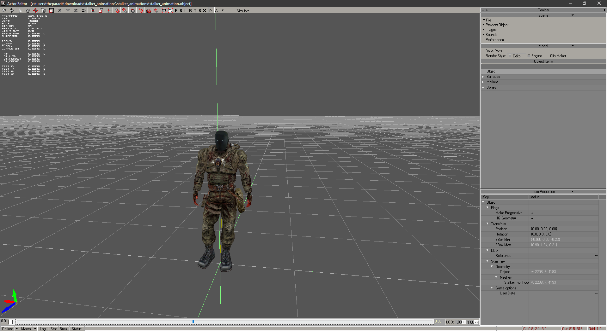

# Actor Editor

___

The Actor editor is usually needed to customize objects (NPCs, Objects, etc.)

___

## Interface

### Toolbar

___

#### Scene

File Button

| Button | Description | Note |
|---|---|---|
| Clear | Clears scene | - |
| Load | Loads an object into a new scene | - |
| Save | Saves object | - |
| Save As | Saves the object as | [.object](../../../main-folders-and-files/file-formats/models/object.md)  .lwo  |
| Make Trumbnail | Creates trumbnail | Creates a thumbnail from the camera view |
| Open Recent | Opens recent | - |
| Import | Imports the model into the scene | - |
| Optimize Motions |  |  |
| Batch Convert |  |  |
| Export | Exports the model to formats  | [.ogf](../../../main-folders-and-files/file-formats/models/ogf.md)  [.omf](../../../main-folders-and-files/file-formats/animations/omf.md)  [.obj](../../../main-folders-and-files/file-formats/models/object.md)  [.dm](../../../main-folders-and-files/file-formats/models/dm.md) C++ |
| Quit | Exiting the program | - |

___

Preview Object Button

| Button | Description | Note |
|---|---|---|
| Custom | After selecting an object in the library it loads the model | It cannot be edited |
| Clear | Clears the scene of objects that were loaded via Preview Object | - |
| Preference | Preference | - |

___

Images Button

| Button | Description |
|---|---|
| Image Editor | Open [Image Editor](../image-editor/image-editor.md) |
| Synchronize Textures | Synchronizes changes |
| Check New Textures |  |

___

Sounds Button

| Button | Description |
|---|---|
| Sound Editor | Open [Sound Editor](../sound-editor/sound-editor.md) |
| Synchronize Sounds | Synchronizes changes |

___

Preferences Button

Opens a window with preferences

___

##### Model

Bone Parts Button

Shows the [Bone Parts](../../../main-folders-and-files/file-formats/models/bone-parts.md) of the object's skeleton

Example Bone Parts of `stalker_animation.object`
___

Render Style

| Render Style | Description |
|---|---|
| Editor | Editor Render Style |
| Engine | Engine (X-Ray 1.6) Render Style |
| Clip Maker |  |

___

##### Object Items

Shows available items at the object (Surface, Object, Motions, Bones, etc.)
___

##### Item Properties

Shows parameters of the selected element of the model object

**For the object**

| Flags | Description |
|---|---|
| Make Progressive |  |
| HQ Geometry |  |

| Transform | Description |
|---|---|
| Position |  |
| Rotation |  |
| BBox Min |  |
| BBox Max |  |

| LOD | Description |
|---|---|
| Reference | LOD Reference |

**Summary**

Displays information about the object

| Game options | Description |
|---|---|
| User Data |  |

**For surface**

| Surface | Description |
|---|---|
| Name | Texture Name |
| Texture | Path to texture |
| Shader | Shader |
| Compile | Compile Shader |
| Game Mtl | Game Mtl Shader |
| 2 Sided | Double-sided texture |
| Face Count | Face Count |
