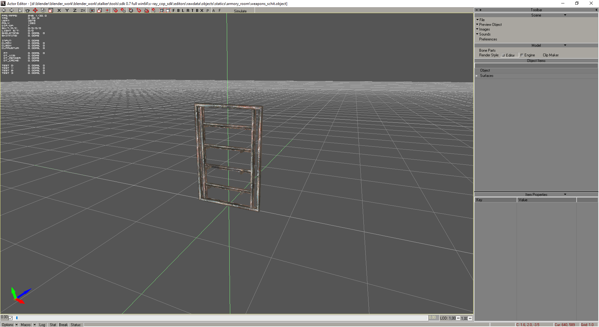
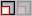
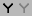
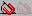

# Interface

___

Depending on the different versions of the SDK and the editors in it, the interface may be different

SDK 0.7

SDK 0.8 by RedPanda

But the basic buttons and their functionality remain in place

## Editing Toolbar

Hotkeys in the table are standard (they can be set under Preference > Keyboard > Hotkeys)

| Image | Name | Description | Note |
:---:|---|---|---|
|  | Undo | Undo | - |
|  | Redo | Redo | - |
|  | Select | Used to select objects | Before the object can be moved, it must be selected with this button |
|  | Add | Adds objects | To add an object, select it in the object panel |
|  | Move | Allows to move objects | - |
|  | Rotate | Allows to rotate objects | - |
|  | Uniform Scale | Allows to scale objects | Scale object on all axes |
|  | Restrict to X | Locks the object to the X-Axis | allowing movement/rotation only on that axis |
|  | Restrict to Y | Locks the object to the Y-Axis | allowing movement/rotation only on that axis |
|  | Restrict to Z | Locks the object to the Z-Axis | allowing movement/rotation only on that axis |
|  | Restrict to Z/X | Locks the object to the Z and X Axis | allowing movement/rotation only on that axis |
|  | Parent CS Toggle |  |  |
|  | Non-Uniform Scale | Ignores proportions when scaling | Scale object along the selected axis only |
|  | Grid Snap Toggle | Snap the object to the grid when creating or when Move + Ctrl + LMB | - |
|  | Object Snap Toggle | Snap an object to an object when creating or with Move + Ctrl + LMB | - |
|  | Moving Snap To Object Toggle | Snap an object to an object in Move mode | - |
|  | Normal Aligment | Take into account the normal during object snapping | - |
|  | Vertex Snap Toggle | Snap the object to the object vertices when creating or when Move + Ctrl + LMB | - |
|  | Angle Snap Toggle | Discrete rotation | Works when the Rotate button is pressed |
|  | Moving Snap Toggle | Discrete motion | Works when the Move button is pressed |
|  | Zoom Extent | Standard zoom of the entire scene | - |
|  | Zoom Extents Selected | Standard zoom of the selected object | - |
| **F** | Front View | Front View | - |
| **B** | Back View | Back View | - |
| **L** | Left View | Left View | - |
| **R** | Right View | Right View | - |
| **T** | Top View | Top View | - |
| **B** | Bottom View | Bottom View | - |
| **X** | Reset View | Reset View | - |
| P | Zoom Extents | Free Camera Mode | - |
| A | Zoom Extents Selected | Centers the camera view on the origin of coordinates | - |
| F | Zoom Extents Selected | Camera Flight Mode | - |
| Simulate | Simulate | Enables physics simulation | Only in [Actor](actor-editor.md) & [Level Editor](level-editor.md) |
| UseSimulatePositions | UseSimulatePositions |  | Only in [Level Editor](level-editor.md) |

___

## Scene Properties

### Options Button

| Render | Description |
---|:---:|
| Quality | Render quality |
| Fill Mode | Draw or Fill mode Point Wireframe Solid |
| Shade Mode | Shading mode selection [Flat](https://en.wikipedia.org/wiki/Shading#Flat_shading) [Gouraud](https://en.wikipedia.org/wiki/Gouraud_shading) |
| Edged Face | Enables displaying edges at polygons |
| HW Render | Enables Hardware Rendering |
| Linear Filter | Enables linear filtering |
| Textures | Enables texture display |

| Options | Description |
---|---|
| Draw Safe React |  |
| Draw Grid | Draw Grid |
| Weather |  |
| Fog |  |
| Mute Sounds | Mutes sounds from objects that have sound in the SDK |
| Light Scene | Light Scene |
| Real Time | Real Time |

### Macro Button

### Log Button

Outputs log

### Stat Button

Displays scene statistics

### Break Button

Break operation

### Status Button

Show operation status
