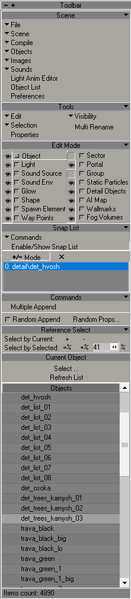

# Level Editor

___

Level Editor is used to create locations

___

## Interface

### Toolbar

#### Scene

File Button

| Button | Description | Note |
|---|---|---|
| Clear | Clear scene | Essentially creates a new scene |
| Open | Opens .level file | - |
| Save | Save file | - |
| Save As | Saves as | .level |
| Open Selection |  |  |
| Save Selection As | Save Selection As | .level |
| Make pack... |  | - |
| Open Recent | Opens recent | - |
| Quit | Exiting the program | - |

Scene Button

| Button | Description | Note |
|---|---|---|
| Options | Opens level options | - |
| Validate | Checks the level for errors | - |
| Summary info | Shows information about objects in the scene | - |
| Highlight Texture... | Highlights the selected texture | - |
| Clear Debug Draw |  |  |
| Export entire Scene as Obj |  | *.object  *.lwo  *.txt  *.xr  *.wav  *.obj  *.ltx  *.cpp |
| Export Selection as Obj |  | *.object  *.lwo  *.txt  *.xr  *.wav  *.obj  *.ltx  *.cpp |

Compile Button

| Button | Description | Note |
|---|---|---|
| Build | Creates a [*.prj](../../../main-folders-and-files/file-formats/game-levels/prj.md) precompilation file | - |
| Make Game | Creates a [*.game](../../../main-folders-and-files/file-formats/game-levels/game.md) file | - |
| Make Details | Creates a [*.details](../../../main-folders-and-files/file-formats/game-levels/details.md) file | - |
| Make HOM | Creates a [*.hom](../../../main-folders-and-files/file-formats/game-levels/hom.md) file |  |
| Make Sound Occluder | Creates a [*.som](../../../main-folders-and-files/file-formats/game-levels/som.md) file |  |
| Make Ai-Map | Creates a [*.ai](../../../main-folders-and-files/file-formats/game-levels/ai.md) file | - |
| Import Error List | Import Error List | *.err |
| Export Error List | Export Error List | *.err |
| Clear Error List | Clear Error List | - |

Objects Button

| Button | Description | Note |
|---|---|---|
| Library Editor | Opens the Object Library | Scene should be before the opening |
| Reload Objects | Reload Objects | - |
| Clear Library | Clear Library | - |
| ClipEditor |  |  |

Images Button

| Button | Description | Note |
|---|---|---|
| Image Editor | Open Image Editor | - |
| Reload Textures | Reload Textures | - |
| Synchronize Textures |  | - |
| Check New Textures | Check New Textures | - |
| Edit minimap |  |  |
| SyncTHM |  |  |

Sounds Button

| Button | Description | Note |
|---|---|---|
| Sound Editor | Open Sound Editor | - |
| Synchronize Sounds |  | - |
| Refresh Environment Library |  | - |
| Refresh Environment Geometry |  |  |

Light Anim Editor Button

Opens Light Anim Library

Object List Button

Shows the list of objects in the scene

Preference

Shows preferences in the editor

#### Tools

Various object editing tools

#### Edit Mode

Object type selection list

>Eye () - shows these objects in the viewport

#### Snap List

#### Commands

Allows you to add multiple items at once with random settings

#### Reference Select

#### Current Object

Allows you to select a selected object in Library Objects

#### Objects

Shows the library (Objects, Particles, etc.) based on the one selected in Edit Mode
