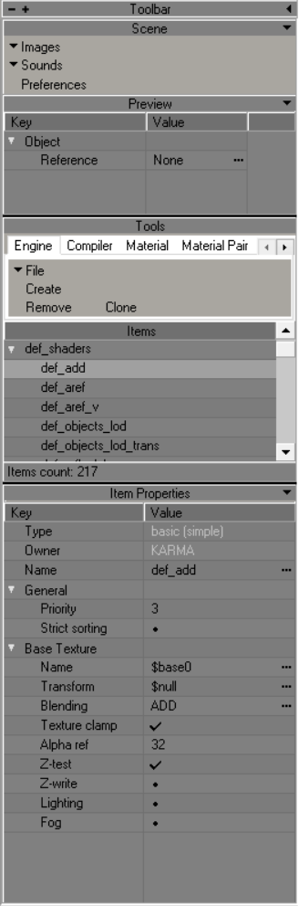
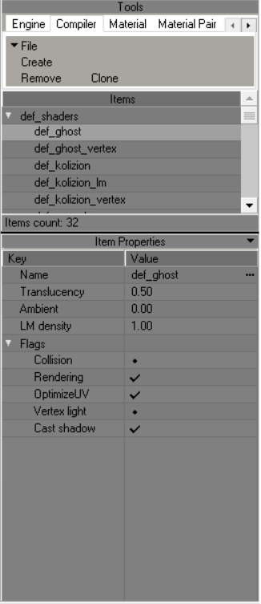

# Shader Editor

___

Used to create/edit shaders

___

## Interface

## Tools

| Button | Description |
|---|---|
| File | Save  Reload |
| Create | Create New Shader |
| Remove | Remove Selected Shaders |
| Clone | Clone Selected Shaders |

___

### Engine Shader Parametres

[Shader List Here](../shaders/shaders-list/shaders-list.md)

#### Shader Types

| Name | Description |
|---|---|
| \<none> |  |
| EDITOR: selection | Designed to display object selection in the SDK |
| EDITOR: wire | Wireframe shader |
| INTERNAL: blur | Blur effect (dx8) |
| INTERNAL: gray-scale effect | Discoloration effect (dx8) |
| INTERNAL: lighting projecting | Lightening effect (dx8) |
| INTERNAL: shadow projecting | General shadow projection (dx8) |
| LEVEL: (lmap+env\*const)*base | A type of shader with a wide range of functions. Through it you can transform ID0 textures, assign Environment map to them and customize them, with changing RGBA constants |
| LEVEL: Implicit | Designed to apply illuminance information to model geometry from light sources such as the sun (Outdated) |
| LEVEL: Implicit**detail | Designed to replace the outdated LEVEL: implicit. Allows to apply several types of detail map to the main texture, supports mask technology |
| LEVEL: detail objects | Designed for detailed objects like grass. Supports alpha channel dissolution |
| LEVEL: diffuse*base | A shader designed to apply vertex lighting to the geometry that will use it |
| LEVEL: diffuse*base.aref | A shader designed to apply vertex lighting to geometry to which alpha channel textures are assigned |
| LEVEL: lmap*(env^base) | Lightmap type of shader with a feature set such as Environment map and Alpha-Blend |
| LEVEL: lmap*base (default) | Default Lightmap shader type. This shader type is used in most of the geometry in the game. It can use tessellation |
| LEVEL: lmap*base.aref | A shader designed to apply lightmap lighting to geometry to which alpha channel textures are assigned |
| LEVEL: trees/bushes | A type of shader for flora and LOD.  Supports alpha channel dissolution |
| MODEL: Default | Default shader for dynamic geometry. Supports alpha channel and tessellation |
| MODEL: env^base | Similar to LEVEL: lmap*(env^base), only for dynamic objects |
| basic (simple) | A basic shader, with a wide range of features. Supports transformation, different types of blending, adjusting the effect of lighting on it and Z-buffering. Used for most effects, such as glow |
| particles | Practically identical to basic (simple), except that it does not support a certain set of functions that are needed only for static geometry |

___

### Compiler Shader Parametres

[Compiler Shader List Here](../shaders/shaders-list/compiler-shaders-list.md)

**Name**

> Shader Name

**Translucency**

> Translucency of object with this shader

**Ambient**

>

**LM density**

#### Flags

**Collision**

> Enable Collision for object with this shader

**Rendering**

> An object with this shader will not render in the game world

**OptimizeUV**

> ?

**Vertex Light**

> ?

**Cast Shadow**

> Enable shadow casting for object with this shader

___

### Material Parametres

**Name**

> Material Name

**Desc**

> Material Description

#### Flags

**Dynamic**

> whether the object is dynamic or not

**Passable**

> passable material (no physical collision)

**Bounceable**

> Enabling bounce from this material

**Skidmark**

> whether it is possible to leave marks on this material

**Bloodmark**

> can the material be splattered with blood

**Climable**

> whether it is possible to climb the material

**Liquid**

> Is the material a liquid?

**Suppress Shadows**

> do not draw shadows on this material

**Supress Wallmarks**

> not to draw marks on this material

**Actor Obstacle**

> An actor's ability to collide with the material?

**Bullet No Ricoshet**

> Will the bullet ricochet off the material

#### Physics

**Friction**

> friction coefficient

**Damping**

> softness coefficient of the material (collision energy loss)

**Spring**

> material stiffness coefficient (spring stiffness)

**Bounce start vel**

> initial velocity at which the bounce starts to work

**Bouncing**

> bounce coefficient

#### Factors

**Bounce Damage**

> the damage that is inflicted by bouncing?

**Injurius**

> radiation exposure by contact

**Shooting (1-went through)**

> material penetrability

**Shooting MP (1-went through)**

> material penetrability in Multiplayer?

**Transparency (1-full transp)**

> material transparency for AI

**Sound occlusion (1-full hear)**

> attenuation factor

**Flotation (1-full passable)**

> deceleration coefficient when passing through this material

**Density Factor**

> how many m/s the bullet slows down when passing 1 m of material

___

### Material Pair

[Material List Here](../shaders/shaders-list/compiler-shaders-list.md)

**Command**

> ?

**Parent**

> ?

**Breaking Sounds**

> Breaking Sounds

**Step Sounds**

> Step Sounds

**Collide Sounds**

> Collide Sounds

**Collide Particles**

> Collide Particles

**Collide Marks**

> Collide Marks

___

### Sound Env

**Name**

> Sound Environment Name

#### Environment

**Set**

> Reset - Resets parameters
> Identity - Sets the parameters to the parameters from Identity

**Preset**

| Presets | Description |
|---|---|
| Alley | Alley |
| Arena | Arena |
| Auditorium | Auditorium |
| Bathroom | Bathroom (most likely a tiled room) |
| Carpet Hallway | Corridor (hallway) with carpeting (likely to affect the sound of footsteps?) |
| Cave | Cave |
| City | City |
| Concert Hall | Concert Hall |
| Dizzy | Dizzy |
| Drugged | Drugged |
| Forest | Forest |
| Generic | Generic |
| Hallway | Hallway |
| Hangar | Hangar |
| Livingroom | Livingroom |
| Mountains | Mountains |
| Padded Cell | Padded Cell |
| Parkinglot | Parkinglot |
| Plain | Plain |
| Psychotic | ? |
| Quarry | Quarry |
| Room | Room |
| Sewer Pipe | Sewer Pipe |
| Stone Corridor | Stone Corridor |
| Stone Room | Stone Room |
| Under Water | Under Water |

**Size**

> This setting sets the perceived size of the audio environment. The larger the number, the larger and wider the environmental space will "sound"

**Diffusion**

> Controls the master density of audio reflections and reverbrations, i.e. how thick the reverb and echo effects will be

#### Room

**Room**

> This controls the initial volume level and amount of reverb and echo effects; "0" equates to full effects, while "-10000" equates to no effects

**RoomHF**

> Sets the high frequency attenuation via a low-pass filter for Room setting and audio reflection; "0" equates to no low-pass filter, while "-10000" equates to no sound refelected

#### Distance Effects

**RoomRolloffFactor**

> This setting attenuates reflected sound based on how far from the audio source the player is; the higher the value, the more a sound will decay the greater the player's distance from the source of the audio

**AirAbsorptionHF**

> This setting attenuates high frequencies based on the distance between the player and the audio source, but simulates a denser environment. The higher the value, the less absorbent the environement is (e.g. a low value would mimic thick fog, a high value would mimic a dry desert or tundra)

#### Reflections

**Reflections**

> This sets the amount of initial echoes dependant upon the Room setting. "1000" equates to maximum initial reflections, while "-10000" equates to no initial reflections

**ReflectionsDelay**

> Sets the amount of time (in milliseconds) from the initial perception of the audio source, to the first percieved echo. The higher the value, the longer the amount of time between first hearing a sound, and hearing any echoes of that sound

#### Reverb

**Reverb**

> This setting controls the amount of late reverbrations dependant upon the Room setting. "2000" equates to maxmium late reverbrations, while "-10000" equates to no late reverbrations

**ReverbDelay**

> This sets the length of time (in milliseconds) from the initial perception of audio reflections, to the first percieved reverbration. The higher the value, the longer the amount of time between the first echo and it's resounding reverbration

#### Decay

**DecayTime**

> Controls the decay time of the audio reverbration; how quickly the reverbration fades away. The smaller the value, the quicker reverbrations fade out, and the smaller the percieved room size is; the higher the value, the longer it takes for reverbrations to fade out

**DecayHFRatio**

> Sets the ratio of high frequency reverbration decay relative to actual reverbration decay time. The higher the value, the brighter the high frequency reverbration decay; the lower the value, the more dull the high frequency reverbration
