# Shaders List (shaders.xr)

___

## About

This section contains a list and description of the shaders that are available in the shaders.xr file. This file contains descriptions of shader settings.

## List

### Shaders for static objects

| Shader name | Description |
|---|---|
| zfill |  |
| xwindow | Old unused glass shader |
| selflight | self-lighting material |
| glass |  |
| friendly_indicator |  |
| font |  |
| default_pn_hm |  |
| default_pn |  |
| default_hm |  |
| default | basic lightmap shader |
| clouds |  |

### ufp Shaders

| Shader name | Description |
|---|---|
| ufp_blend |  |

### Test Shaders

| Shader name and path | Description |
|---|---|
| test\aaaaaaaa__ |  |
| test\aass |  |

### Sky Shaders

| Shader name and path | Description |
|---|---|
| sky\background |  |
| sky\clouds |  |
| sky\clouds_old |  |
| sky\skydome |  |

### Particles Shaders

| Shader name and path | Description |
|---|---|
| particles\add |  |
| particles\alpha_add |  |
| particles\blend |  |
| particles\dark |  |
| particles\set |  |
| particles\xadd |  |
| particles\xblend |  |
| particles\xdistort |  |

### Shaders for dynamic objects

| Shader name and path | Description | Preview |
|---|---|
| models\antigas_glass | CubeMap reflection shader (variant 1) |  |
| models\artefact | CubeMap reflection shader (variant 2) | 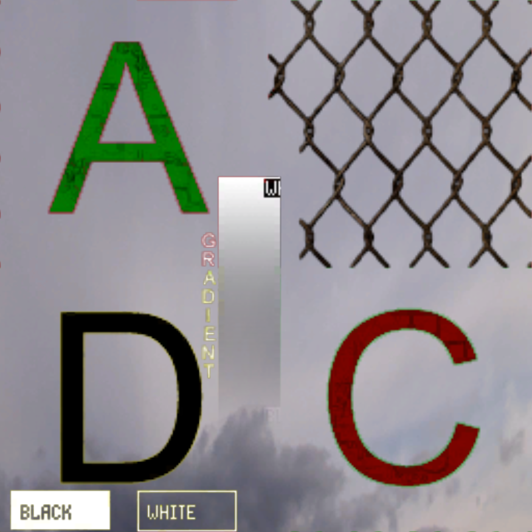 |
| models\artefact2 | CubeMap reflection shader (variant 3) | 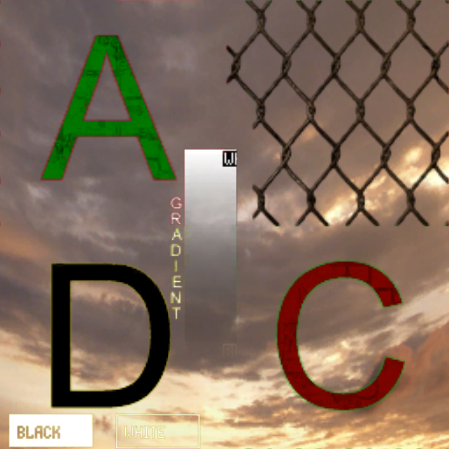 |
| models\artifact-anim-env |  |  |
| models\glass_stalker_refl |  |  |
| models\lfo_black_lens_weapons |  |  |
| models\lfo_black_soft_lens_weapons |  |  |
| models\lfo_glass_lens_weapons |  |  |
| models\lfo_light_dot_weapons |  |  |
| models\lightplanes | self-lighting material with translucent and falloff effect |  |
| models\mirror |  |  |
| models\model | basic shader | 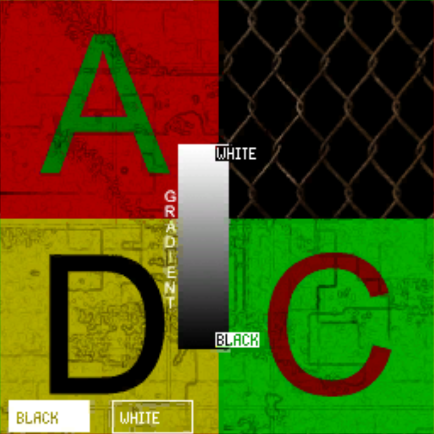 |
| models\model_aref | transparency. alpha test - trans (with gradients) | 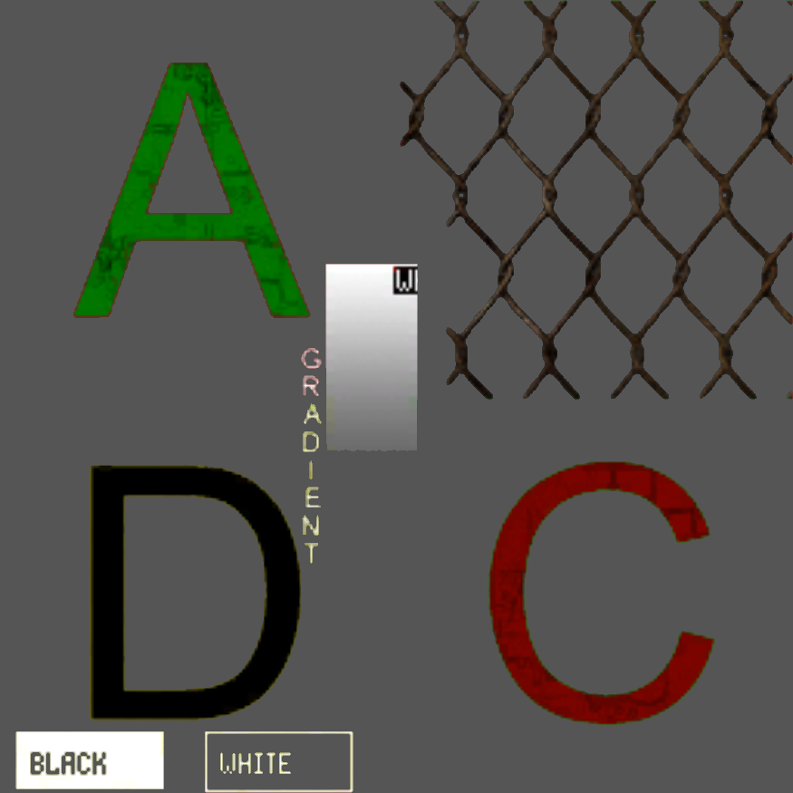 |
| models\model_fur | transparency. alpha test - aref (no gradients) |  |
| models\hm |  |  |
| models\pn |  |  |
| models\pn_hm | enable tesselation on models (DX11 only) |  |
| models\pautina | material with transparency and falloff effect | 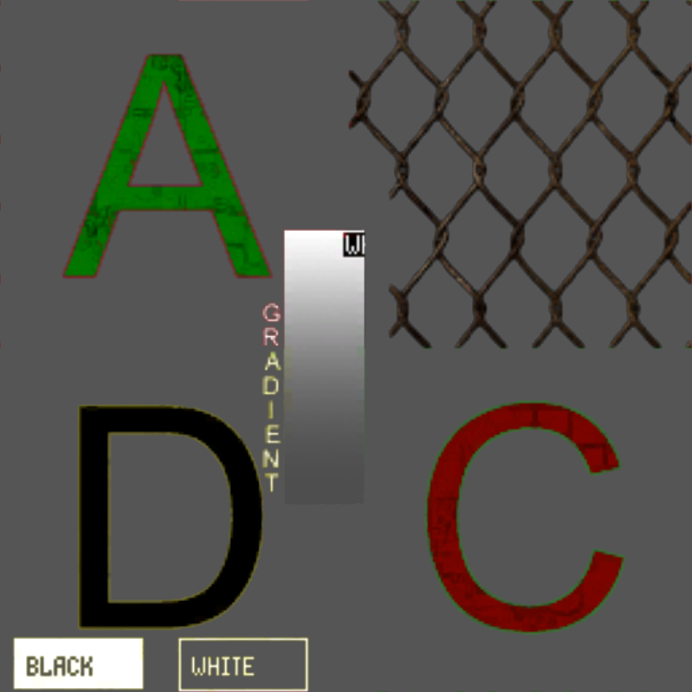 |
| models\selflight | basic self-lighting material |  |
| models\seftlight_det | uses an engine shader variable. For example, it is possible to make the detector screen turn off when the battery level is too low |  |
| models\selflightl | self-lighting material with lower intensity |  |
| models\transparent | transparency |  |
| models\water |  |  |
| models\water_ryaska |  |  |
| models\weapons | CubeMap reflection shader (variant 4) | 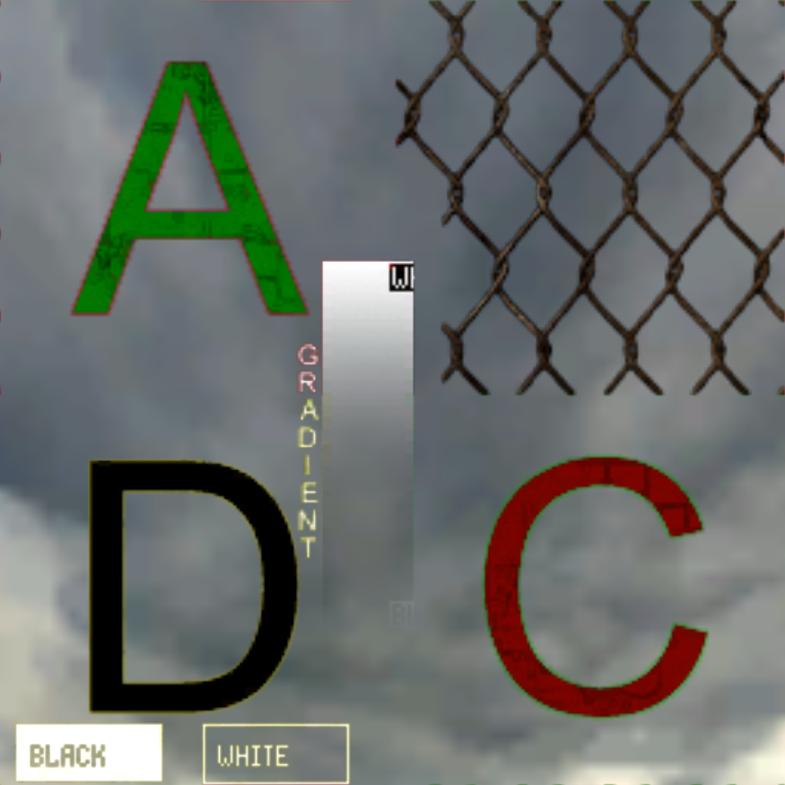 |
| models\window | semi-transparent shader with CubeMap reflection | 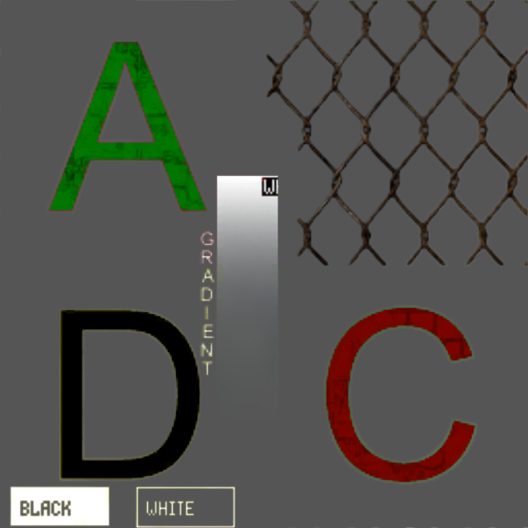 |
| models\xanomaly |  |  |
| models\xdistor |  |  |
| models\xdistorcolor |  |  |
| models\xdistorcolorl |  |  |
| models\xdistorinv |  |  |
| models\xmonolith |  |  |
| models\xwindows |  |  |

### Levels Shaders

| Shader name and path | Description |
|---|---|
| levels\agroprom_asfalt | terrain shader (asphalt) |
| levels\agroprom_grass | terrain shader (grass) |
| levels\agroprom_gravel | terrain shader (gravel) |
| levels\bar_asfalt |  |
| levels\bar_asphalt |  |
| levels\bar_grass |  |
| levels\bar_gravel |  |
| levels\darkcape_asfalt |  |
| levels\darkcape_grass |  |
| levels\darksc_asfalt |  |
| levels\darksc_grass |  |
| levels\darkvalley_asfalt |  |
| levels\darkvalley_grass |  |
| levels\darkvalley_sand |  |
| levels\dead_city_asfalt |  |
| levels\dead_city_grass |  |
| levels\dead_city_ground |  |
| levels\deadcity_asfalt |  |
| levels\deadcity_earth |  |
| levels\dead_city_grass |  |
| levels\escape_asfalt |  |
| levels\escape_asfalt_noblend |  |
| levels\escape_grass |  |
| levels\escape_sand |  |
| levels\garbage_asfalt |  |
| levels\garbage_earth |  |
| levels\garbage_grass |  |
| levels\generator_asfalt |  |
| levels\generator_earth |  |
| levels\generators_art |  |
| levels\hospital_grass |  |
| levels\hospital_sand |  |
| levels\jupiter_asfalt |  |
| levels\jupiter_earth |  |
| levels\jupiter_grass |  |
| levels\jupiter_plates |  |
| levels\l01_escape_asfalt |  |
| levels\l01_escape_asfalt_noblend |  |
| levels\l01_escape_detritus |  |
| levels\l01_escape_grass |  |
| levels\l01_escape_sand |  |
| levels\limansk_asfalt |  |
| levels\limansk_earth |  |
| levels\limansk_grass |  |
| levels\maedow_asfalt |  |
| levels\maedow_grass |  |
| levels\maedow_sand |  |
| levels\marsh_earth |  |
| levels\military_asfalt |  |
| levels\military_grass |  |
| levels\military_sand |  |
| levels\pripyat_asfalt |  |
| levels\pripyat_earth |  |
| levels\pripyat_gras2 |  |
| levels\pripyat_grass |  |
| levels\radar_asfalt |  |
| levels\radar_grass |  |
| levels\red_forest_asfalt |  |
| levels\red_forest_earth |  |
| levels\red_forest_grass |  |
| levels\red_forest_leaves |  |
| levels\red_forest_sand |  |
| levels\stancia |  |
| levels\stancia_asfalt |  |
| levels\stancia_build_kanal |  |
| levels\stancia_kanal |  |
| levels\truckscemetery |  |
| levels\truckscemetery_asfalt |  |
| levels\truckscemetery_grass |  |
| levels\yantar_asfalt |  |
| levels\yantar_earth |  |
| levels\zaton_asfalt |  |
| levels\zaton_cracked |  |
| levels\zaton_earth |  |
| levels\zaton_earth_2 |  |
| levels\zaton_grass |  |
| levels\zaton_pebbles |  |
| levels\zaton_plates |  |
| levels\zaton_sand |  |

### HUD Shaders

| Shader name and path | Description |
|---|---|
| hud\add |  |
| hud\add-alpha |  |
| hud\cursor |  |
| hud\default |  |
| hud\fog_of_war |  |
| hud\hitmarker |  |
| hud\p3d |  |
| hud\set |  |
| hud\seta |  |

### Flora Shaders

| Shader name and path | Description |
|---|---|
| flora\leaf_wave |  |
| flora\trunk_wave |  |

### Effects Shaders

| Shader name and path | Description |
|---|---|
| effects\bullet_tracer |  |
| effects\flame |  |
| effects\flare |  |
| effects\fx_refl_pod |  |
| effects\glow |  |
| effects\lightning |  |
| effects\lightplanes |  |
| effects\moon |  |
| effects\rain |  |
| effects\screen_add |  |
| effects\screen_blend |  |
| effects\screen_noise |  |
| effects\screen_set |  |
| effects\shadow |  |
| effects\shadow_blur |  |
| effects\shadow_world |  |
| effects\sun |  |
| effects\wallmark |  |
| effects\wallmarkblend |  |
| effects\wallmarkmult |  |
| effects\wallmarkset |  |
| effects\water | pure water shader |
| effects\waterryaska | crayfish shader |
| effects\waterstuden | swamp shader |
| effects\watertest |  |
| effects\watertest-1 |  |

### SDK Shaders

| Shader name and path | Description |
|---|---|
| editor\ai_node |  |
| editor\do_base |  |
| editor\selection |  |
| editor\spawn_icon |  |
| editor\wire |  |

### Details Shaders

| Shader name and path | Description | Preview |
|---|---|---|
| details\blend |  |  |
| details\lod |  |  |
| details\set |  | 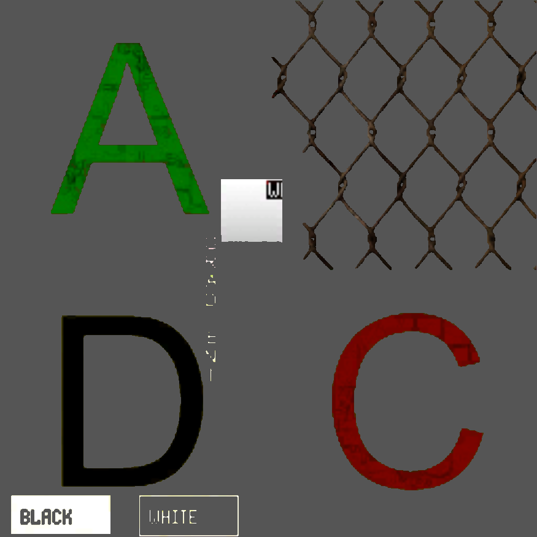 |

### Def_Shaders

| Shader name and path | Description | Preview |
|---|---|---|
| def_shaders\def_add |  |  |
| def_shaders\def_aref |  | 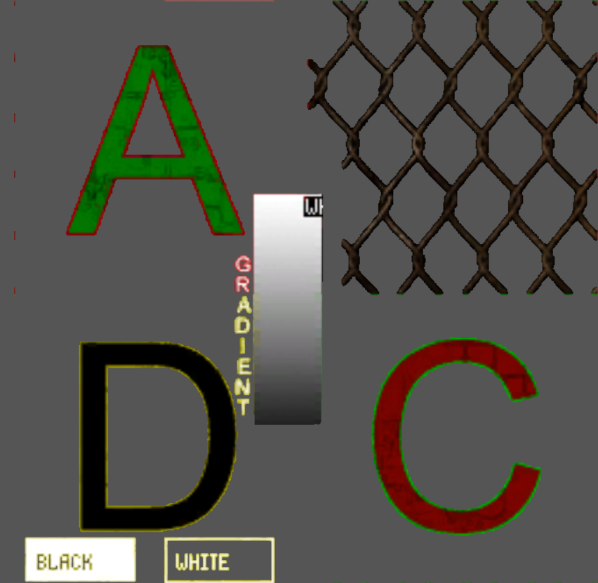 |
| def_shaders\def_aref_v |  | 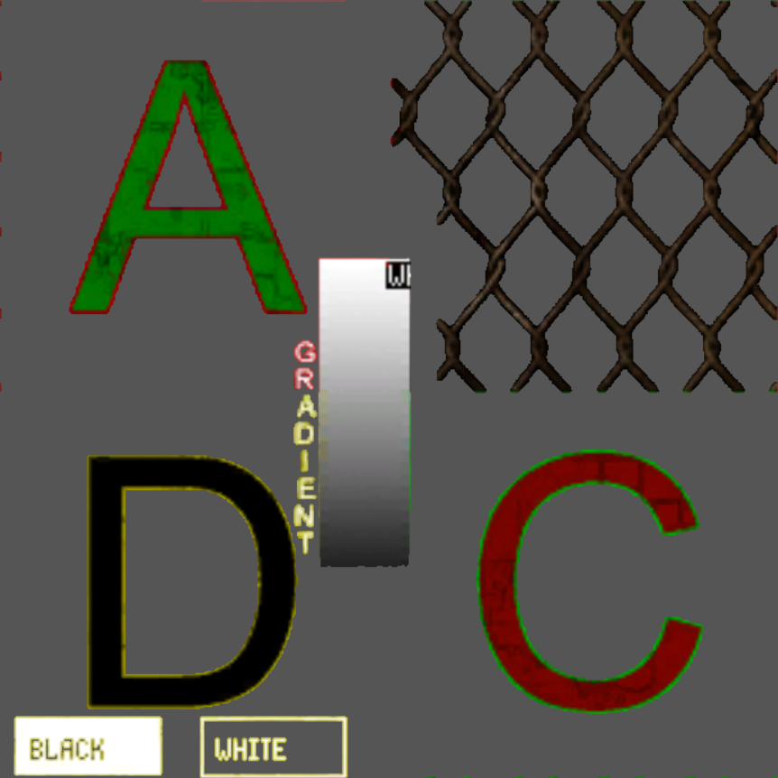 |
| def_shaders\def_objects_lod |  | 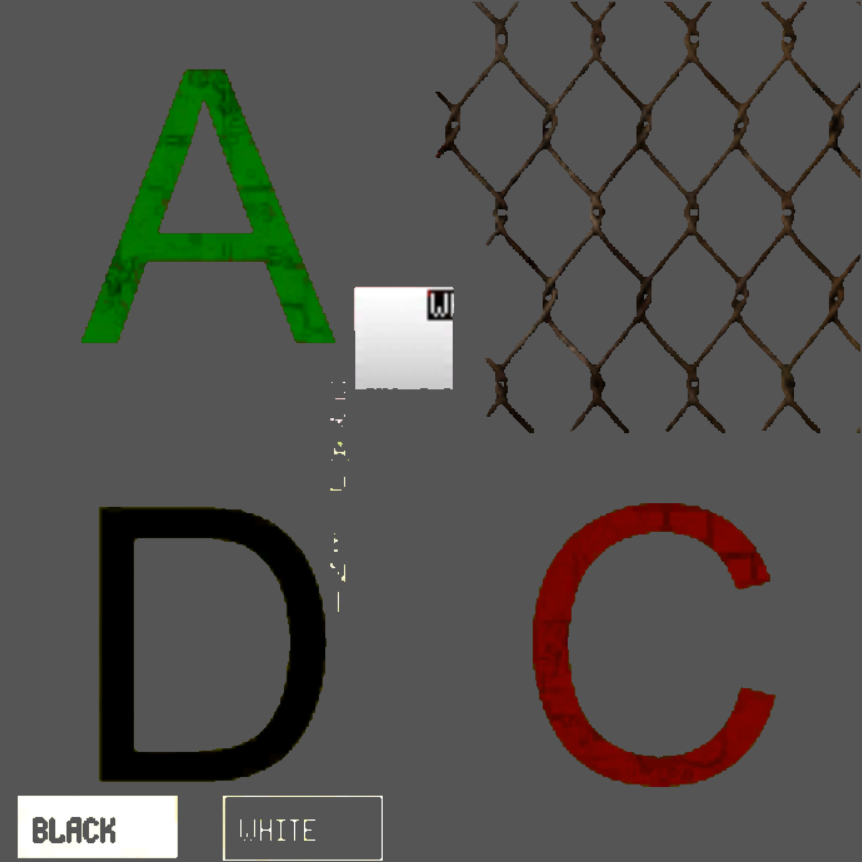 |
| def_shaders\def_objects_lod_trans |  | 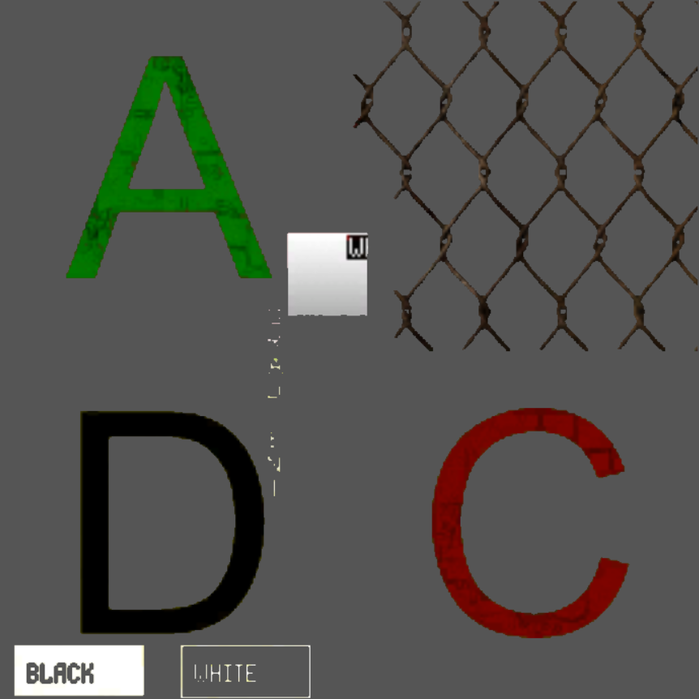 |
| def_shaders\def_refl_alpha |  |  |
| def_shaders\def_refl_alpha_heli |  |  |
| def_shaders\def_refl_trans |  | 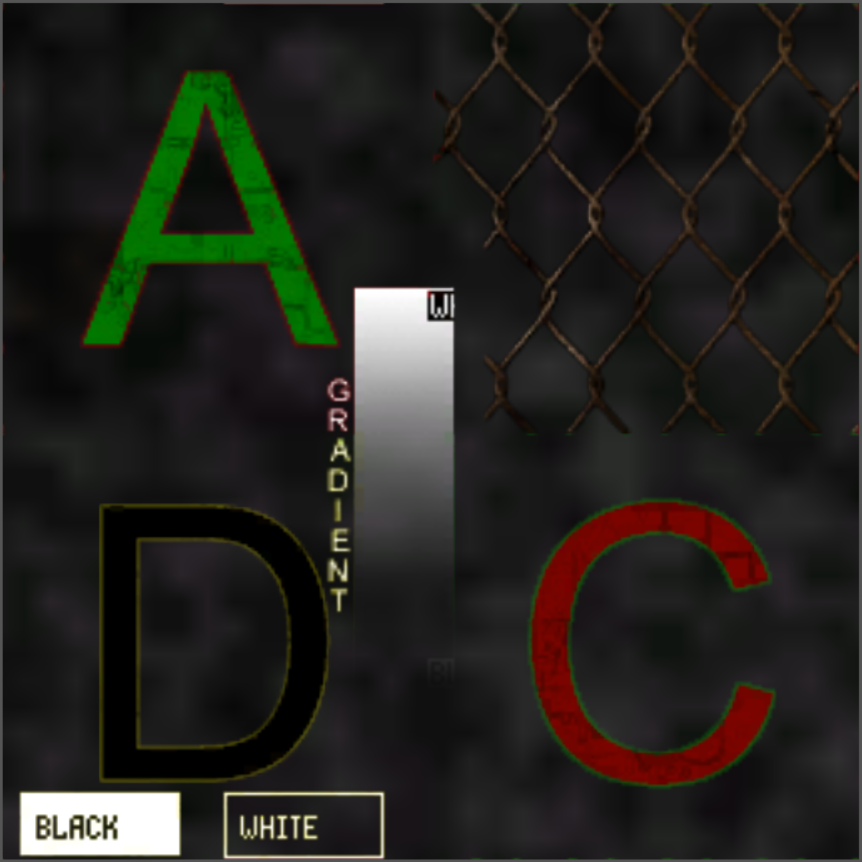 |
| def_shaders\def_trans |  | 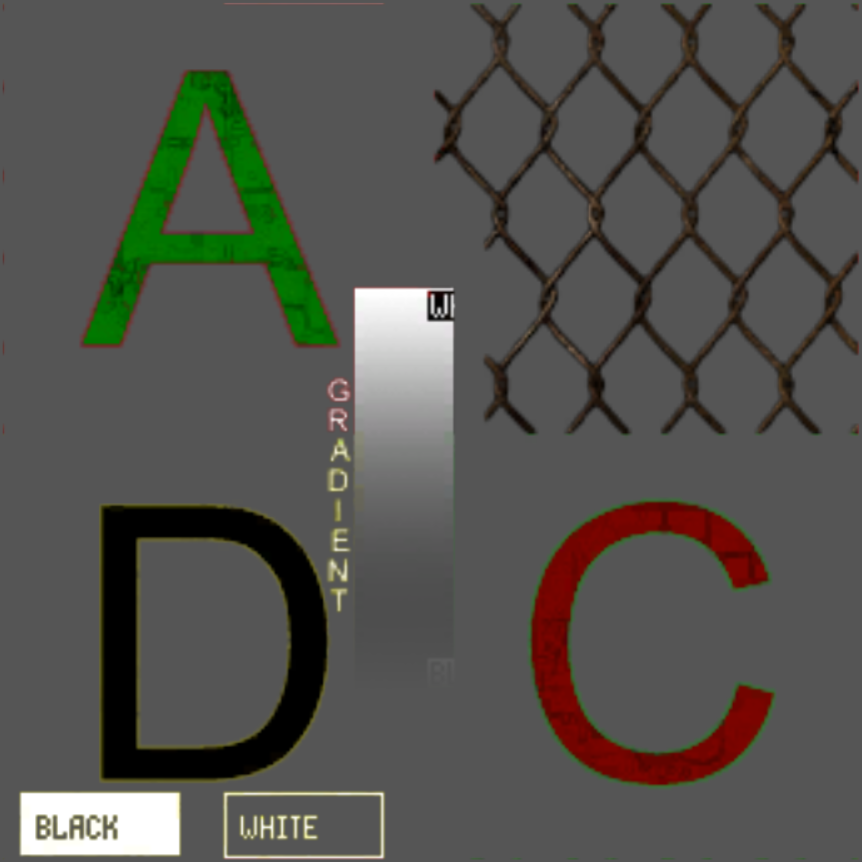 |
| def_shaders\def_trans_v |  |  |
| def_shaders\def_trans_v_tuchi |  | 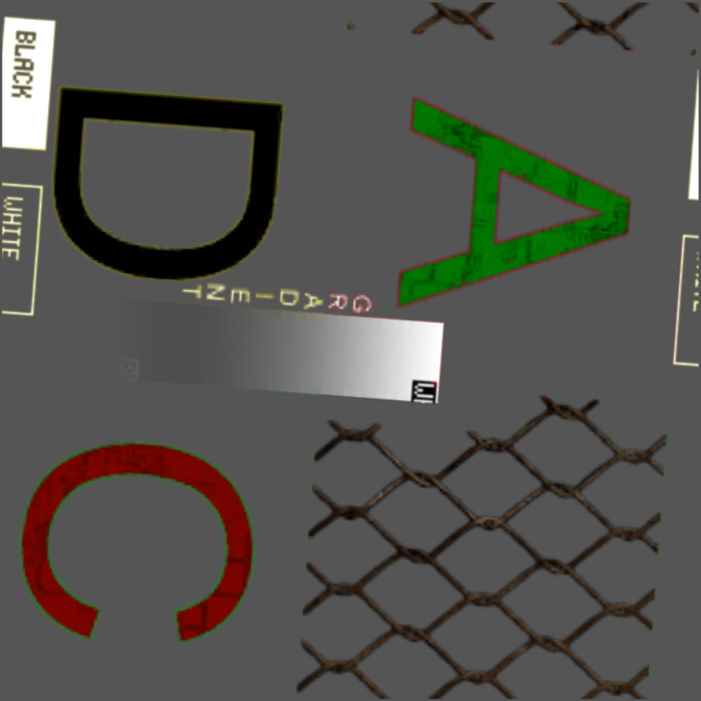 |
| def_shaders\def_vertex |  |  |
| def_shaders\def_vertex_hm |  |  |
| def_shaders\def_vertex_pn |  |  |
| def_shaders\def_vertex_pn_hm |  |  |
| def_shaders\lod |  | 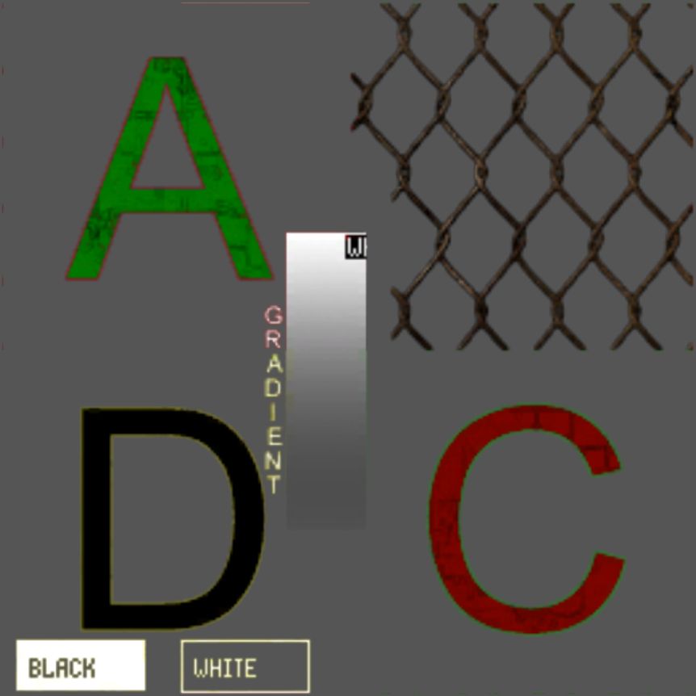 |
| def_shaders\lod_old |  |  |

### Debug Shaders

| Shader name and path | Description |
|---|---|
| debug\ai_nodes |  |
| debug\wireframe |  |
