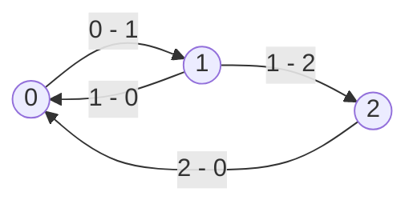

# Finite State Machines

___

## About

Finite State Machines (FSM) are a common and convenient technique for programming the behavior of bots (NPCs) in computer games.

The FSM is based on the principle that at any given moment the NPC is in some well-defined state. Such states are a finite number, and all of them are known in advance. For example, the states of the bot can be: doing nothing, walking the route, playing sound or animation. A special state is when the NPC is under the control of the game's AI.

An NPC can go from one state to another after meeting some transition condition. When specifying a transition condition from state A to state B, we actually define under what conditions the transition from one state to another will be performed. At that, transition from B to A requires defining its own transition condition. If the transition condition between any two states is not set, the transition is considered impossible.

The FSM structure can be represented as an oriented graph, whose vertices (circles) are states, and edges (arrows) are transition conditions.

### Example

|||
|---|---|
| States | 0 – soldier's state under the control of the AI  1 – the soldier says "stop, I'll shoot!"  2 – the soldier says "gone bastard" |
| Transition conditions | 0-1 – soldier sees actor for the first time  1-0 – soldier finished saying the phrase "stop, I'll shoot!" and sees the actor  1-2 - soldier finished saying the phrase "stop, I'll shoot!" and lost sight of the actor  2-0 - soldier finished saying the phrase "gone bastard". |
