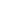

# Creating Motion Marks in Blender

___

## Need to know

- How working in Blender and creating animations
- What a Motion Marks
- Skeleton animations ([*.skl](../../reference/file-formats/animations/skl-skls.md), [*.skls](../../reference/file-formats/animations/skl-skls.md), [*.omf](../../reference/file-formats/animations/omf.md))

___

## About

Motion Marks can be useful for creating events in animations (e.g., enabling IK on NPC legs, marking the end of a reload animation, etc.).

```admonish info
In the [Blender X‑Ray Addon](../../modding-tools/blender/blender-x-ray-addon-summary.md), Motion Marks are implemented via [Custom Properties](https://docs.blender.org/manual/en/latest/files/custom_properties.html).
To make an action include keyframes for this property, you need to animate the Custom Property itself.
If the property’s value equals zero (or False) in a particular frame, that frame does not belong to the mark’s interval.
For any other value, the keyframe falls within the mark interval.
To preserve these marks when exporting, you must set the export format to `CS/CoP`.
```

## Start

To get started you’ll need to create an animation.

Pick any bone and open its `Bone Properties`. Add a Custom Property to the bone. Click `Edit Property`t the Motion Mark to be called. to rename it to whatever you wan

- Open `Dope Sheet` or `Timeline` and select the animation you want to work with.
- In the N‑panel, find the X‑Ray section.
- In the Marks Bone field, assign the bone that has the Custom Property.
- Create the Motion Marks and choose the Custom Property you just added.
- Animate the Custom Property value (Set the property to a non‑zero value or True for frames that should belong to the mark interval; keep it zero or False otherwise).


In the SDK (specifically in the [Key Form](../../modding-tools/sdk/actor-editor/windows/key-form.md)), Motion Marks look like this:


