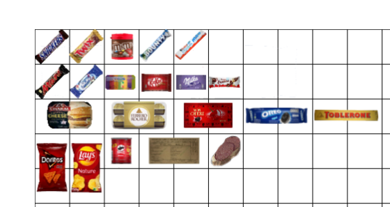
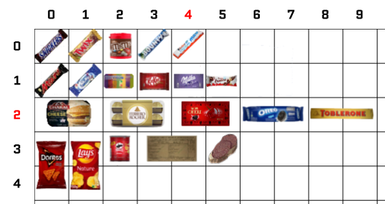

# Inventory Icons

___

Written by @nltp_ashes

Table of content :

- [I. Item config](inventory_icons.md#i-item-config)
- [I.A. Defining an icon sheet](inventory_icons.md#ia-defining-an-icon-sheet)
- [I.B Placement on the icon sheet](inventory_icons.md#ib-placement-on-the-icon-sheet)
- [II. Icon sheet](inventory_icons.md#ii-icon-sheet)
- [II.A. Generalities](inventory_icons.md#iia-generalities)
- [II.B. Setting up icons within the sheet](inventory_icons.md#iib-setting-up-icons-within-the-sheet)

___

Items in S.T.A.L.K.E.R. have icons. They are used in the inventory, when picking them off the ground, on the main HUD when attached to the belt, and so on.  

This guide aims to help you understand how icons are assigned to an item, how the icon system works, and ultimately, how to properly create your own icons.

___

## I. Item config

Let's start from the end : the item's config. To assign an icon to an item, you need to consider two things. Which icon sheet to use, and where your icon is on this sheet.

___

### I.A. Defining an icon sheet

First, icons textures are contained in icon sheets : textures containing multiple icons. In your item's config, you must (or not) define the icon sheet to use :

**File :** `gamedata\configs\items\items\items_my_item.ltx`

```ini,lang=LTX
[my_item]
icons_texture           = ui\icons\my_icon_sheet
...
```

In this example, the `icons_texture` field contains a path, relative to `gamedata\textures\` where the game to look for the icon sheet at `gamedata\textures\ui\icons\my_icon_sheet.dds`.

If you do not define this field, the game will default back to the vanilla icon sheet : `gamedata\textures\ui\ui_icon_equipment.dds`.

___

### I.B Placement on the icon sheet

Like will be later explained, your icon will be somewhere on this icon sheet. Thus, you need to define the coordinates of the icon on the sheet, and the size of the icon.

**File :** `gamedata\configs\items\my_item.ltx`

```ini,lang=LTX
[my_item]
...
inv_grid_width          = 2    ; how many slots wide it should be
inv_grid_height         = 1    ; how many slots tall it should be
inv_grid_x              = 4    ; where on the grid the icon is on the x axis
inv_grid_y              = 2    ; where on the grid the icon is on the y axis
```

___

## II. Icon sheet

Now that we understand how the icon sheet is used, it's time to... well, create an icon sheet.

___

### II.A. Generalities

To create and edit your icon sheet, you'll need a specialized software program. Many exist, and it's really up to your personal preferences. I personally use [Paint.NET](https://www.getpaint.net/download.html) (Free), but you can use [GIMP](https://www.gimp.org/downloads/) (Free), [ImageMagick](https://imagemagick.org/script/download.php) (Free), [Adobe Photoshop](https://www.adobe.com/products/photoshop.html) (Paid), etc.

First, you will need to create a DirectDraw Surface (.dds) file at the location you defined in the item's config. Here, following the same example, that will be `gamedata\textures\ui\icons\` with a file called `my_icon_sheet.dds`.

For your icons to look good, and have maximum compatibility, you should :

1. Have the x and y resolution of your texture must be a power of 2 : `128x256` or `256x256`, etc.;
2. Save the icon sheet, using `ARGB8` (also called `A8R8G8B8`) format;
3. Make the background of your icon sheet should be transparent.

You can think of your sheet as a grid of "slots". Each slot is 50px by 50px. So if you want your icon to be 1 slot, it should be 50px by 50px, two slots vertically 100px by 50px, etc.

Your icon(s) should :

1. Be at least 1 slot wide and 1 slot tall (otherwise there isn't really an icon you know?);
2. Be at most 10 slots wide (that's the width of vanilla's inventory).

___

### II.B. Setting up icons within the sheet

Let us take the following icon sheet as an example.

**Note :** The [black grid](https://forums.getpaint.net/topic/4175-grid-maker-plugin/) is here to help in the explanation, and is of course to be removed before using the icon sheet in-game !

**Note 2 :** The white background is here to help you see the grid. Your icon sheet should not have a white background !

**File :** `gamedata\textures\ui\icons\my_icon_sheet.dds`



You can imagine each slot having a coordinate on this grid. Coordinates start a (0, 0).

**File :** `gamedata\textures\ui\icons\my_icon_sheet.dds`


The coordinates for the box of Mon Cheri (the red box in the middle) are for example (4, 2).

**File :** `gamedata\configs\items\my_item.ltx`

```ini,lang=LTX
[my_item]
...
inv_grid_x              = 4    ; where on the grid the icon is on the x axis
inv_grid_y              = 2    ; where on the grid the icon is on the y axis
```

**File :** `gamedata\textures\ui\icons\my_icon_sheet.dds`



The size of the icon is 2 for the width, and 1 for the height.

**File :** `gamedata\configs\items\my_item.ltx`

```ini,lang=LTX
[my_item]
...
inv_grid_width          = 2    ; how many slots wide it should be
inv_grid_height         = 1    ; how many slots tall it should be
```

**File :** `gamedata\textures\ui\icons\my_icon_sheet.dds`


