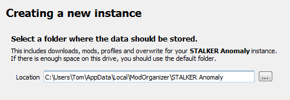

# Installing MO2

___

This guide is meant to show you how to setup Mod Organizer 2 and how to mod Anomaly in a simple and easy way step by step.

Made by [Starcry](https://www.blogger.com/profile/07678551170854762591)


## What makes Mod Organizer 2 the superior mod manager?

- Installed addons never touch your original game files, instead they are injected into the game only when you boot it up by utilizing virtual file system.

- Mod list is easily manageable, unlike with JSGME you can update or make changes to any addons at any time, without the need of enabling/disabling.

- Shows you which mods are conflicting in details.

Important note: Many antivirus softwares will block MO2 and Anomaly files causing you to have strange crashes, the reliable solution is to scan your MO2 folder for safety, then set an antivirus exclusion to the entire MO2 folder (and to your Anomaly folder).

## Installation and instance setup

1. [Download](https://github.com/Modorganizer2/modorganizer/releases) the latest version of MO2
(Scroll down, download the .exe and install it)

    

2. After getting this error and clicking "OK" select "Create a portable instance" and press next.

    

    

3. Click "Browse..." and select your S.T.A.L.K.E.R Anomaly folder, name the instance whatever you want and click next.

    > Note if you have an error when selecting the game directory:
    Sometimes MO2 won't detect the game if the directory isn't named "S.T.A.L.K.E.R. Anomaly", in case your problem remains and you have Windows 7 try downloading and double clicking [this Windows file](https://www.microsoft.com/en-us/download/details.aspx?id=47442).

    

4. The next page will show you where you'r mods and other files for Anomaly mods will be stored, you can leave it as it is and click next.

    

5. Click next again as linking an account to Nexus is not needed.

    

6. After that you should see something like this.

    

7. Congratulations, you paired MO2 with Anomaly successfully.
After you click finish MO2 will start up.

___

## Small tutorial

After MO2 boots up you will get 2 popups, one is for an optional tutorial and the other one is for Nexus which we won't need.


In case you skipped the tutorial or didn't fully understand it here's a quick explanation of the most important features:

- <text style="color: red">Red</text> highlight shows what you need to click to install addons.

- <text style="color: yellow">Yellow</text> highlight shows profiles, you can create how many you want and have different mods enabled on each of them.

- <text style="color: green">Green</text> highlight shows your virtual game directory, this can be useful for checking which file is being used from which addon.

- <text style="color: blue">Blue</text> highlight is used for starting the game, if you don't start your game with this button your mods won't be activated.


___

## Guide to modding and solving conflicts

On the image below you can see how my MO2 looks, I have a little over 100 addons and a lot of conflicts.


After installing few addons you might notice these icons:

-  This little lightning icon with a red minus next to it shows that the addon is being overwritten.
-  A lightning icon with green plus means the addon is overwriting another addon.
-  If you see both of these icons it means the addon is overwriting an addon and is being overwritten by one.
-  And last is the grey icon, this icon is next to an addon which is being fully overwritten making it redundant.

To make things work together you need to maintain a load order, that means that you can't just install addons and expect them to all work together, you can start by keeping your load order clean, make some separators (right-click into empty area) like I have in my load order [here](https://imgur.com/a/6d29UzT), after that you can install patches if needed. You can always ask about load orders in the addon-discussion channel.

> A good start would be [Grok's Community Curated Add-ons List for Anomaly 1.5.1](https://www.moddb.com/mods/stalker-anomaly/addons/groks-anomaly-community-curated-add-ons-list).

### Is it better to use a mod pack or do everything yourself?

If you are new to modding you might think simply downloading a mod pack is the best option, but that might not be the case as most of the time mod packs are the vision of the person who created it - meaning it might have features you won't like and it can be difficult to remove them, you also can't know if it works fine as it's all packed into one folder.

Using a mod pack will also mean you won't be able to get help from the community with your crashes as only the mod pack creator knows what changes were made and you'll have to rely on them to help you.

Most of the time mod packs aren't being updated frequently and it's near impossible to install any other addon with them.

___

## Solving conflicts

Most of the time it's pretty easy because most popular addons already have existing patches, for example if you wanted to install Boomsticks and Sharpsticks with JSRS you would put BaS first, then JSRS files and then the patch for JSRS that comes with BaS.

### Making patches yourself (Not recommended for beginners)

What if there is no patch available and the addons won't work together? You either have to choose which one you want or you can make a patch yourself, the best guide for that is [Anomaly modding resource](https://www.moddb.com/mods/stalker-anomaly/addons/anomaly-modding-resource-compatibility-patching) made by community member Jack-it.

___

## Installing addons the right way

Remember that every addon you install needs to have only one gamedata folder, if you find an addon with many optional files you need to install it again every time and select only one gamedata.

As you can see in the picture below I get a popup when trying to install JSRS because it has multiple files, select one and install it, then do it again with the second file (Applies for every addon).


In case you get this popup instead of the one above, you need to expand the file tree and have only option selected, after that you rightclick it and press "set as stalker directory"


In case MO2 crashes when clicking on "manual" addon installation add this text to file ModOrganizer.ini found in Modding/Mo2/:

```ini
[CompletedWindowTutorials]
InstallDialog=true
```

### Reporting crashes

Please ignore this if you are using a mod pack and report any crashes to the mod pack "creator".

If your game crashes and you don't know what caused it go to addon-discussion in Anomaly discord and post your load order along with a log from appdata/logs, it will be a text file named "xray_username".

#### Converting from JSGME to Mod Organizer 2

To do this you simply have to delete your "gamedata" folder (This will not delete your saves and MO2 will recreate the folder for you) and install the addons you had with MO2, if you don't want to reinstall them you can simply copy the contents of MODS folder to User/AppData/Local/ModOrganizer/Name of your instance/mods.

If you installed addons manually you also need to delete your gamedata folder.

___

## Additional info

If you have any ideas what I should change, fix or add in this guide feel free to ping me on discord (Starcry#4447)

Inspired by [lazy stalker guide](https://lazystalker.blogspot.com/2020/11/mod-organizer-2-stalker-anomaly-addons.html).

Link to my patreon [here ( ͡° ͜ʖ ͡°)](https://cdn.discordapp.com/attachments/831306141904404491/833351054707654706/provak.png).

Credits:

- d_nan: did absolutely nothing
- Caesar_salad: also did absolutely nothing


