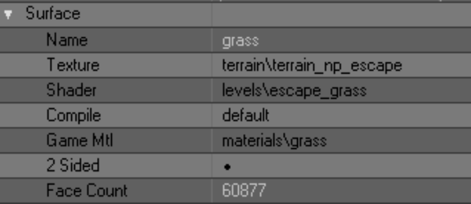
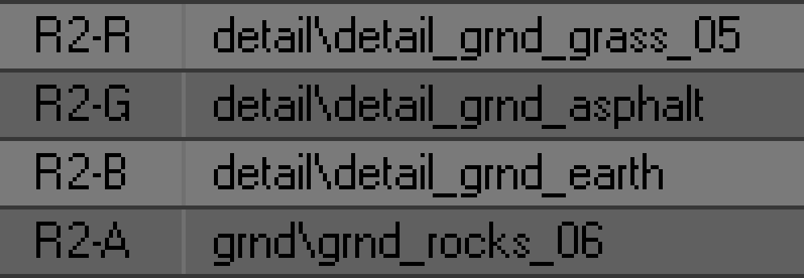
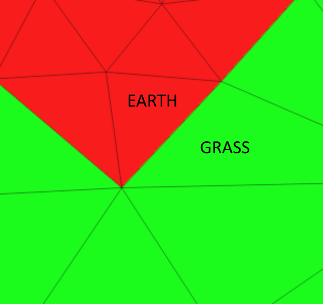
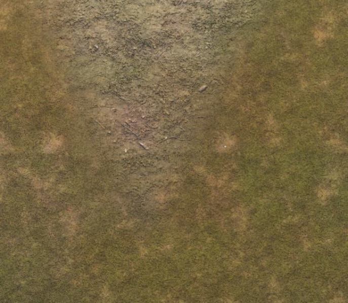
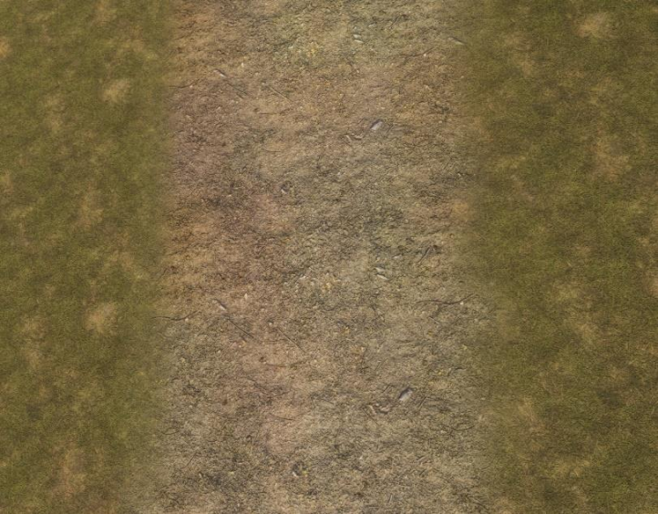
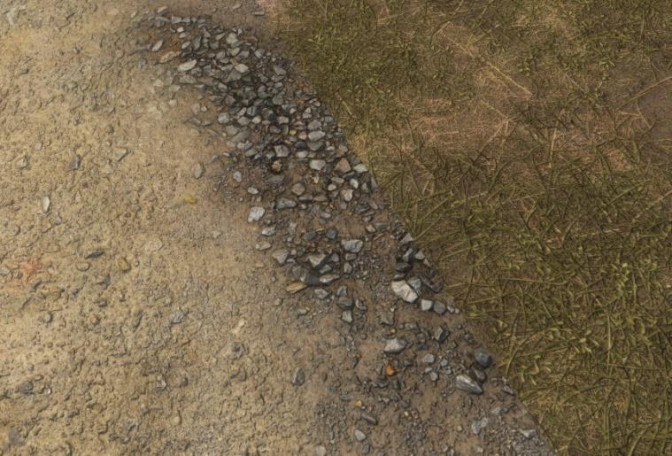
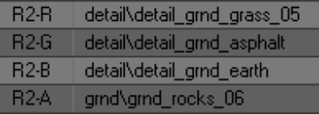
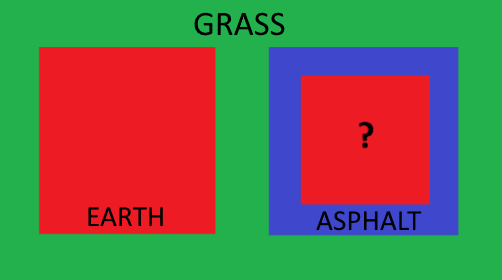

# Multimaterial Terrain Guide

> Written by the New Project mod team

- [VK](https://vk.com/stalker_new_project)
- [AP-PRO](https://ap-pro.ru/forums/topic/1902-stalker-new-project)
- [ModDB](https://www.moddb.com/mods/stalker-new-project)
- [Telegram](https://t.me/stalker_new_project)
- [Discord](https://discord.gg/chZans7pUU)

___

So first, let's try to understand how the rendering system works in general

A terrain is a regular 3d model consisting of many polygons. They can have different materials that will determine the type of their surface: grass, earth, asphalt, etc. In the X-Ray engine, a material has two important parameters that determine its type:

- `Game Mlt` - actually the material itself, which determines the sounds of footsteps on the given surface, bullet hits, etc.
- `Shader` – determines the appearance of this material

> Terrane settings in SDK Actor Editor

Also, a terrane has a texture, but it defines nothing more than its color in the game - it doesn't even have a bump. And, of course, this texture is common for all the materials in a given terrane. So there is no sense to dwell on it for a long time. Also in our analysis we will skip the Compile parameter.

The material, texture and shader of the terrane can be changed in both SDK Actor Editor and SDK Level Editor in the Library Editor tab. Or even in Blender itself, whichever is more convenient for you.

Let's talk more about the material shader. As already mentioned, it is responsible for the appearance of the material, namely, it defines its detail-texture. No, not the one we wrote about above. Detail-texture is responsible for the pattern of the material - grass, sand, pebbles, etc. This texture has a bump and it is around these textures that we are talking about today.

Customization of shaders and their detail-textures is done in SDK Shader Editor. Opening any terrane shader in it (so-called level-shaders) we will see that all of them have... Wait, why do they need 4 textures? Which of them will be displayed in the game?

> RGBA channels of one of the level shaders

To understand this, let's take a close look at these textures. Each of them is assigned in some one of the channels - R (red), G (green), B (blue) or A (alpha). You have already guessed that these are the channels of the RGBA color model, namely - the channels of the terrane mask, with the help of which the game engine understands which texture of a given shader should be shown in the game. Let's look into this in more detail.

The terrane mask uses only four colors - red, green, blue and black - the very same RGBA channels. How does it all work? Let's try to explain it on the example of how the game engine understands it:

1. the game sees the terrane with all its many polygons
2. From each polygon it reads its material and shader
3. In the shaders the game sees the same 4 textures.
4. Next, the game reads the mask of the terrane and the color of each polygon
5. And finally, the game, according to the color of the mask of a particular polygon, selects from its shader the texture that corresponds to the color channel of the mask.

For example, the game sees a polygon with the material "grass". At the same time, the game sees that this polygon is painted with a green color mask. Based on this, the game decides that in the shader of this material it should take a texture from the G channel. Of course, in a properly configured shader, the grass texture we want should be assigned to this channel. Same with the red, blue and black colors of the mask.

> Green grass meets red earth (Blender)

> The same stretch of terrane in the game

The principle of shader operation seems to be clear. But why do you need other texture channels in the shader, if only one is used for rendering? They are responsible for smooth transition of this material to other ones. We decided for ourselves that channel G on our mask is grass, channel R is earth, channel B is asphalt, and channel A is sometimes sand, sometimes something else. In fact, we could do it the other way around - give R to grass, B to earth, etc. But it doesn't matter at all, because we decide in the shader settings what texture to feed through what color.

So, let's assume that our green grass polygons met with red earth polygons. You have already guessed about the ground material, that in the R-channel of its shader the ground texture must be assigned - it is this texture that will be rendered. What do we need to do to make a smooth transition between the ground and the grass? The obvious solution comes to mind - to make a smooth transition between red and green on the mask, i.e. just blur the boundary between the colors. However, this will do nothing, there will be no smooth transition in the game anyway. The engine has another mechanism for that.

> Example of properly configured channels for transition

Let's remember the unused channels in shaders. For grass, the G channel is responsible for texture rendering - RBAs remain free. For the ground, the R channel is responsible for rendering the texture - GBAs remain free. In order to make a smooth transition between grass and earth, you need to do a very simple action - in the grass in channel R to assign the texture of the earth, and in the earth in channel G - the texture of grass. And indeed, if polygons of green grass meet polygons of red earth, the grass begins to change to the texture that is assigned to it in the channel R, and the earth begins to change the texture to the texture that is assigned to it in the channel G. As a result, both grass and earth from their sides generate a smooth transition to the neighboring material, and at the junction of these materials you can't see a seam (unless, of course, we made a mistake and assigned the same textures in the corresponding shader channels).

> The ground in channel G was mistakenly labeled gravel

All this is difficult to understand from the first time, but try. You can clearly see the principle of smooth transition generation if you assign wrong textures to shaders. For example, let's try to assign sand to the grass in channel R and gravel to the ground in channel G. In the game it will look like this: in the place where the transition of grass to earth should have taken place, a smooth transition of grass to sand will be generated on the grass side, and on the earth side - the transition of earth to pebbles. And at the junction of sand and pebbles, logically, there would be a visible seam. On the one hand, because the textures are not the same, and on the other hand - because the generation of a smooth transition has already occurred earlier.

> The ground in channel G was mistakenly labeled gravel

As you have already guessed, the same is true for combining channel B with channel G, channel A with channel R, etc. In any combinations, one thing is important - all shaders must have the same detail-textures in their respective channels. The only difference is that for one shader, for example, our earth, channel R will be responsible for rendering a texture, and for others - for transitioning to this texture. The same is true for the other G, B and A channels.

Thus we conclude that there are no unnecessary mask channels in the shader, all of them are used either in rendering or in transition generation. Of course, we should not forget that all declared detail-textures must have bump, bump# and thm for correct display.

And now we're ready to understand why the X-Ray engine allows you to assign only 4 materials to a terrane - because one material can only smoothly transition into 3 other materials. After all, if the grass is rendered through the G channel, it can only transition to the
the remaining RBA channels - there are no others. And if we could set the color of the mask through which the detail-texture will be rendered (for example, yellow or blue), then we could use more materials and create more combinations of them with each other. But in the classic version we are limited to only four mask channels and, accordingly, four terrane materials. And these are already, apparently, limitations independent of the engine. And in general, this is a story from a parallel universe....

___

Now let's try to understand how we can "legally" bypass this limitation. To understand the text below you must understand exactly how the standard terrane rendering system works and how terrane shaders are organized.

> Scheme 1. The most complex in this document

Take a look at scheme 1. We see the familiar grass (green), earth (red) and asphalt (blue). All of these materials, as we know, can be combined with each other in any form. Notice the red square inside the blue square. What kind of material is that? In the standard scheme of building terrane shaders, it should be a ground, because we have agreed that all terrane shaders must have a ground in the red channel, otherwise the generation of a smooth transition between materials will be disturbed. But there is one important trick in this scheme - the left red square does not intersect with the blue square, nor with the second red square. Now strain yourself, it's going to be tricky.

The grass in channel R is tuned to ground, and in channel B to asphalt, so it can generate a smooth transition to the left red square and right blue square. It's business as usual, it seems like nothing special. But if the blue square (asphalt) does not intersect with the left red square (ground) - are we obliged to assign a ground to its R channel? In the standard scheme, yes, because they will intersect somewhere. They will, won't they...?

What if, on our terrane, asphalt never actually intersects with earth, what does that give us? It allows us to free up the R channel from the asphalt and set it up to work with some other material that just like the ground will be fed through the R channel. Got it?

Take another look at Scheme 1. Let the left red square be earth as usual, and the right one be sand. For everything to work, the blue square must have sand in the R channel - only then will it be able to generate a smooth transition to sand. And the sand, in turn.
channel B must be set to asphalt.

Can the blue square intersect with the left red square? No, because they have different textures in the R channel, and crossing them will render the wrong transition (see example above). So if asphalt will never make contact with the ground, then we don't have to set asphalt to ground and ground to asphalt. Take a few minutes to think about what you've read. When the idea becomes more or less clear - keep reading.

> Scheme 2. Slightly easier, but much more interesting

Let's complicate the task - add a new blue square inside the red square. If you have understood the new idea of shader customization, you can guess that this new blue square does not have to be asphalt - let it be, for example, gravel (see Scheme 2).

So, I hope the idea of squares is clear and now we are ready to make one important conclusion - mask channels can be used more than once in different shaders. In other words, we can have two shaders that use blue or any other channel to render their texture. The main thing is that these two shaders must not touch each other anywhere, otherwise they will not generate a proper transition between them. The other channels will still be used to generate transitions. This is the most important thing we need to understand at this point.

But even though this approach theoretically allows you to create more than 4 materials, in practice it turns out to be useless. Seriously, take another look at Scheme 2 and think, in what real situation will you have to put one material inside another like a matryoshka doll? In practice, we most often want a terrane that is 60-70% grass to have 5-6 other materials in various combinations. For example, we want to make a lake. It should be surrounded by grass with specks of earth. Then the grass together with earth should pass into sand, and sand - and bottom silt, which will already be covered with water. Alas, but the above "matryoshka doll method" will not allow to create such complex transitions. However, let's repeat what we have learned from this method - one mask channel can be used for rendering many times.

Now we'll look at a method that will really help us create an unlimited number of materials in any combinations.

First of all, let's take the most common terrain again with 4 materials, which are combined with each other in various combinations. It will be better if this is some kind of test level. Let the materials of the terrane have these shader settings:

- green - grass
- red - earth
- blue - asphalt
- alpha - sand

In such a situation, all channels of the mask are occupied, there is nowhere to go. And we want to make a gravel section on the terrane. What can we do? We have already found out that even if all the mask channels are occupied, we can reuse any of them with another material. But how do we use them when our source materials are already combined in all combinations and we don't want to disrupt them? In other words, what if, in Scheme 2, the red and blue squares do overlap with each other and their shaders are fully tuned to each other?

This is where the "fake transition method" comes to our rescue. This is the same "sorcery" that we were able to discover after months of experimenting with shaders. Now work hard, it's about to get hard again.

Just adding new material for now:

1. In the 3d editor create a new gravel material and assign it to some test polygons that are surrounded by grass.
2. In Shader Editor create a new gravel shader (gravel). In its channel R we assign gravel texture (it will be rendered), and in channel G - grass texture (with it we will make a transition). In channels B and A you can assign anything you want, we don't need them yet.
3. In the mask terrane draw a red color in place of the new test polygons of gravel
4. Assign a new shader to the new material

If we leave it like this now and put the level on compilation, we will see the following in the game. Gravel will be rendered, but at the place of its correct transition to grass it will encounter an incorrectly generated transition of grass to ground - because the ground has the channel
R channel is set to ground. And at the junction of transitions we will see a clear seam. Thus we are once again convinced that it is impossible to insert new material just like that. But we will go further:

1. In 3d editor surround the gravel polygons with a "frame of polygons". Speaking professionally - extrude (extrude) the edges of the polygons of gravel outside. You should get something like a square from the scheme 2.
2. There in the 3d editor create a new material and assign it to the polygons of the frame, which now surrounds the gravel. Looking ahead, this frame will generate a smooth transition of grass to gravel, so for convenience, name the new material "grass_to_gravel".
3. In Shader Editor create another material, name it the same "grass_to_gravel". In its G channel assign grass (this is the render channel), and in its R channel assign gravel (this is the transition channel).
4. Assign the new shader to the new transition material
5. Do not do anything in the mask terrane, because if you squeezed the edges outward, they now diverge in the area of green color. And we need it, because the frame texture will be fed through the green channel.

And now if you have done everything as described above, you can compile the test level and see that you have just added a fifth working material to your terrane, which generates the transition to grass without any problems. The operation of the original 4 materials is not disturbed in any way. Impressive? Now let's take a closer look at what we've just done.

As you have already realized, the essence of witchcraft lies in the "frame" that we have created around the new material. It acts as a kind of buffer or channel settings switch, with the help of which we ourselves determine what material our grass will change into.

Note again the grass shader, in its G channel we assigned grass, and this channel according to the terrane mask is used to render the texture, and the other channels are used to generate transitions to other materials. But what if we create a shader that also has grass in its G channel and something else other than grass in the other channels? That's exactly the kind of material we just made, because the grass in the R channel has earth, and the transition has gravel.

As a result, we have two different materials, with the same texture in the render, but with different textures in the "transition" channels. At the junction of grass and frame, the original grass purely technically generates a "transition to itself", but in fact we do not see this transition in the game. Thus, the G channel of both the grass and the fake is simultaneously used for rendering and transition. And the other channels remain free, and we can use them as we want. In the case of the original grass, all channels are already occupied, but in the case of the fake transition they are free. And this is what allows us to assign any new material to it. We have chosen gravel, so we can assign gravel to any of the remaining channels (we have chosen channel R, but you can use any free channel), and then we just need to set the appropriate gravel texture in the shader of our new material.

Thus, having created a fake transition, we can place in it as in a matryoshka doll the new material we need. And such matryoshka dolls on the terrane can be as many as you want.
