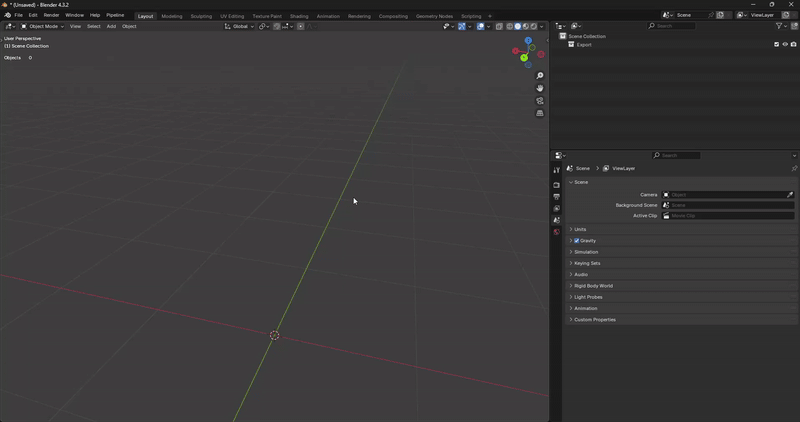
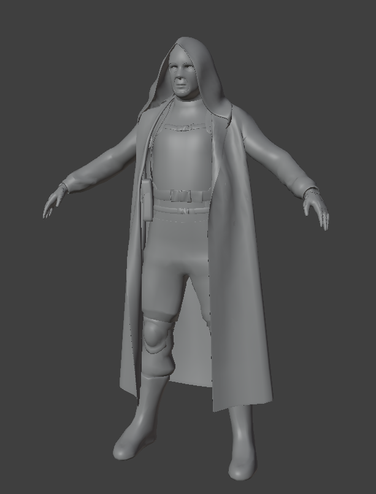

# Binding Model in Blender

___

## Authors

TheParaziT

## Need to know

- How to work in Blender
- How to work with Blender [X-Ray Addon](../../modding-tools/blender/blender-x-ray-addon-summary.md)
- What is a Dynamic Object and how to [Setup Dynamic Object in Blender](setup-dynamic-object-in-blender.md)

___

## About

So you want to make a new model of weapons, stalker or mutant and replace, or add to the existing ones. The example will be on the stalker model.

### Import reference model



We will need the reference model to check the proportions of the model and to bind our model to the skeleton of this model

- `N-Panel` -> `Viewer` -> `Open Folder` -> Go to the unpacked `gamedata/meshes/actors` folder.
- Now select any model in any folder. For example, let's take the model `stalker_do_balon_3.ogf` from the `stalker_dolg` folder.
- Click `Import`: `Active` (The model is imported into the scene) and now we can close the `Viewer` (`Close Folder`).

### Import your model

Just import your model into the scene. Resize it if necessary. I will use this model ([model by spytnik on Sketchfab](https://sketchfab.com/3d-models/stalker-5fa82920a45845e386c2a7d778c0972c)) as an example.



### Posing and binding

```admonish tip
If you use the standard animations your model must be in the same pose as the reference model (have the same height and proportions) (For stalkers the bind pose is [T-pose](https://en.wikipedia.org/wiki/T-pose)), but in theory you can not put your model in the right pose, but then there may be problems with animations (the animation itself will be played correctly, but the geometry attached to the bones may move incorrectly (Because of the large distance between the bones and the geometry, the geometry can shift a lot from bone movement)).
```

You can adjust the character's original pose in a number of ways:

- Create your own armature, bind it to your character and use the bones to change the default pose.
- Change with geometry editing (Via `Edit Mode` or `Sculpt Mode`([Example](https://www.youtube.com/watch?v=7P5rdtzc18E&t=1082s))).

I chose the way to change pose through the creation of armature (But the situations and models are different. Choose the method that suits you best and that you are more skilled with).

After editing the original pose of your model (If you had it in a different pose from the standard pose) you need to bind your model to the stalker bones, for this we needed a reference model.

Bind the model to the skeleton can also be done in different ways:

- `With Armature Deform` (`CTRL` + `P` -> `Armature Deform` -> Select the desired method) - Fast but not accurate method
- With manual `Weight Paint` - Most accurate but time consuming
- With `Data Transfer` Modifier
- With third-party addons for Blender (Such as Auto Rig Pro or Voxel Heat Diffuse Skinning)

I chose to bind via `Weight Paint`

### Checking

You can just move the character's bones or import the animation to check the bind. My model moves pretty badly, but you can improve the result if you don't do it for just five minutes.


```admonish info
For a good result, your model should be initially modeled in the standard pose, to avoid manual editing of the model and possible breakage of the mesh, made for animation ([Topology for animation example](https://www.youtube.com/watch?v=7DAFS8sga2k)). `Weigh Paint` is used to better bind the model, third-party addons for Blender can only help for fast work, but they are not 100% accurate. Just remember, Weight Painting is a very time-consuming process, and the accuracy of your model's binding to the skeleton can be highly dependent on the pose and its offset from the reference skeleton.
```
