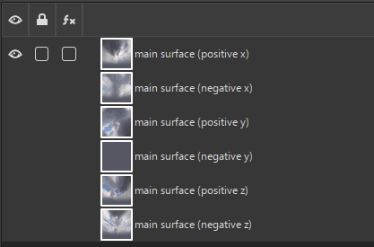
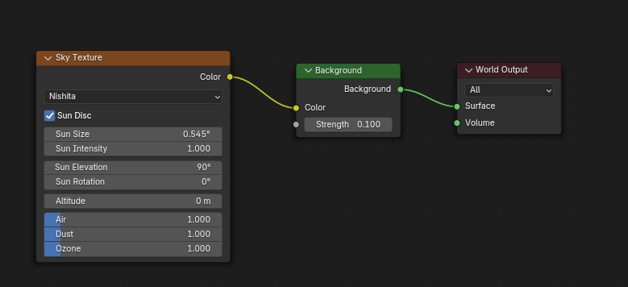
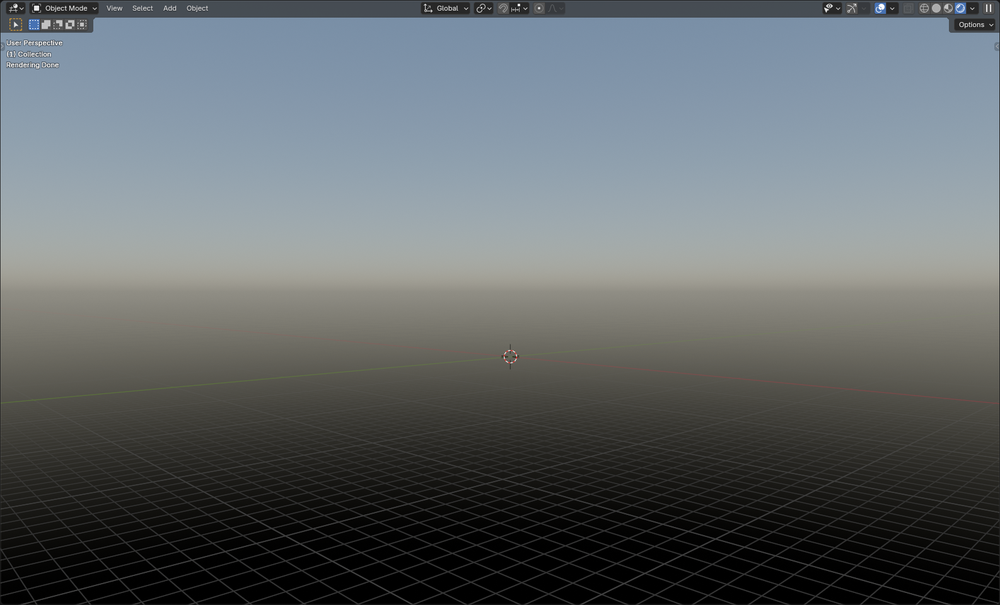

# Creating Cubemap in Blender

___

## About

In X-Ray, cubmaps are used for Sky Box and for reflective surfaces (mirrors, glass).

```admonish tip
Cubmaps can be created in different ways (addons, procedural textures or HDRi maps) and in different programs.
```

```admonish info
In X-Ray cubemap are made this way: One [*.dds](../../reference/file-formats/textures/dds.md) texture with multiple layers.


```

## Start

To give an example, let's create a simple procedural sky.

To do this, go to `Shading` or open `Shader Editor` .

In `Shader Type` select `World` 

Find and add the [Sky Texture Node](https://docs.blender.org/manual/en/4.3/render/shader_nodes/textures/sky.html) and connect it to the [Background Node](https://docs.blender.org/manual/en/4.3/render/shader_nodes/shader/background.html) that is connected to the [World Output Node](https://docs.blender.org/manual/en/4.3/render/shader_nodes/output/world.html).



Switch Render Engine to `Cycles` in `Render Properties` .

Scene should look like this.

