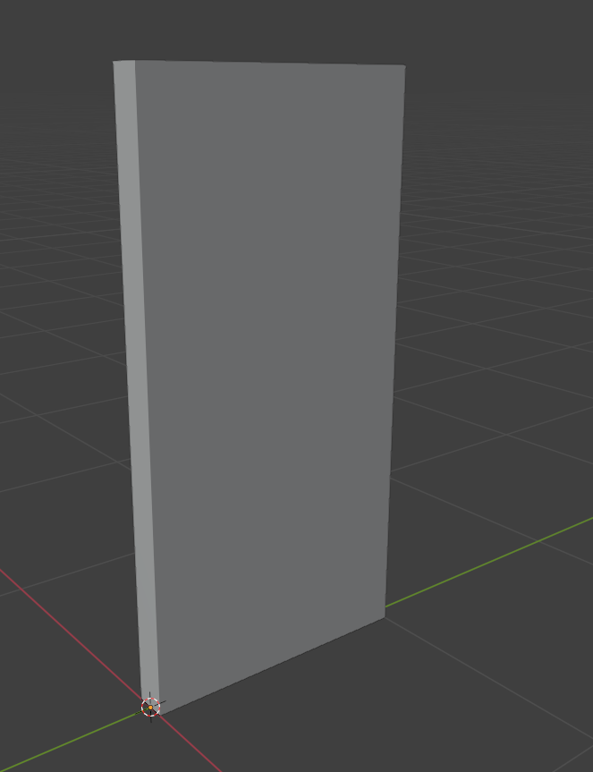
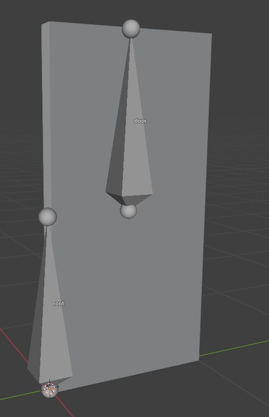
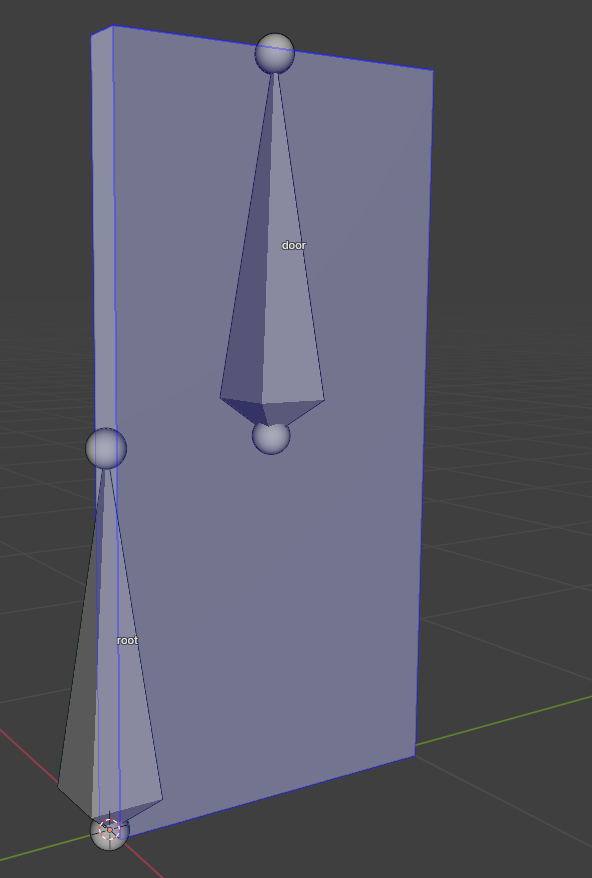

# Creating Door in Blender

___

## Need to know

- How to work in Blender
- How to work with Blender [X-Ray Addon](../../modding-tools/blender/blender-x-ray-addon-summary.md)
- What is a [Dynamic Object](../../glossary/glossary.html#dynamic-object)

___

## About

Creating a functional door in Blender.

## Start

### Example 1

First, we need a door model.

Create 2 bones.

The first bone is needed for fixation (could be any name (original developers named it `link`)).
The second bone must be named `door`.

#### Bone

We need to set up a `door` bone.

Go to `Bone Properties` tab.

In X-Ray Engine: Bone, be sure to select `Box` in Shape Type

For Joint Type, you can select `Joint` or `Slider`

- `Joint` is required for doors opening in two directions on one axis.
- `Slider` for slider type doors.

For bone, you must configure the maximum bone limits.

For example for my door with type `Joint`

Limit Y:

- Min - 0 --- Minimum Y-axis door limit
- Max - 90d --- Maximum Y-axis door limit

### Example 2

## Finish

Go to `Object Properties`.

In [X-Ray Engine: Object](../../modding-tools/blender/addon-panels/panel-object.md) select `Dynamic` or `Progressive Dynamic` in the `Type` list.

Next you need to set up the logic and config of your door.
