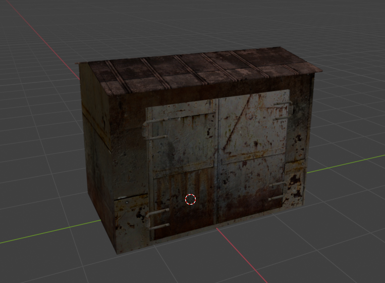
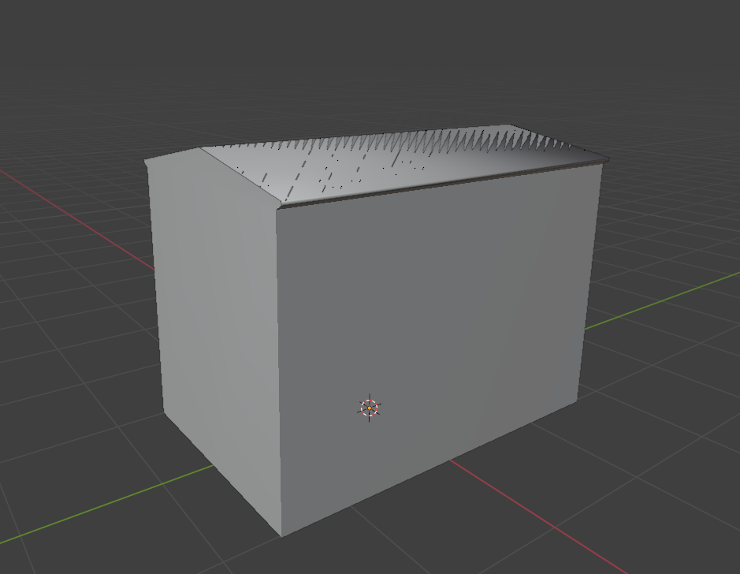

# Creating HOM Occluder in Blender

___

## Authors

TheParaziT

## Need to know

- How to work in Blender
- How to work with Blender [X-Ray Addon](../../modding-tools/blender/blender-x-ray-addon-summary.md)
- What is a [Static Object](../../glossary/glossary.html#static-object)
- What is a [Hierarchical Occluder Mesh](../../glossary/glossary.html#hierarchical-occluder-mesh)

___

## About

HOM occluders are essential for optimizing levels. They remove the geometry in the occluder.

## Start

For the tutorial, the creation will be for Static Object, but HOM occluders can also be used for other purposes (e.g. for tall view bounders, hills, etc.). Let's take this as an example:

All we need to do is create a mesh that simplistically represents our model:

## Surface

Go to `Material Properties`.

Create a separate material for our HOM occluder.

In [X-Ray Engine: Material](../../modding-tools/blender/addon-panels/panel-material.md) choose:

- Shader --- `any Engine Shader for Static Object` --- ([list of all Engine Shaders](../../reference/shaders/shaders-list/engine-shaders-list.md))
- Compiler --- blah --- ([list of all Compiler Shaders](../../reference/shaders/shaders-list/compiler-shaders-list.md))
- Material --- `materials/occ` --- This material does not include rendering parameters that are unnecessary for the calculation ([list of all Game Materials](../../reference/materials/materials-list.md))

## Finish

Go to `Object Properties`.

In [X-Ray Engine: Object](../../modding-tools/blender/addon-panels/panel-object.md) select `HOM` in the `Type` list.

This completes the setup of the HOM Occluder. You can safely export it in the model format you need.
