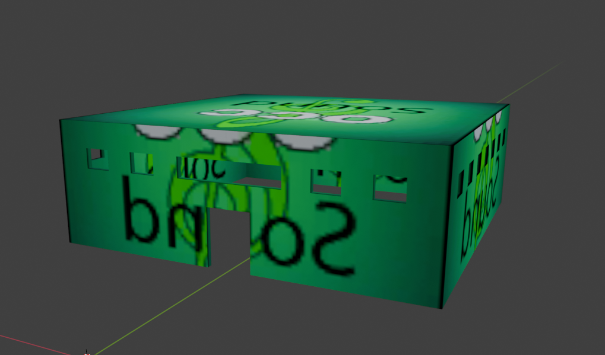

# Creating SOM Occluder in Blender

___

## Authors

TheParaziT

## Need to know

- How to work in Blender
- How to work with Blender [X-Ray Addon](../../modding-tools/blender/blender-x-ray-addon-summary.md)
- What is a [Static Object](../../glossary/glossary.html#static-object)
- What is a [Sound Occluder Mesh](../../glossary/glossary.html#sound-occluder-mesh)
- What is a [Game Material](../../glossary/glossary.html#game-material)

___

## About

SOM occluders are needed to calculate sound propagation.

## Start

For example, let's create such an object for a building with a large space inside.

Building example:


Create a cube and simply replicate the interior of the building.



## Surface

Go to `Material Properties`.

Create a separate material for our SOM occluder.

```admonish note
If you go to have the sound cut off on both sides, select the `2 Sided` flag
```

In [X-Ray Engine: Material](../../modding-tools/blender/addon-panels/panel-material.md) choose:

### Shader

Choose any Engine Shader for Static Object ([list of all Engine Shaders](../../reference/shaders/shaders-list/engine-shaders-list.md))

### Compiler

Any Compiler Shader ([list of all Compiler Shaders](../../reference/shaders/shaders-list/compiler-shaders-list.md))

### Material

Choose or create new Game Material ([list of all Game Materials](../../reference/materials/materials-list.md))

```admonish note
In Game Material for the SOM occluder the main factor will be `Sound occludion`
```

## Finish

Go to `Object Properties`.

In [X-Ray Engine: Object](../../modding-tools/blender/addon-panels/panel-object.md) select `Sound Occluder` in `Type` list.

This completes the setup of the SOM Occluder. You can safely export it in the model format you need.
