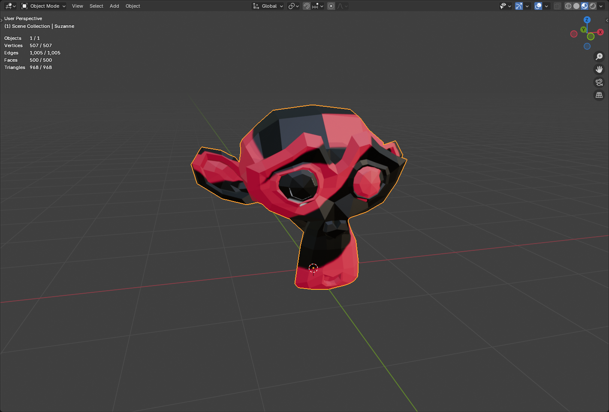
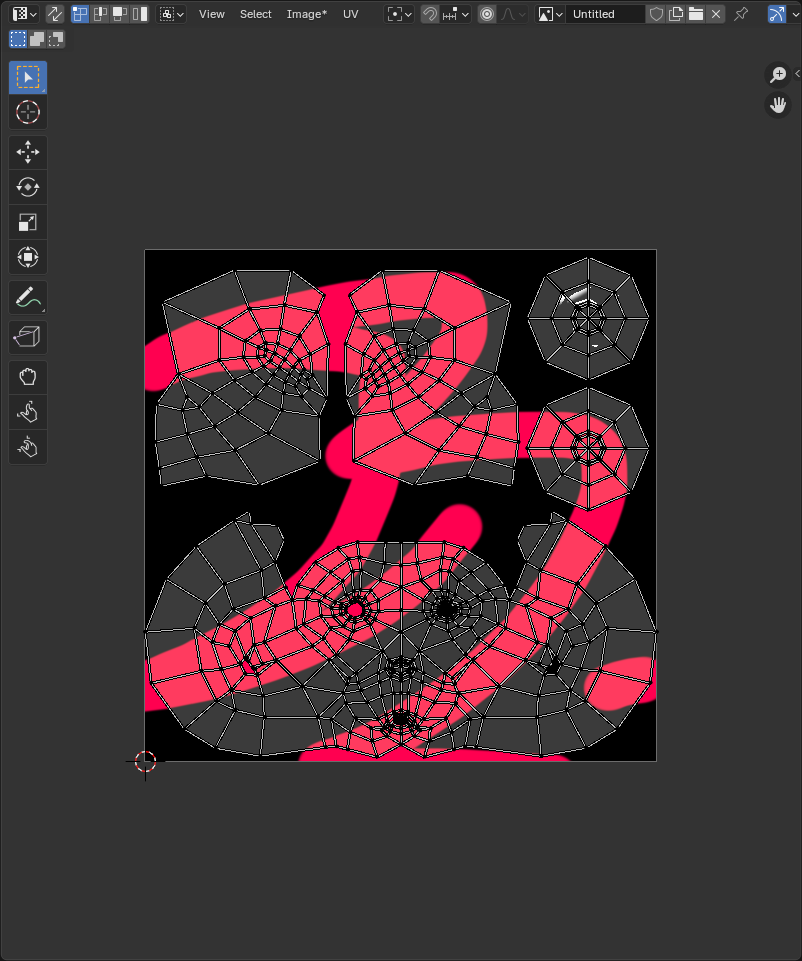
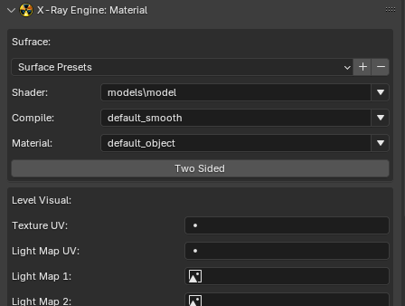

# Static Object Setup in Blender

___

## Need to know

- How to work in Blender
- How to work with Blender [X-Ray Addon](../../modding-tools/blender/blender-x-ray-addon-summary.md)
- Familiarize yourself with the limitations and capabilities of the format [*.object](../../reference/file-formats/models/object.md) (because you may export to it more often than to [*.ogf](../../reference/file-formats/models/ogf.md)) to avoid errors
- Familiarize yourself with [Static Object](../../glossary/glossary.md#StaticObject) model type
- How [Smoothing](../../reference/models/smoothing.md) work in X-Ray

___

## Start

Create or download the model you like.
Do a UV if you don't have one.

- ### Example

The model itself:


UV:


___

## Texturing

Textures can be created in any program designed for this purpose, or you can simply download them.

```admonish info Title = "Important note about texture maps"
In STALKER only the following texture maps are used:

- Color Map ([*.dds](../../reference/file-formats/textures/dds.md))
- Bump Maps (For Stalker they are used as [_bump.dds](../../reference/file-formats/textures/bump.md) and [_bump#.dds](../../reference/file-formats/textures/bump_hash.md)) (The [Blender X-Ray](../../modding-tools/blender/blender-x-ray-addon-summary.md) addon does not support the [_bump.dds](../../reference/file-formats/textures/bump.md) format at this time.
```

Here you need to add your created texture in [*.dds](../../reference/file-formats/textures/dds.md) format

As a result, in the Shader Editor () our textures should look something like this:


So after creating the model, the UV and the texture, the setup within Blender begins.

___

## Setting up

### Model

First, the model itself will be set up.
You can start by positioning the model over the origin in this way (The ["Drop It"](https://andreasaust.gumroad.com/l/drop_it) addon for Blender is highly recommended for such actions)

Then apply the coordinates with Ctrl + A > All Transform. This will allow us (if you make for example a model library or work in the SDK) to drag and drop the model on the surface.

___

### Material

Select our object and go to the "Material Properties" () tab.

Here we see the name of our material and a list of [X-Ray Engine: Material](../../modding-tools/blender/addon-panels/panel-material.md) with lots of items.



There is no point in telling about each point here. (there is a separate section in the book)

The items we need for the model now are:

- [Shader](../../reference/shaders/shaders-list/engine-shaders-list.md) (This setting is responsible for the appearance of the surface.)
- [Compile](../../reference/shaders/shaders-list/compiler-shaders-list.md) (Here are descriptions of the settings that the level geometry compiler uses)
- [Material](../../reference/materials/materials-list.md) (Here you can select surface materials)

Select the shaders you want.

Well, the model setup in Blender is done. Congratulations!

___

## Export
