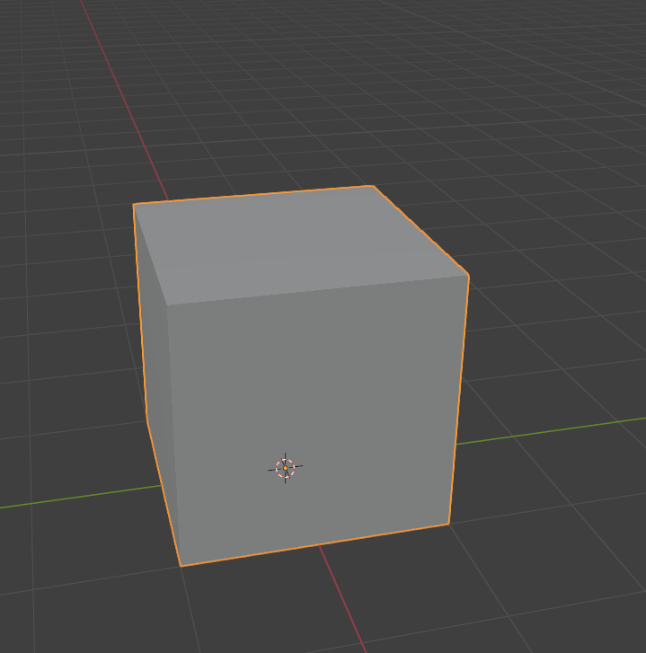
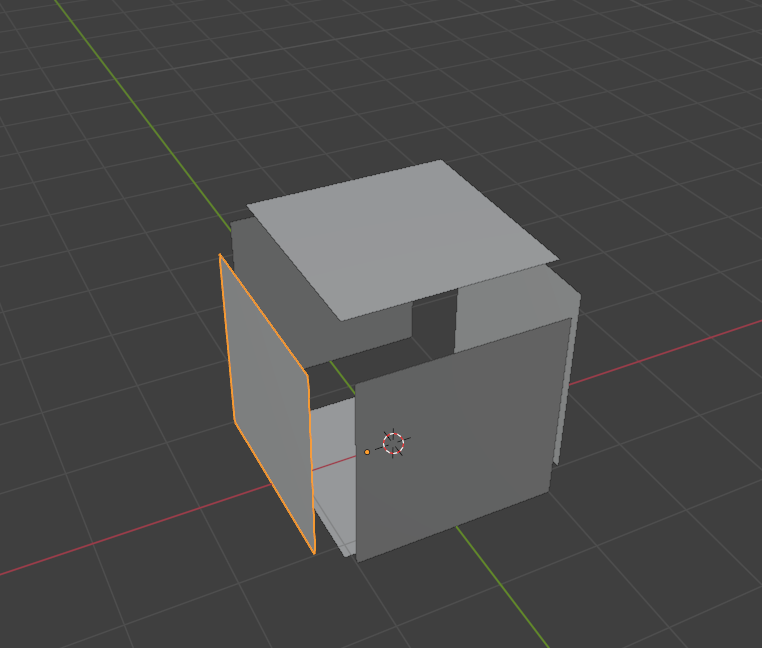

# Creating Breakable Object in Blender

___

## About

In X-Ray, Dynamic Objects can be breakable if you set them up correctly.

## Start

First, we need a model that you have made or downloaded. I'll have one of those:



Choose your model and duplicate it.

```admonish note
When breaking a model, a separate, already broken model will be spawned. It can be divided parts of the original object or the same object, but with a different number of bones and Bone Shapes.
```

For example for my model, I want to separate parts of the original model:



## Bones

[Main article: Setup Dynamic Object in Blender](setup-dynamic-object-in-blender.md)

For the main object we need to create a bone and a Bone Shape.


For parts of the object we will also need to create our own bones and Bone Shapes.

## Material

[Main article: Creating Game Material in SDK](../materials/creating-game-material-in-sdk.md)

The main object needs to be matched with a suitable material (where the `Breakable` flag is set). [List of all materials](../../reference/materials/materials-list.md).
