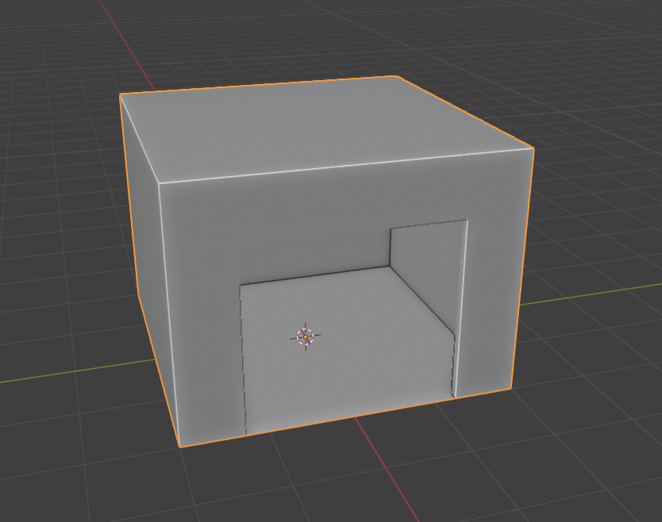
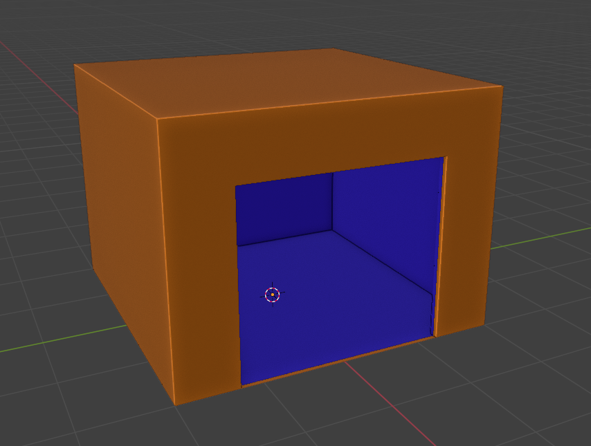

# Preparing Building in Blender

___

## Need to know

- How to work in Blender
- How to work with Blender [X-Ray Addon](../../modding-tools/blender/blender-x-ray-addon-summary.md)
- What is a [Static Object](../../glossary/glossary.html#static-object)
- What is a [Portal](../../glossary/glossary.html#portal) and [Sector](../../glossary/glossary.html#sector)

___

## About

Buildings should be created according to a special pipeline. This is necessary for future creation of `Sectors` and `Portals` for optimization.

## Start



The idea is to separate the inside and outside of the building.



```admonish note
Orange indicates the outer side.

Blue indicates the inner side.
```

## Finish

Go to `Object Properties`.

In [X-Ray Engine: Object](../../modding-tools/blender/addon-panels/panel-object.md) select `Static` in the `Type` list.
