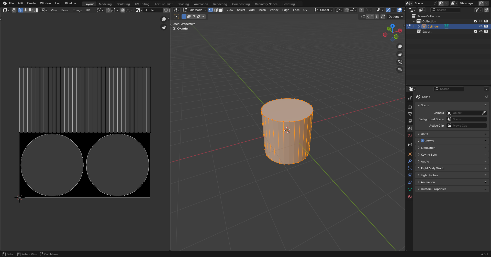
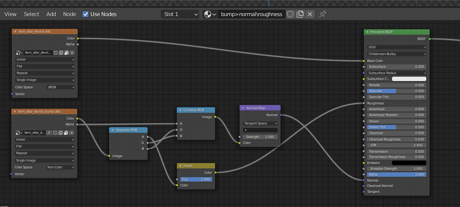
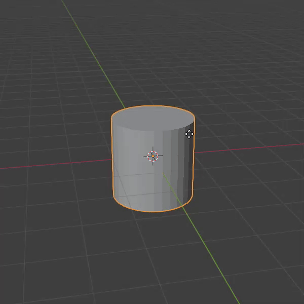
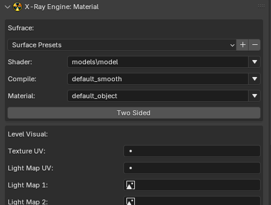

# Setup Static Object in Blender

___

## Need to know

- How to work in Blender
- How to work with Blender [X-Ray Addon](../../modding-tools/blender/blender-x-ray-addon-summary.md)
- Familiarize yourself with the limitations and capabilities of the format [*.object](../../reference/file-formats/models/object.md) (because you may export to it more often than to [*.ogf](../../reference/file-formats/models/ogf.md)) to avoid errors
- Familiarize yourself with [Static Object](../../glossary/glossary.html#static-object) model type

___

## About

Static Objects can be used to create levels and its collision. They will not interact with game physics and will not be dynamic.

## Start

You must have a model downloaded or created by you.

You must have one UV map per mesh.

For my example, I'll have a model with this UV map.



## Texturing

Textures can be created in any program designed for this purpose, or you can simply download them.

```admonish note Title = "Important note about texture maps"
In X-Ray Monolith only the following texture maps are used:

- Diffuse color ([*.dds](../../reference/file-formats/textures/dds.md))
- Bump maps ([*_bump.dds](../../reference/file-formats/textures/bump.md) and [*_bump#.dds](../../reference/file-formats/textures/bump_hash.md))
```

Here you need to add your created textures in [*.dds](../../reference/file-formats/textures/dds.md) and [*_bump.dds](../../reference/file-formats/textures/bump.md) (if you have) format

As a result, in the `Shader Editor` our textures should look something like this:



## Placement

First, the model itself will be set up.
You can start by positioning the model over the origin in this way

```admonish tip
(The ["Drop It"](https://andreasaust.gumroad.com/l/drop_it) addon for Blender is highly recommended for such actions)
```

Then apply the coordinates with `Ctrl + A` > `All Transform`.

This will allow us (if you make for example a model library or work in the SDK) to drag and drop the model on the surface.



## Surface

Select our object and go to the `Material Properties` tab.

Here we see the name of our material and a list of [X-Ray Engine: Material](../../modding-tools/blender/addon-panels/panel-material.md) with lots of items.



The items we need for the model now are:

- [Shader](../../reference/shaders/shaders-list/engine-shaders-list.md) (Engine Shader; This setting is responsible for the appearance of the surface.) --- Choose Engine Shader for Static Object
- [Compile](../../reference/shaders/shaders-list/compiler-shaders-list.md) (Compile Shader; Here are descriptions of the settings that the level geometry compiler uses)
- [Material](../../reference/materials/materials-list.md) (Here you can select Game Material) --- Choose Game Material for Static Object

## Finish

Go to `Object Properties`.

In [X-Ray Engine: Object](../../modding-tools/blender/addon-panels/panel-object.md) select `Static` in the `Type` list.

This completes the setup of the Static Object. You can safely export it in the model format you need.
