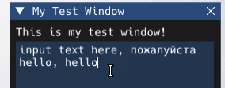

# ImGui

____

## Basics

Dear ImGui is a bloat-free graphical user interface library for C++.  
It outputs optimized vertex buffers that you can render anytime in your 3D-pipeline-enabled application.  
It is fast, portable, renderer agnostic, and self-contained (no external dependencies).  

This guide explains how to use Anomaly's ImGui implementation (currently available only with Modded Exes), which can be used in Lua scripts.

By default pressing F11 will show the ImGui overlay (a menu bar at the top of the screen).  
The keybind can be changed in the settings.

When the ImGui overlay is shown, the mouse cursor will change and the game will no longer react to any input.  

Pressing Esc or F11 will hide it again - you can also transfer the input back to the game without closing the overlay by double clicking anywhere outside of existing ImGui windows.  
In this case, pressing F11 will bring the input back to the ImGui overlay.

Some resources to get you started on ImGui:
- <a href="https://pthom.github.io/imgui_manual_online/manual/imgui_manual.html">Interactive ImGui Demo</a>
- <a href="https://github.com/ocornut/imgui/wiki/Debug-Tools">ImGui Debug Tools</a> (accessible in-game from the `About` menu)

## Differences between C++ and Lua ImGui implementations

Not every feature of ImGui has been ported (yet?), for example drawlists or custom images/textures are not supported at the moment.  
I didn't test every single function, it's possible that there may be some oversights.  

The main differences:

- `ImGui.` instead of `ImGui::`

- Some functions return multiple values, so the following C++ code
	```c++
	bool expanded = ImGui::Begin("My Test Window", &my_window_visible, 0)
	```
	turns into
	```lua
	expanded, my_window_visible = ImGui.Begin("My Test Window", my_window_visible, 0)
	```
- `ImGui.Text()` and `ImGui.TextUnformatted()` do the same thing, use `string.format()` to format strings
- The `InputText` functions have their return values swapped
	```lua
	multiline_text, changed = ImGui.InputTextMultiline("##Multiline", multiline_text, 500, vector2():set(500,500))
	-- vs. other functions
	changed, test_value = ImGui.DragFloat("Test", test_value, 0.01, 0, 10)
	```
- Scripted ImGui uses XRay types (`vector2, vector, vector4, fcolor`)

Check `lua_help_imgui.script` for a full list of functions and enums.

### ImGui Window

Let's begin with a simple window

```lua
my_window_visible = true

function imgui_on_render(name)
	
	if name == "Main" then
	
		if my_window_visible then
		
			expanded, my_window_visible = ImGui.Begin("My Test Window", my_window_visible, 0)
			
			if expanded then
				
				ImGui.Text("This is my test window!")
				
			end
			
			ImGui.End()
		end
	end
end

function on_game_start()
	RegisterScriptCallback("imgui_on_render", imgui_on_render)
end
```


Pressing the triangle will contract the window - `expanded` will be false in the example above.  
Closing the window will set `my_window_visible` to false.

### When to call ImGui functions

The ImGui implementation adds a new script callback `imgui_on_render`.
It has a single argument i.e. `function imgui_on_render(name)` which tells you the name of the UI that is being rendered at the moment.  

The engine currently sends callbacks for rendering `Main`, `MenuBar` and `MenuFile` but you can also call the callback yourself with a custom name to allow other scripts to append to your menus or windows.

#### Main

The main ImGui render, this is where you want to draw your windows.

#### MenuBar

You can also add your own menus to the menu bar at the top of the screen like this:

```lua
function imgui_on_render(name)
	
	if name == "Main" then
	
	[...]
	
	elseif name == "MenuBar" then
		
		if ImGui.BeginMenu("My Menu") then
			clicked, my_window_visible = ImGui.MenuItem("My Cool Window", nil, my_window_visible, true)
			SendScriptCallback("imgui_on_render", "MyMenu")
			ImGui.EndMenu()
		end
	end
end
```


#### MenuFile

The `File` menu is the very first menu that shows up on the menu bar.  
You can also append your menu items to this menu.

```lua
function imgui_on_render(name)
	
	[...]
	
	elseif name == "MenuFile" then
		_, my_window_visible = ImGui.MenuItem("My Cool Window", nil, my_window_visible, true)
	end
end
```


#### Any time, actually

In reality, you can draw ImGui UI whenever you want.  
If you wanted to make a debug overlay that's visible at all times, even without opening the ImGui overlay, just render your window inside a new function and use `AddUniqueCall` to have it run once per frame.

```lua
function window_overlay()

	expanded, _ = ImGui.Begin("My Overlay", true)
			
	if expanded then
		
		ImGui.Text("This is visible all the time!")
		
	end
	
	ImGui.End()
end

AddUniqueCall(window_overlay)
```


____

## Other UI elements

Some more examples.

### Buttons

```lua
if ImGui.Button("Do Something", vector2():set(80,22)) then do_something() end
```


### Draggables

```lua
local test_value = 1
local test_vec = vector():set(0,0,0)

[...]

changed, test_value = ImGui.DragFloat("Test", test_value, 0.01, 0, 10)
if changed then [...] end

changed, test_vec = ImGui.DragFloat3("TestVec", test_vec, 1, -100, 100)
if changed then [...] end
```


### Color Picker

```lua
local my_color = fcolor():set(0.75,0,0.25,1)

[...]

changed, my_color = ImGui.ColorPicker4("Light Color", my_color)
if changed then test_light.color = my_color end
```


### Text Input

```lua
local multiline_text = "input text here, пожалуйста"

[...]

multiline_text, changed = ImGui.InputTextMultiline("##Multiline", multiline_text, 500, vector2():set(250,200))
if changed then
	printf("newtext: %s", multiline_text)
end
```



### Tree Nodes

```lua
if ImGui.TreeNode("Node Label") then
	
	ImGui.Text("Text inside node")
	
	ImGui.TreePop()
end
```


### Combo Box

```lua
local selectables = {

	[1] = "test1",
	[2] = "test2",
	[3] = "test3",

}

local selected = 1

[...]

if ImGui.BeginCombo("Test Combo", selectables[selected]) then
	for i = 1, #selectables do
		if (ImGui.Selectable(selectables[i], i == selected, 0, vector2():set(100, 15))) then
			printf("Selected %s", selectables[i])
			selected = i
		end
	end
	ImGui.EndCombo()
end
```


____

## Fonts

You can add custom fonts by putting `.ttf` or `.otf` files into `gamedata\textures\fonts`  
Optionally, font configurations can be changed by adding a `.ltx` file with the same name into the fonts folder

Example font configuration to change the font size (fonts use `sizepixels = 16` by default)
```ini
[font]
sizepixels = 19
```

If you want to adjust the built-in font, create a font config with the name `$default.ltx`  
Or you could even replace the built-in font with a new one by adding a `$default.ttf` or `$default.otf` into the fonts folder.

### Using different fonts

To use the font in your ImGui window, you'll have to tell ImGui which font to use

```lua
ImGui.PushFont("Blackcraft")
ImGui.TextColored(fcolor():set(1,0,0.25,1), "Gobocore")
ImGui.PopFont()
```


Make sure to use `PopFont` once you're done, this will make ImGui return to the default font

### Icons

The default font also supports icons to enhance the look of your UIs

```lua
ImGui.BeginMenu(ImGui_Icon.WRENCH.." Hud Adjust")
```


Check `imgui_helper.script` for a full list of icons!

____

## Styles and colors

Tweak ImGui styles and colors to your liking

```lua
ImGui.PushStyleColor(ImGuiCol.WindowBg, fcolor():set(0.04, 0.00, 0.05, 0.82))
ImGui.PushStyleColor(ImGuiCol.FrameBg, fcolor():set(0.48, 0.16, 0.43, 0.54))
ImGui.PushStyleColor(ImGuiCol.PopupBg, fcolor():set(0.61, 0.12, 0.41, 0.60))

ImGui.PushStyleVar(ImGuiStyleVar.WindowBorderSize, 0)
ImGui.PushStyleVar(ImGuiStyleVar.WindowPadding, vector2():set(20,20))

[draw your UI]

ImGui.PopStyleColor(3)
ImGui.PopStyleVar(2)
```

#### Gobo-bo!