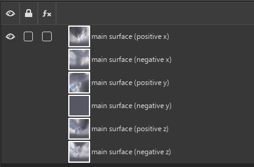
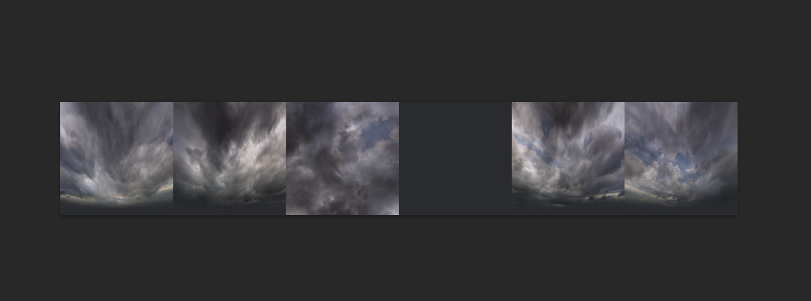
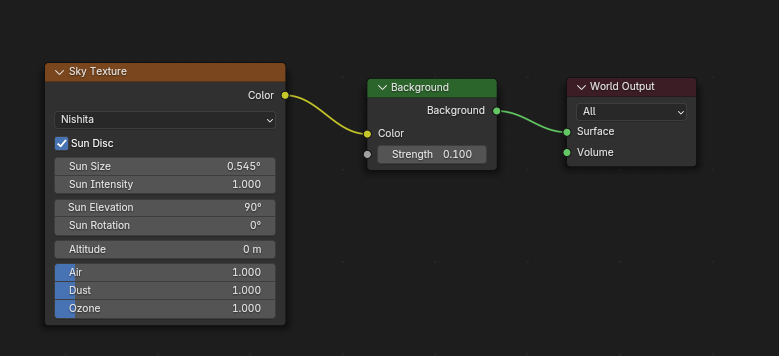
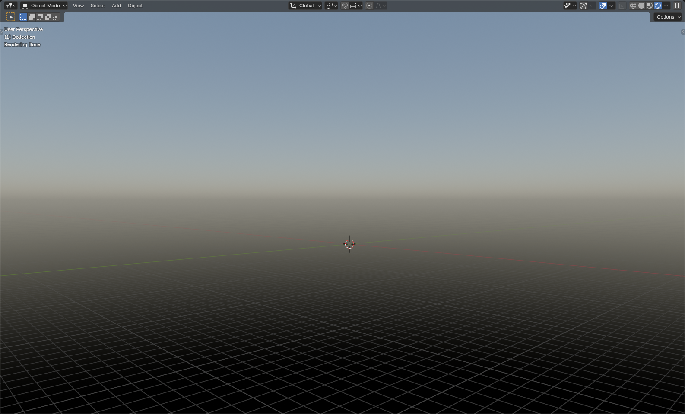

# Creating Cubemap in Blender

___

## About

In X-Ray, cubmaps are used for Sky Box and for reflective surfaces (mirrors, glass).

```admonish tip
Cubmaps can be created in different ways (addons, procedural textures or HDRi maps) and in different programs.
```

```admonish info
In X-rays, Сubemaps are based on six projections arranged in a specific order, where:


```

```admonish info
They may look different in the view of different programs

In the `Gimp` view, it might look like this (texture with six layers)



In `Photoshop` view, it may look different (six projections)


```

## Start

To give an example, let's create a simple procedural sky.

To do this, go to `Shading` or open `Shader Editor` .

In `Shader Type` select `World` 

Find and add the [Sky Texture Node](https://docs.blender.org/manual/en/4.3/render/shader_nodes/textures/sky.html) and connect it to the [Background Node](https://docs.blender.org/manual/en/4.3/render/shader_nodes/shader/background.html) that is connected to the [World Output Node](https://docs.blender.org/manual/en/4.3/render/shader_nodes/output/world.html).



```admonish tip
If you are using `Nishita`, you will need to uncheck `Sun Disc`, as the sun positions are set in a separate `suns.ltx` file
```

Switch Render Engine to `Cycles` in `Render Properties` .

Scene should look like this.



Далее нам нужно создать камеру и настроить ее.

Создайте камеру. В Object Data Properties для камеры в списке Lens в Type выберете Panoramic, а в появившемся Panorama Type выберете Equirectangular.

Перейдите в режим просмотра из камеры, она должна выглядить так.

```admonish tip
Для примера я добавил куб, чтобы было понятнее
```

Перейдите в Output Properties, нужно настроить разрешение камеры.

```admonish note
Так как в игре будет шесть проекций, нам нужно расчитать разрешение камеры.
```

Для примера одна сторона будет в 2048x2048 разрешении

## Finish

Экспортируйте вашу текстуру