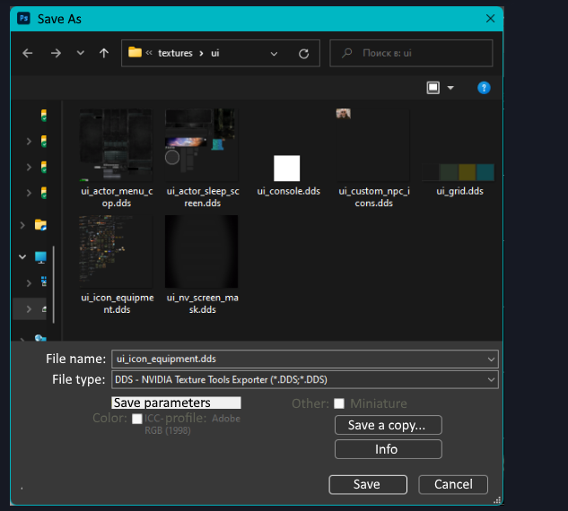
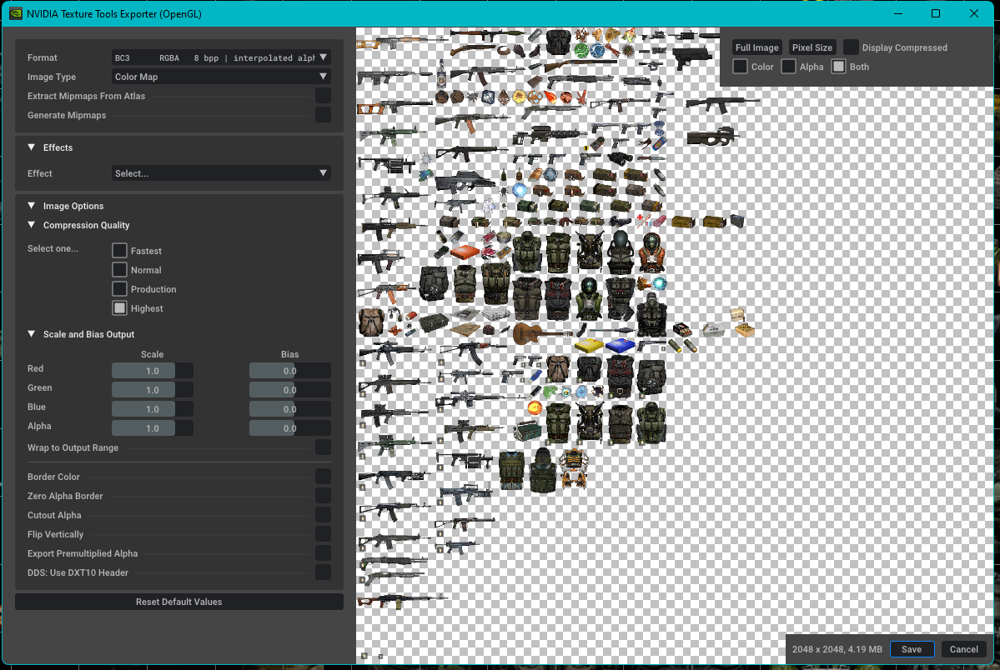

# Working correctly with icon atlases

___

> Greetings, this is comrade [Hrusteckiy](#hrust-contacts) - UI-programmer, whose work can be seen in the New Project, Last Fallout Overhaul, Oblivion, Hike, and many others, also made 100x100 icons for the original game. Noticed that many modders suffer from improper saving textures and work with them. This guide will make their life easier and teach them to do without mistakes (by the way, came to this myself through their own messes).

___

## Let's start with software

* First of all, use Photoshop CS5/CS6 or CC (I use 2019)
* Second, forget about the Stalker Icon Editor
* Third, we need [Paint.net](https://www.getpaint.net/). That is, we use only two programs to work with the icons themselves, not counting the program for rendering them

Next, you need to work with the source - [*.tga](https://en.wikipedia.org/wiki/Truevision_TGA) ideal buffer format for these two programs, save it in 32-bit format.


To add new icons, use Paint.net. We make a new layer, paste on it the picture we need and adjust to the size (bilinear method), select the area, cut and paste to the main layer, thereby erasing the previous icon, if any. We save and go to Photoshop. Here we turn on the grid (Ctrl+'), its size is adjusted here, by default it is 50 pixels.


```admonish warning title="Important!"
DO NOT USE THE RIGHTMOST AND BOTTOMMOST CELLS, THEY ARE NOT WHOLE AND ARE SMALLER THAN THE REST BY A FEW PIXELS.
```

We select with shift color+alpha, and, if necessary, adjust the icon within a cell, save it.
To copy icons from one atlas to another, select the icon on one, copy and paste on the other - it's best to do it with the color and alpha selected, so you don't have to transfer separately.
Next, we go to "layers" and unlock the layer - this opens us information in the properties about the selected element and its position. This is where we will find out the coordinates, for 50x50 we have to use a calculator, and for 100x100 we just cut off two zeros each.

```admonish warning
In CS5/CS6 you can get coordinates on F8 (in the new versions have simplified access and it is on the properties fold).
```


Here is the position of the X - 950, divide by 50 and we get 19 - this is the number written in inv_grid_x. Similar story with the player. W - Width 50, divide by 50, we get inv_grid_width equal to one. It's the same with height.

```admonish warning title="Important!"
AFTER UNLOCKING THE LAYER, DON'T SAVE THE ATLAS, JUST CLOSE IT!
```

Open the atlas in Paint.net or in Photoshop (you need the .dds plugin).

___

### To save in Photoshop




___

### To save in Paint.net

.png)
.png)

___

## Sources

[Ap-pro Topic](https://ap-pro.ru/forums/topic/4205-pravilnaya-rabota-s-atlasami-ikonok/)

### Hrust Contacts

* [VK](https://vk.com/hrusteckiy)
* [AMK](https://amk-team.ru/forum/profile/57247-hrust/)
* [Ap-Pro](https://ap-pro.ru/profile/4757-hrust/)
* Discord - Hrust#8964
