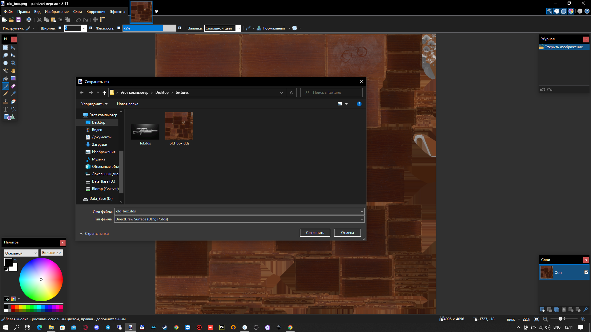
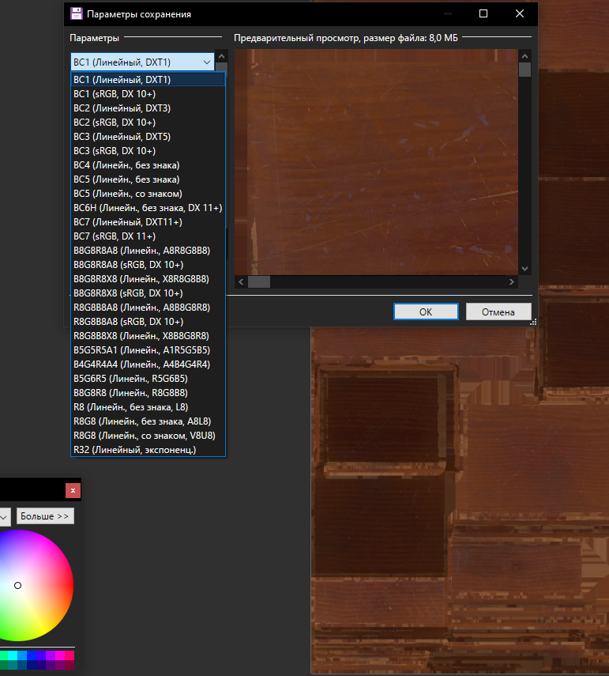

# Creating and preparing textures

___

## Related Videos

<iframe width="560" height="315" src="https://www.youtube.com/embed/HwTYYH5zLjo?start=418" title="YouTube video player" frameborder="0" allow="accelerometer; autoplay; clipboard-write; encrypted-media; gyroscope; picture-in-picture; web-share" allowfullscreen></iframe>

___

## Beginning (Via Paint.net)

First, familiarize yourself with the supported texture compression ([.dds](../main-folders-and-files/file-formats/index.html#dds-directdraw-surface) [.bump](../main-folders-and-files/file-formats/index.html#bumpdds-1) [.bump#](../main-folders-and-files/file-formats/index.html#bumpdds))

## Start

First we have to create a texture, or we have to download one.
Next, we need to convert our texture into [.dds](../main-folders-and-files/file-formats/index.html#dds-directdraw-surface) format.
To do this, you can use any program of yours that can do such a thing. (or you can take a program from [this](../../reference/modding-tools/README.md) list)

The most commonly used program for this is Paint.net. We download the texture and save it as [.dds](../main-folders-and-files/file-formats/index.html#dds-directdraw-surface).
The Save Settings window appears.

We have to choose the texture compression that suits us.

Save our texture.
